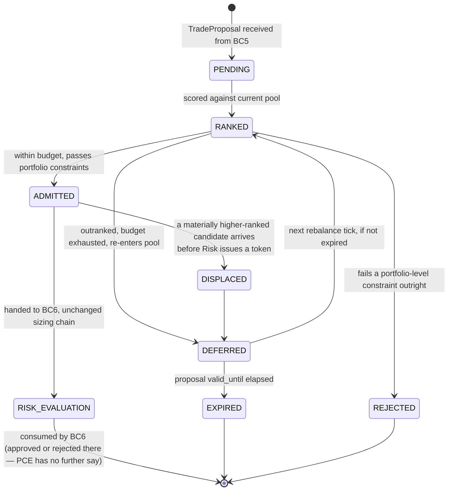

# 18 — Portfolio Construction Engine

**Diagram:** `18_Portfolio_Construction.excalidraw`
**Phase:** 11 — Architecture Completion (2 of 5)
**C4 Level:** L3 — Component
**Depends on:** `09_Decision_Intelligence_Layer.md`, `17_Evidence_Graph.md`, `10_Risk_Portfolio_Platform.md`
**Container:** new — see `decisions/0043-portfolio-construction-is-a-twelfth-bounded-context.md`
**Status:** New page. No prior source or review page designed this; page 10's pipeline and `review/R19_Missing_Components.md` §12 (Strategy Portfolio Manager, deferred P3) are the closest precedents and are both superseded by this page for the capital-competition problem specifically.
**Bounded context:** BC12 Portfolio Construction (new — see ADR-0043; `19_Bounded_Context_Map.md`)

---

## Purpose

The ADD's original pipeline is `Signal -> Risk -> Execution`: one `TradeProposal` at a time, sized against the portfolio it happens to arrive to. That is correct for a single-symbol, single-strategy platform and silently wrong the moment two proposals are live candidates at once, because nothing in the platform can answer **"we can afford one of these, which one, and what did we give up by not taking the other?"**

This page inserts a Portfolio Construction Engine (PCE) between Deliberation (BC5) and Risk Authorisation (BC6): `Signals -> Portfolio Construction -> Risk Platform -> Execution Platform`. PCE ranks and allocates; it never authorises. **ADR-0011 (Risk Engine is the sole authorisation authority) is unchanged and unweakened** — every candidate PCE admits still passes the full, unmodified gate-and-sizing chain in `10_Risk_Portfolio_Platform.md` / `review/R11_Risk_Architecture.md` §3. PCE can only narrow the candidate set before Risk sees it and cap the size Risk is allowed to grant; it cannot raise a size, waive a gate, or issue a token.

## The three questions this engine exists to answer

| Question | Mechanism |
|---|---|
| **Why this trade?** | `opportunity_score`, ranked against every other live candidate in the pool, not evaluated alone |
| **Why not another trade?** | The `DEFERRED`/`REJECTED` candidate carries the same audit weight as an `ADMITTED` one — logged with the specific candidate(s) that outranked it |
| **How much capital, and what was the opportunity cost?** | `allocated_risk_budget` plus an explicit `opportunity_cost_note` naming the marginal candidate the allocation displaced or fell short of |

## Responsibilities

- Maintain the `CandidatePool`: every unexpired, unauthorised `TradeProposal` from BC5, across all symbols and strategies.
- On each new proposal or a scheduled rebalance tick, score every pool member for expected return, expected risk, and marginal diversification contribution.
- Rank the pool, allocate available risk budget headroom top-down, and mark each candidate `ADMITTED`, `DEFERRED`, or `REJECTED`.
- Apply trade-replacement logic: a materially higher-ranked new candidate may displace a **pending, unfilled** lower-ranked one; a **filled position is never touched** by this engine (exits are owned by the OMS and are never gated by anything upstream of BC6's exit exemption, ADR-0019).
- Hand every `ADMITTED` candidate to Risk Authorisation (BC6) with `allocated_risk_budget` as an additional, monotonic-only cap on the existing sizing chain (R11 §3) — never a size increase, never a bypass.
- Publish the full ranking, including every deferred and rejected candidate and why, to the Decision Record Store.

## Scoring model

```
expected_return(c)   = calibrated_committee_confidence(c) x precedent_edge_estimate(c)
expected_risk(c)     = vol_target_base_size(c) x instrument_volatility(c)
opportunity_score(c) = expected_return(c) / expected_risk(c)
diversification(c)   = -1 x marginal_contribution_to_portfolio_variance(c)   // more negative contribution = more diversifying = higher score
```

`precedent_edge_estimate` reads `Precedent` nodes from the candidate's own sealed `EvidenceGraph` (page 17 §7) — a candidate with no precedent history or a `sample_size` below the minimum (default 20) is scored on `calibrated_committee_confidence` alone, discounted, never assigned a fabricated edge. `marginal_contribution_to_portfolio_variance` uses the same rolling correlation and cluster map as the Risk Engine's `CorrelationLimitRule` (R11 §4) — **one correlation model, read by both contexts, never two independently maintained ones.**

## Ranking and allocation

```
1. Sort CandidatePool by opportunity_score desc, ties broken by diversification(c) desc,
   then by calibrated_committee_confidence desc.
2. remaining_budget = RiskBudgetSnapshot.headroom   (BC6 published read model, sync, 30ms fail-closed —
                                                       same pattern as the existing Portfolio -> Risk OHS)
3. for candidate in ranked_pool:
     required = candidate.capital_requirement
     if required <= remaining_budget AND passes_portfolio_level_constraints(candidate):
         candidate.status = ADMITTED
         candidate.allocated_risk_budget = required
         remaining_budget -= required
     elif a pending lower-ranked ADMITTED candidate can be displaced
          (opportunity_score gap > displacement_threshold, default 25%):
         displace the weaker candidate -> DEFERRED, with opportunity_cost_note
         candidate.status = ADMITTED
     else:
         candidate.status = DEFERRED (if unexpired, re-enters pool next tick)
                             or REJECTED (if it fails a portfolio-level constraint outright,
                             e.g. cluster exposure would breach even at zero marginal size)
4. Every non-ADMITTED candidate is logged with its rank and the candidate(s) that outranked it.
```

`passes_portfolio_level_constraints` checks cluster exposure and correlation **before** Risk's own `CorrelationLimitRule` runs, so a candidate that cannot possibly be sized within cluster limits is deferred here rather than consuming a full Risk Engine evaluation for a foregone rejection. This is an optimisation, not a substitute: BC6 re-checks the same constraint independently regardless (no context trusts another's gate — ADR-0011's boundary is preserved exactly).

## Candidate lifecycle



**Note on `RISK_EVALUATION -> [*]`:** once a candidate leaves PCE for BC6, PCE tracks it only for displacement eligibility until BC6 issues a token or rejects it. After that point the candidate is entirely BC6/BC8's concern; PCE has no veto and no re-entry path for a candidate BC6 has rejected.

## Inputs

`TradeProposal` stream from BC5 (Deliberation), `RiskBudgetSnapshot` (BC6 published read model — headroom only, never the authorisation logic itself), `PortfolioSnapshot` (BC7), the correlation/cluster model (shared with BC6's `CorrelationLimitRule`), sealed `EvidenceGraph` per candidate for `Precedent` nodes.

## Outputs

`PortfolioAllocationPlan`: the full ranked pool with `{candidate_id, rank, opportunity_score, status, allocated_risk_budget, opportunity_cost_note}` for every member, `ADMITTED` members forwarded individually to BC6 in rank order.

## Dependencies

BC5 Deliberation (source of candidates), BC6 Risk Authorisation (source of budget headroom, sync read, fail-closed on timeout — a stale or unreachable `RiskBudgetSnapshot` means PCE admits nothing that cycle, never a guessed headroom), BC7 Portfolio (source of current book state), page 17 Evidence Graph (source of `Precedent` nodes).

## Owns (exclusive)

- The `CandidatePool` and every `PortfolioAllocationPlan` it produces.
- The `opportunity_score` and `diversification` scoring functions and their versioned parameters (PBO/DSR-gated like any other learned parameter, per the same discipline applied to desk weights in page 08 and evidence reliability in page 17).
- The displacement threshold and rebalance-tick cadence.

PCE does **not** own risk budget headroom (BC6 owns and publishes it), correlation data (shared model, BC6 co-owns the computation), or anything about a filled position (BC7/BC8 own that entirely — PCE never sees a `Fill`).

## Interfaces

| Call | Direction | Contract |
|---|---|---|
| `submit(TradeProposal) -> CandidateId` | BC5 → PCE | Adds to the pool; triggers an immediate rank if the pool is small enough, else waits for the next tick |
| `rebalance() -> PortfolioAllocationPlan` | Scheduled (default: every bar close, and on every `submit`) | Full re-rank of the live pool |
| `get_plan(as_of) -> PortfolioAllocationPlan` | Dashboard, audit | Point-in-time resolvable, per the platform-wide `AsOf` discipline |

## Events Published

- `portfolio_construction.candidate.admitted` — forwarded to BC6 with `allocated_risk_budget`.
- `portfolio_construction.candidate.deferred` — with rank and the candidate(s) that outranked it.
- `portfolio_construction.candidate.rejected` — with the specific portfolio-level constraint that failed.
- `portfolio_construction.candidate.displaced` — with the `opportunity_cost_note`.
- `portfolio_construction.plan.published` — the full ranked pool, every rebalance tick, to the Decision Record Store.

## Events Consumed

`ProposalIssued` (BC5, per `review/R03_Domain_Model_DDD.md` §4), `EquityMarked` / fill events from BC7 (to keep headroom estimates current between BC6 snapshot reads), `evidence.graph.sealed` (page 17, for `Precedent` nodes).

## Invariants

1. **PCE never produces an `AuthorisedOrder` and never has the signing key.** It is architecturally incapable of authorising a trade — ADR-0011 preserved by construction, not by convention.
2. **`allocated_risk_budget` can only cap, never raise, the size Risk's own sizing chain would otherwise grant.** It enters the monotonic-reduction chain (R11 §3) as one more `min()` step, structurally unable to increase a size.
3. **A filled position is never displaced.** Displacement applies only to `ADMITTED`-but-not-yet-authorised candidates. This is the portfolio-construction analogue of ADR-0019 (exits are never blocked) — entries can lose a capital competition; open risk that is already taken cannot be unwound by this engine.
4. **Every non-admitted candidate is logged with the same durability as an admitted one.** A `DEFERRED` or `REJECTED` candidate is not a discard; it is the opportunity-cost record the platform needs to evaluate whether PCE's ranking is any good (see Recovery Strategy).
5. **Correlation and cluster data is read from one shared model, never duplicated.** A PCE-side correlation number diverging from BC6's is a data bug, not an expected feature of two independent estimates.

## Failure Modes

- **Stale headroom read** — `RiskBudgetSnapshot` a few seconds old during fast-moving conditions, admitting a candidate BC6 then rejects anyway on the fresher check (safe: BC6 still gates independently, this only wastes a cycle, never causes an over-allocation).
- **Scoring model miscalibration** — `opportunity_score` systematically favours one desk's signals because that desk's `calibrated_committee_confidence` runs hot, silently starving other symbols of capital.
- **Displacement thrash** — two candidates repeatedly outrank each other across successive rebalance ticks as new evidence arrives, neither ever reaching Risk long enough to be authorised.
- **Correlation model drift between PCE and BC6** — if the shared model is ever forked instead of shared (a deployment error, not a design error), the two contexts' portfolio views diverge silently.

## Degraded Mode

| Condition | Behaviour |
|---|---|
| BC6 `RiskBudgetSnapshot` unreachable | PCE admits nothing that cycle; every candidate is `DEFERRED` with reason `budget_unreachable` — fail-closed, matching the existing Portfolio→Risk sync-read pattern |
| BC7 `PortfolioSnapshot` unreachable | Same: fail-closed, no admissions, all deferred |
| Precedent index unavailable | Candidates score on `calibrated_committee_confidence` alone; `opportunity_score` computation continues, discounted, never blocked |
| Correlation model unavailable | PCE cannot compute `diversification`; ranking falls back to `opportunity_score` alone, and `passes_portfolio_level_constraints` cannot run, so **every candidate defers to BC6's own correlation gate with zero pre-filtering** rather than PCE guessing |

## Recovery Strategy

`opportunity_score` and `diversification` weights are re-tuned by Continuous Learning (page 12) exactly like desk weights (page 08) and evidence reliability (page 17): proposed changes, PBO/DSR-gated, never manually eyeballed. The rejection-analysis discipline in `review/R11_Risk_Architecture.md` §12 extends directly to PCE: track what `DEFERRED` and `REJECTED` candidates would have done, because that is the only way to know whether the ranking function is well-tuned rather than just restrictive. Displacement thrash is bounded by a minimum dwell time (default: a candidate cannot be displaced within N seconds of being admitted) so a candidate has a real chance to reach Risk before being unseated.

## Latency Budget / SLO

- `rebalance()`: **< 300ms p99** for a pool of up to 50 live candidates (deterministic Python, no LLM call on this path).
- `submit()` acknowledgement: **< 20ms p99**.
- This sits between the Committee's ~10s debate cycle and Risk's <100ms hot-path check (page 10) — PCE's own budget must not become the bottleneck between them, and 300ms against a ~10s upstream budget leaves ample margin.

## Security Boundary

CORE zone (R15 §2), no inbound from OPS or DMZ. Reads BC6's and BC7's published read models only, never their internal tables (ADR-0010's exclusive-ownership rule applies to PCE as a new context exactly as it does to the original eleven). Cannot reach the broker endpoint, the Execution Service, or the token-signing key under any configuration — enforced at the network layer, not by application logic, matching the VAULT isolation rule.

## Technology

Python, same stack as BC6 (R10's Redis/Postgres pattern) for the candidate pool and plan storage. No LLM call anywhere in this component — PCE is entirely deterministic, consistent with ADR-0002.

## Future Expansion

- Cross-strategy allocation once a second strategy exists (`review/R19_Missing_Components.md` §12's deferred Strategy Portfolio Manager becomes this engine's natural extension, with `strategy_id` as an additional ranking dimension rather than a new component).
- Portfolio-level Kelly optimisation across correlated candidates simultaneously, rather than per-candidate fractional Kelly followed by a capital cap (page 10's Future Expansion note, now with a concrete home).

---

## Related

- `decisions/0043-portfolio-construction-is-a-twelfth-bounded-context.md`
- `decisions/0011-risk-engine-sole-authorisation-authority.md` — the invariant this page is designed never to weaken
- `decisions/0020-fractional-kelly-as-platform-default.md`, `decisions/0019-exits-never-blocked-by-entry-rules.md`
- `10_Risk_Portfolio_Platform.md`, `review/R11_Risk_Architecture.md` §3 — the unmodified sizing chain every `ADMITTED` candidate still passes through
- `review/R19_Missing_Components.md` §12 — the deferred Strategy Portfolio Manager this page supersedes for the capital-competition problem
- `17_Evidence_Graph.md` — source of `Precedent` nodes for edge estimation
- `19_Bounded_Context_Map.md` — BC12
- Previous: `17_Evidence_Graph.md`
- Next: `20_Model_Registry.md`
