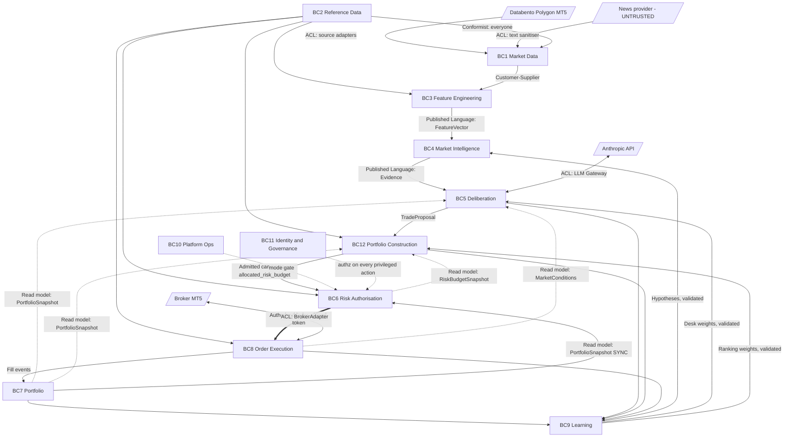

# 19 — Bounded Context Map

**Diagram:** `19_Bounded_Context_Map.excalidraw`
**Phase:** 11 — Architecture Completion (3 of 5)
**C4 Level:** L2 — Container (context boundary view, cross-cutting)
**Depends on:** all of `00_Master_Architecture.md` … `18_Portfolio_Construction.md`
**Status:** Canonical operational home for the domain model. **Rationale and criteria remain in `decisions/0010-eleven-bounded-contexts.md` (unmodified, Accepted) and `decisions/0043-portfolio-construction-is-a-twelfth-bounded-context.md`** — this page does not restate why the boundaries are where they are, only what each boundary owns, exposes, and is forbidden from touching.

---

## How to read this page

ADR-0010 decided **why** eleven contexts, and by what criteria. ADR-0043 added a twelfth. `review/R03_Domain_Model_DDD.md` designed the aggregates inside each one. Neither is a page you can hold open next to a pull request. This page is: the ownership matrix, the interaction rules, and the per-context spec table, in the format the user asked for and the format an engineer actually references while wiring a new service. If this page and ADR-0010 ever appear to disagree, ADR-0010 is the decision of record and this page has drifted and needs a fix, not the other way around — that is the governance rule this whole directory runs on.

## The twelve bounded contexts

| # | Bounded Context | Core question it answers | Type | Source page(s) |
|---|---|---|---|---|
| BC1 | **Market Data** | What happened in the market, and can we trust the record of it? | Supporting | 01, 02 |
| BC2 | **Reference Data** | What is this instrument, and is it tradable right now? | Supporting (blocking) | *absent — see §7* |
| BC3 | **Feature Engineering** | What derived quantities describe the market at time T, computable only with information available at T? | Supporting | 03 |
| BC4 | **Market Intelligence** | What state is the market in? | **Core** | 04, 05, 06, 07 |
| BC5 | **Deliberation** | Given the evidence, what should we do and why? | **Core** | 08, 09, 17 |
| BC12 | **Portfolio Construction** | Given everything we could do, what should we actually spend capital on, and at whose expense? | **Core** | 18 |
| BC6 | **Risk Authorisation** | May this action be taken with this capital right now? | **Core** | 10 |
| BC7 | **Portfolio** | What do we own, what is it worth, what did it cost? | **Core** | *absent — see §7* |
| BC8 | **Order Execution** | How do we get from an authorised intent to a confirmed broker state? | **Core** | 11 |
| BC9 | **Learning** | Where were we wrong, and what specific change would have helped? | **Core** | 12 |
| BC10 | **Platform Operations** | Is the system healthy, and what mode is it in? | Generic | 13, 14 |
| BC11 | **Identity & Governance** | Who is allowed to do what, and what did they do? | Generic | *absent — see §7* |

BC12 is placed in table order between BC5 and BC6 because that is its position in the data flow (`Signals -> Portfolio Construction -> Risk Platform -> Execution Platform`), not because it is senior to BC6 in any authority sense — it has none, per ADR-0043.

## Context map

The dotted lines into BC5 and BC12 are the acyclic fix: both consume **read models**, never a live dependency on BC6 or BC8's internals. BC12 reads BC6's `RiskBudgetSnapshot` the same way BC5 reads BC7's `PortfolioSnapshot` — an Open Host Service, not a coupling.

## Context ownership matrix

| Context | Exclusive data owned | Schema/DB | Primary technology home |
|---|---|---|---|
| BC1 Market Data | Raw bars, ticks, quality scores | `market_data` | `01_Data_Ingestion.md`, `02_Data_Quality_Engine.md` |
| BC2 Reference Data | Instrument specs, trading calendar, session defs, contract terms | `reference_data` | New container C04 (`review/R19_Missing_Components.md` §4) |
| BC3 Feature Engineering | Feature vectors, labels | `features` | `03_Feature_Store.md` |
| BC4 Market Intelligence | `MarketView`, regime/vol/structure/model estimates | `market_intelligence` | 04, 05, 06, 07 |
| BC5 Deliberation | `DeliberationCycle`, `EvidenceGraph`, `TradeProposal` | `deliberation` | 08, 09, 17 |
| BC12 Portfolio Construction | `CandidatePool`, `PortfolioAllocationPlan` | `portfolio_construction` | 18 |
| BC6 Risk Authorisation | `RiskAssessment`, `AuthorisedOrder`, `LimitSet`, `KillSwitchState` | `risk` | 10 |
| BC7 Portfolio | `Account`, `Position`, `Lot`, `Trade`, `LedgerEntry` | `portfolio` (event-sourced) | New container C22 (`review/R19_Missing_Components.md` §5) |
| BC8 Order Execution | `Order`, `Fill`, `ExecutionReport` | `execution` | 11, plus OMS C23 |
| BC9 Learning | Hypotheses, model/desk/weight evaluations, precedent index | `learning` | 12 |
| BC10 Platform Operations | Mode state, circuit breakers, deployment/release state | `platform_ops` | 13, 14 |
| BC11 Identity & Governance | Identities, roles, audit log, approvals | `identity` | New containers C38/C39 |

**Enforced at the database role level, not by convention** (ADR-0010 binding rule 1). A per-schema role that lacks grants on every other schema is a CI-checkable fact, not a code review checklist item.

## Per-context specification

Compact form of the twelve fields requested for each context. `Failure isolation` states what continues to work if this context is fully down. `Latency expectation` is the SLO this context's Open Host Service or synchronous query must meet for its downstream consumers, not this context's own internal processing budget (which is stated on its source page).

### BC1 — Market Data

| Field | Value |
|---|---|
| Purpose | Be the trusted record of what happened in the market |
| Responsibilities | Ingest, validate, quality-score, never mutate raw records |
| Team ownership | Data platform |
| Internal models | `Bar`, `Tick`, `QualityScore`, `SourceHealth` |
| External interfaces | `get_bars(symbol, tf, range) -> Bar[]`, quality-score query |
| Events published | `data.bar.received`, `data.quality.scored` |
| Events consumed | `job.scheduled` |
| Allowed dependencies | None (leaf context on the ingest side) |
| Forbidden dependencies | Any context downstream of BC3 |
| Failure isolation | BC3-BC9 continue serving stale/cached data if BC1 halts; no order-path impact |
| Latency expectation | Real-time tick path < 200ms source-to-store (page 01) |

### BC2 — Reference Data

| Field | Value |
|---|---|
| Purpose | Be the single source of truth for what an instrument is and whether it can be traded right now |
| Responsibilities | Contract specs, tick/lot sizes, trading calendar, DST, instrument clusters |
| Team ownership | Data platform |
| Internal models | `InstrumentSpec`, `TradingCalendar`, `ClusterMap` |
| External interfaces | `get_spec(symbol)`, `is_tradable(symbol, as_of)`, `cluster_of(symbol)` |
| Events published | `instrument.spec.changed`, `calendar.session.changed` |
| Events consumed | None (source of truth, not derived) |
| Allowed dependencies | None |
| Forbidden dependencies | Everything — BC2 is Conformist upstream of everyone and must never depend back on a consumer |
| Failure isolation | Sizing, gating, and PCE's cluster-aware ranking all degrade to fail-closed; nothing may guess a spec |
| Latency expectation | < 10ms p99, cached aggressively, changes rarely |

### BC3 — Feature Engineering

| Field | Value |
|---|---|
| Purpose | Compute point-in-time-correct derived quantities |
| Responsibilities | Technical, regime-input, SMC-input, volatility-input, macro, cross-asset, label features |
| Team ownership | Quant research |
| Internal models | `FeatureVector`, `Label` |
| External interfaces | `get_features(symbol, tf, as_of) -> FeatureVector` |
| Events published | `feature.updated`, `feature.backfilled` |
| Events consumed | `data.bar.received`, `data.quality.scored` |
| Allowed dependencies | BC1, BC2 |
| Forbidden dependencies | BC4 and everything downstream |
| Failure isolation | BC4 serves its last-known feature vector, marked stale; no order-path impact directly, but BC4 output degrades in step |
| Latency expectation | Recompute on bar close, < 500ms per symbol (page 03) |

### BC4 — Market Intelligence

| Field | Value |
|---|---|
| Purpose | Classify current market state across regime, volatility, structure, and model prediction |
| Responsibilities | Regime, volatility, structure engines; ML/RL inference |
| Team ownership | Quant research |
| Internal models | `MarketView`, `RegimeEstimate`, `VolatilityEstimate`, `StructureSnapshot`, `ModelPrediction` |
| External interfaces | `get_view(symbol, tf, as_of) -> MarketView` |
| Events published | `RegimeClassified`, `RegimeShifted`, `VolatilityForecastPublished`, `StructurePublished`, `ModelPredictionMade`, `ModelDriftDetected` |
| Events consumed | `feature.updated` |
| Allowed dependencies | BC3 |
| Forbidden dependencies | BC5 and everything downstream — BC4 never reads a desk opinion, a proposal, or portfolio state |
| Failure isolation | BC5 abstains the affected desk; quorum rule (R03 §4) may force `NO_ACTION`, never a fabricated estimate |
| Latency expectation | Consumed synchronously by BC5 within page 17's evidence-assembly budget, < 500ms |

### BC5 — Deliberation

| Field | Value |
|---|---|
| Purpose | Given evidence, decide what to do and produce an auditable reason why |
| Responsibilities | Evidence Graph assembly (page 17), six-desk debate (page 08), consensus, proposal issuance |
| Team ownership | AI/decision systems |
| Internal models | `DeliberationCycle`, `EvidenceGraph`, `DeskOpinion`, `TradeProposal` |
| External interfaces | `convene(trigger) -> DeliberationCycle`, `get_proposal(cycle_id)` |
| Events published | `CycleConvened`, `EvidenceGraphSealed`, `ConsensusReached`, `CycleDeadlocked`, `ProposalIssued` |
| Events consumed | `RegimeShifted`, `StructurePublished`, `VolatilityForecastPublished`, `ModelPredictionMade`, BC7's `PortfolioSnapshot`, BC8's `MarketConditions` (both read models, not live dependencies) |
| Allowed dependencies | BC4 (Published Language), BC7 (read model), BC8 (read model), the LLM Gateway ACL |
| Forbidden dependencies | **BC6 directly.** Any proposed code path from BC5 to BC6's internals is the B3 defect returning (ADR-0012) |
| Failure isolation | A halted BC5 produces no new proposals; existing positions and BC6/BC8 continue operating normally |
| Latency expectation | < 10s per cycle (page 08); evidence assembly sub-budget < 500ms (page 17) |

### BC12 — Portfolio Construction

| Field | Value |
|---|---|
| Purpose | Rank and allocate scarce capital across every currently eligible candidate |
| Responsibilities | Candidate pool maintenance, scoring, ranking, capital allocation, displacement |
| Team ownership | AI/decision systems (research cadence, not safety-critical cadence — this is one of the criteria that justifies its own context per ADR-0043) |
| Internal models | `CandidatePool`, `PortfolioAllocationPlan` |
| External interfaces | `submit(TradeProposal)`, `rebalance()`, `get_plan(as_of)` |
| Events published | `portfolio_construction.candidate.admitted/deferred/rejected/displaced`, `portfolio_construction.plan.published` |
| Events consumed | `ProposalIssued` (BC5), BC7's `PortfolioSnapshot`, BC6's `RiskBudgetSnapshot`, `evidence.graph.sealed` (page 17) |
| Allowed dependencies | BC5 (proposals), BC6 (read model only), BC7 (read model), page 17 (Precedent nodes) |
| Forbidden dependencies | Cannot call anything on BC6's authorisation path, cannot reach BC8 directly, cannot touch a filled position |
| Failure isolation | BC6 continues gating whatever reaches it directly; a halted BC12 simply admits nothing, which is the fail-closed default, not an outage of the capital plane |
| Latency expectation | `rebalance()` < 300ms p99 (page 18) |

### BC6 — Risk Authorisation

| Field | Value |
|---|---|
| Purpose | Decide, deterministically, whether an action may be taken with this capital right now |
| Responsibilities | Gate chain, sizing chain, issuance, kill switch, limits governance |
| Team ownership | Risk systems |
| Internal models | `RiskAssessment`, `AuthorisedOrder`, `LimitSet`, `KillSwitchState` |
| External interfaces | `evaluate(candidate) -> AuthorisedOrder \| Rejection`, `get_budget_snapshot()` |
| Events published | `TradeAuthorised`, `TradeRejected`, `LimitBreached`, `KillSwitchTriggered` |
| Events consumed | `portfolio_construction.candidate.admitted`, BC7's `PortfolioSnapshot` (sync, 30ms fail-closed), BC10's mode gate, BC11's authz |
| Allowed dependencies | BC2 (specs), BC7 (sync read model), BC10, BC11 |
| Forbidden dependencies | BC4, BC5, BC12's internals (reads only the admitted candidate and the budget snapshot it itself publishes — never reaches back into BC12's ranking logic) |
| Failure isolation | Fail-closed universally (ADR-0025): any dependency failure blocks new authorisations; exits remain exempt (ADR-0019) |
| Latency expectation | < 100ms per check, hot path (page 10) |

### BC7 — Portfolio

| Field | Value |
|---|---|
| Purpose | Be the single authoritative record of what is owned, its value, and its cost basis |
| Responsibilities | Event-sourced ledger, cost basis, P&L decomposition, snapshot projection |
| Team ownership | Capital/ledger systems |
| Internal models | `Account`, `Position`, `Lot`, `Trade`, `LedgerEntry` |
| External interfaces | `get_snapshot(as_of) -> PortfolioSnapshot` |
| Events published | `PositionOpened`, `PositionReduced`, `PositionClosed`, `EquityMarked`, `ReconciliationBreakDetected` |
| Events consumed | Fill events from BC8 |
| Allowed dependencies | BC8 (fills only) |
| Forbidden dependencies | BC5, BC6, BC12 — BC7 publishes to them, it never calls into them |
| Failure isolation | BC5/BC6/BC12 all fail closed on a stale/unreachable `PortfolioSnapshot`; BC8 continues executing already-authorised orders |
| Latency expectation | Projection freshness < 2s p99 (tripwire metric `portfolio_projection_lag_seconds`, ADR-0012) |

### BC8 — Order Execution

| Field | Value |
|---|---|
| Purpose | Turn an authorised intent into a confirmed broker state, and nothing else |
| Responsibilities | Order state machine, broker adapter, slippage analysis, OMS lifecycle |
| Team ownership | Execution systems |
| Internal models | `Order`, `Fill`, `ExecutionReport`, `SlippageAnalysis` |
| External interfaces | `submit(AuthorisedOrder) -> Order` |
| Events published | `OrderSubmitted`, `OrderFilled`, `OrderRejectedByBroker`, `FillAnalysed` |
| Events consumed | `TradeAuthorised` (command, not broadcast — ADR-0037) |
| Allowed dependencies | BC6 (the only source of a constructible `Order`), the broker ACL |
| Forbidden dependencies | Everything else — BC8 has no upstream context dependency other than the authorisation it is consuming |
| Failure isolation | A halted BC8 means no new orders reach the broker; existing positions are unaffected until a manual or OMS-driven exit is attempted |
| Latency expectation | < 300ms order-send to broker ack (page 11) |

### BC9 — Learning

| Field | Value |
|---|---|
| Purpose | Find where the platform was wrong and propose a specific, validated change |
| Responsibilities | Weekly review, hypothesis generation, PBO/DSR-gated promotion of any proposed change |
| Team ownership | Research |
| Internal models | Hypotheses, evaluation records, the Precedent index |
| External interfaces | `propose_change(target_context, change) -> ValidatedProposal` |
| Events published | `learning.review.completed`, `learning.hypothesis.generated` |
| Events consumed | Fill events, `TradeRejected`, `portfolio_construction.candidate.deferred/rejected` |
| Allowed dependencies | BC7, BC8, BC5, BC12 (read-only, for attribution) |
| Forbidden dependencies | **Write access to anything.** BC9 proposes; PBO/DSR decides (ADR-0010 relationship pattern: Customer/Supplier, gated) |
| Failure isolation | A halted BC9 means the platform stops improving, not that it stops trading |
| Latency expectation | Not latency-sensitive by design (weekly cadence) |

### BC10 — Platform Operations

| Field | Value |
|---|---|
| Purpose | Know whether the system is healthy and enforce what mode it is in |
| Responsibilities | Mode state machine, circuit breakers, deployment/release gating |
| Team ownership | Platform/SRE |
| Internal models | `PlatformMode`, `CircuitBreakerState`, `ReleaseState` |
| External interfaces | `get_mode() -> PlatformMode` |
| Events published | Mode transitions |
| Events consumed | Health signals from every context |
| Allowed dependencies | Reads health from everyone; depends on no one for its own function |
| Forbidden dependencies | None structurally, but BC10 never issues a trading action itself — it only gates |
| Failure isolation | Every order-capable component fails closed if BC10 is unreachable, per the mode-gate rule |
| Latency expectation | Mode read < 10ms, in-process cache with subscription refresh (mirrors the kill switch's T1 tier, R11 §7) |

### BC11 — Identity & Governance

| Field | Value |
|---|---|
| Purpose | Know who is allowed to do what, and record what they did |
| Responsibilities | Auth, RBAC, the append-only audit log, dual-control workflows |
| Team ownership | Platform/security |
| Internal models | `Identity`, `Role`, `AuditRecord`, `ApprovalWorkflow` |
| External interfaces | `authorize(identity, action) -> bool`, `record(action)` |
| Events published | `AuthorizationDenied`, privileged-action audit records |
| Events consumed | Every privileged action platform-wide |
| Allowed dependencies | None |
| Forbidden dependencies | None structurally, but BC11 never makes a trading decision — authorisation of *identity to act*, not authorisation of *capital to move* (that is BC6's exclusive job, kept distinct on purpose) |
| Failure isolation | Every privileged operation fails closed if BC11 is unreachable — no operator override is possible without it, which is intentional |
| Latency expectation | < 15ms p99 for an authz check on the hot path |

## Anti-Corruption Layers

Six, per `review/R03_Domain_Model_DDD.md` §9 with one addition for BC12.

| ACL | Between | Translates | Rule |
|---|---|---|---|
| ACL-1 `BrokerAdapter` | Broker ↔ BC8 | Broker symbols/lots/error codes ↔ domain types | No MT5 type outside `adapters/mt5/` |
| ACL-2 Text sanitiser | News provider → BC1 | Prose → typed, bounded features | Raw text never reaches a desk (closes B5) |
| ACL-3 `LLM Gateway` | Anthropic ↔ BC5 | Vendor concepts ↔ domain concepts | No `anthropic` import outside `adapters/llm/` |
| ACL-4 Market data adapters | Vendors → BC1 | Schema drift, DST, symbol mapping | Per-source, `MarketDataSource` interface |
| ACL-5 Legacy TradeHub | TradeHub → BC4/BC8 | TradeHub's schema ↔ WITrade's schema | Code reuse without schema leakage |
| ACL-6 Shared correlation model | BC6 ↔ BC12 | *Not* a translation ACL — a **shared computation**, deliberately not duplicated. Listed here to make explicit that this is the one place two contexts intentionally read the same model rather than each maintaining their own | Both read one correlation service; neither forks it |

## Shared kernel

Unchanged from `review/R03_Domain_Model_DDD.md` §10: `Symbol`, `Timeframe`, `Timestamp`, `AsOf`, `Money`, `Quantity`, `Price`, `Bps`, `EventEnvelope`, `Clock`, `Result[T,E]`, `Staleness`, `Confidence`, `Probability`, `TenantId`, `AccountId`. BC12 introduces no new shared-kernel type — `opportunity_score` and `diversification` are internal to BC12 and never cross a context boundary as anything other than the `allocated_risk_budget` field on an admitted candidate, which is a plain `Money` value, already in the kernel.

## Relationship patterns

| Upstream → Downstream | Pattern |
|---|---|
| Reference Data → everyone | Conformist |
| Market Data → Feature Engineering | Customer/Supplier |
| Feature Engineering → Market Intelligence | Published Language (`FeatureVector`) |
| Market Intelligence → Deliberation | Published Language (`Evidence`) |
| Portfolio → Deliberation, → Portfolio Construction | Open Host Service, async read model |
| Portfolio → Risk Authorisation | Open Host Service, sync query, 30ms fail-closed |
| Risk Authorisation → Portfolio Construction | Open Host Service, sync query (`RiskBudgetSnapshot`), same fail-closed discipline |
| Deliberation → Portfolio Construction | Customer/Supplier (`TradeProposal`) |
| Portfolio Construction → Risk Authorisation | Customer/Supplier, **not** a signed contract — BC6 re-evaluates independently; BC12's admission is a filter, not a credential |
| Risk Authorisation → Order Execution | Customer/Supplier with a signed contract (the token) |
| External broker → Order Execution | Anti-Corruption Layer |
| News provider → Market Data | Anti-Corruption Layer |
| Anthropic → Deliberation | Anti-Corruption Layer |
| Learning → everyone it touches | Customer/Supplier, gated by PBO/DSR |

## Context interaction rules

1. No context reads another context's tables. Ever. (ADR-0010 binding rule 1.)
2. Cross-context reads are by published event, published read model, or an ACL — never a direct call into another context's internals.
3. Reference other aggregates by identity only (`decision_id`, not a `DeliberationCycle` object).
4. The context map is acyclic. A proposed change that introduces a cycle is rejected, and the fix is a read model, exactly as ADR-0012 fixed B3 and this page's BC12 insertion was designed around from the start (§ above: BC12 reads BC6 as a read model, never the reverse).
5. A new context proposal is evaluated against ADR-0010's six criteria before it is accepted as a boundary rather than a module. BC12 (ADR-0043) is the one context added since the original eleven, and it satisfies three of the six.

## What must not erode

BC6 remains the sole authorisation authority. BC12's entire design is constrained by that sentence — every interface, every invariant, every failure mode in page 18 was written to make violating it structurally impossible rather than procedurally discouraged.

---

## Related

- `decisions/0010-eleven-bounded-contexts.md` — the original eleven and the criteria (unmodified, canonical rationale)
- `decisions/0043-portfolio-construction-is-a-twelfth-bounded-context.md` — BC12's justification against the same criteria
- `decisions/0011-risk-engine-sole-authorisation-authority.md`, `decisions/0012-portfolio-state-as-published-read-model.md`
- `review/R03_Domain_Model_DDD.md` — the aggregate and value-object design inside each context
- `18_Portfolio_Construction.md`, `17_Evidence_Graph.md` — the two new pages this map now includes
- `generated/16_Container_Model_v2.md` — containers, one layer down from contexts
- Previous: `18_Portfolio_Construction.md`
- Next: `20_Model_Registry.md`
