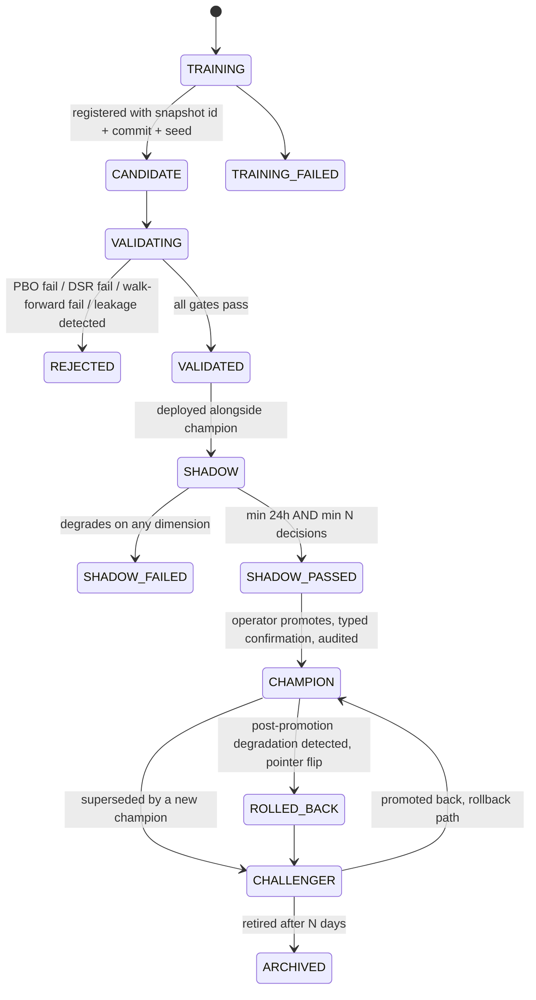

# 20 — Model Registry

**Diagram:** `20_Model_Registry.excalidraw`
**Phase:** 11 — Architecture Completion (4 of 5)
**C4 Level:** L3 — Component
**Depends on:** `07_ML_RL_Model_Layer.md`, `review/R07_State_Machines.md` §6 (SM-5), `review/R19_Missing_Components.md` §8-9
**Container:** C12 (Model Training), C13 (Model Inference), C14 (Model Monitor), C18 (Prompt & Policy Registry) — `generated/16_Container_Model_v2.md`
**Status:** Draft. Consolidates page 07's MLflow reference, `review/R07_State_Machines.md` §6 (the canonical lifecycle, unmodified here), and `review/R19_Missing_Components.md` §8-9 into one governed subsystem.
**Bounded context:** BC4 Market Intelligence (models), BC5 Deliberation (prompts and desk weights) — one registry, two owning contexts, by artefact kind (see §1)

---

## Purpose

Every versioned, learned artefact in the platform — a supervised model, an RL policy, a desk prompt, a desk weight, a Portfolio Construction ranking weight — follows **one lifecycle state machine** (`review/R07_State_Machines.md` §6, SM-5, unmodified and canonical here) so that "what was actually in force at 14:30 on a Tuesday three months ago" is always a resolvable query, never a reconstruction from memory. This page is where that promise becomes a concrete service: what it stores, who may promote what, and what happens automatically when a champion degrades.

## 1. One lifecycle, two owning contexts, three artefact kinds

`review/R19_Missing_Components.md` §8 describes a "Prompt & Policy Registry" as though it might be a separate system from the MLflow-backed model registry named in page 07. It is not, and stating that plainly is this page's first job: **there is one registry service, resolving artefacts of three kinds through the identical `resolve(artefact_kind, slot, as_of)` interface and the identical SM-5 state machine.** The kinds differ in who owns promotion and what "trained" means for each; the machinery is shared.

| Artefact kind | Owning context | What "TRAINING" means | What "CHAMPION" means |
|---|---|---|---|
| Supervised model | BC4 Market Intelligence | Fit against Feature Store + Labels | Actively served by the inference API |
| RL policy | BC4 Market Intelligence | Trained against the transaction-cost-aware simulator | Actively served as a sizing hint |
| Desk prompt | BC5 Deliberation | Authored/edited, not trained | Actively used by a desk's LLM call |
| Desk weight / ranking weight | BC5 Deliberation, BC12 Portfolio Construction | Proposed by Learning (BC9), PBO/DSR-evaluated | Actively used in the Consensus Engine (page 08) or PCE's ranking function (page 18) |

**Why this matters enough to state explicitly:** page 08's mandatory-shadow-run rule for prompt and weight changes and page 07's PBO/DSR gate for model changes are, under this consolidation, **the same enforcement mechanism applied to different artefact kinds**, not two mechanisms that happen to agree. A future implementer who builds two registries because the ADD's language suggested two systems has built a mechanism that can drift; one registry cannot.

## Responsibilities

- Version every artefact of every kind with `{version, hash, effective_from, effective_to, model_pin, eval_scores}` (per R19 §8's design, generalised across kinds).
- Enforce SM-5 without exception: nothing reaches `CHAMPION` without passing through `VALIDATING -> SHADOW -> SHADOW_PASSED` first.
- Resolve `resolve(artefact_kind, slot, as_of)` point-in-time correctly, so replay never sees today's artefact for a decision made in the past (closes the look-ahead vector R19 §8 names: replaying a decision with today's tuned prompts).
- Run the continuous Model Monitor (R19 §9) against every `CHAMPION`, independent of the weekly Learning cycle, and drive the degradation ladder automatically.
- Hold the audit trail of every promotion, rollback, and shadow evaluation with the same durability as the Decision Record Store, because a promotion decision is itself a decision.

## Lifecycle (SM-5, canonical in `review/R07_State_Machines.md` §6)

This page does not restate the guards, dwell times, or illegal-transition assertions — `review/R07_State_Machines.md` §6 is the authoritative transition table and stays that way. What this page adds is the **governance wrapped around each transition**.

## 2. Governance per transition

| Transition | Gate | Approver |
|---|---|---|
| `TRAINING -> CANDIDATE` | Registered with `{snapshot_id, commit, seed}` — no anonymous artefacts (R08 point-in-time discipline) | Automatic, CI-enforced |
| `CANDIDATE -> VALIDATED` | PBO, Deflated Sharpe, walk-forward, leakage check — for models; schema and citation-compliance check — for prompts (a prompt that induces a desk to emit a bare number instead of a citation fails here, per ADR-0013) | Automatic, hard gate, no override |
| `VALIDATED -> SHADOW` | Deployed alongside the current champion; zero live capital impact | Automatic |
| `SHADOW -> SHADOW_PASSED` | Minimum 24h **and** minimum N decisions, no degradation on any monitored dimension | Automatic |
| `SHADOW_PASSED -> CHAMPION` | **Typed confirmation, audited, human.** For a Tier-0 model (R11 §6 criticality) or any desk prompt/weight, this additionally requires the Risk approval gate below | Operator, plus Risk for Tier 0 |
| `CHAMPION -> ROLLED_BACK` | Any single trigger on the degradation ladder (§3) | Automatic, no human latency permitted |
| `CHALLENGER -> CHAMPION` (rollback promotion) | Same as forward promotion, expedited | Operator |

**The Risk approval gate** (new in this page, not present in R19 §8): promoting a Tier-0 artefact — any model or prompt whose failure would leave a desk or engine with no fallback — requires a second, distinct sign-off from whatever currently holds the Risk Authorisation role, separate from the operator's promotion confirmation. In the solo-operator setting (ADR-0009) this is a second, separately-timestamped confirmation with a mandatory cooling period, not a second person — the same asymmetric-friction pattern R15 §7 applies to loosening a risk limit, applied here to promoting a Tier-0 artefact.

## 3. Continuous monitoring and the degradation ladder

Owned by the Model Monitor (C14, R19 §9), running continuously against every `CHAMPION`, independent of BC9's weekly cycle — page 07's weekly-detection gap is what this closes.

| Signal | Action |
|---|---|
| Prediction distribution shift (PSI > 0.2 vs training) | Flag in the evidence graph as reduced reliability (page 17's `reliability` factor) |
| Live hit rate below backtest CI lower bound over N predictions | Weight halved |
| Two consecutive degraded periods | `CHAMPION -> ROLLED_BACK`, automatic, `CHALLENGER` restored |
| Unavailable or non-convergent beyond `max_staleness` | Evidence node marked critically stale, which blocks proposals structurally (page 17, invariant 4) |
| **Multiple slots degrade simultaneously** | **Kill switch, platform scope.** Correlated degradation means the regime changed in a way nothing currently registered represents (R11 §6) |

This ladder is identical for a model, a prompt, and a desk/ranking weight — the artefact kind changes what "degraded" is measured against, never whether the ladder applies.

## Inputs

Feature Store + Labels (BC3, for model training), the transaction-cost-aware simulator (page 07, for RL training), Learning's proposed prompt/weight revisions (BC9, page 12), live inference/desk-call outcomes (for monitoring).

## Outputs

`resolve(artefact_kind, slot, as_of) -> Artefact` for every consumer: the ML/RL inference API (page 07), the Committee's desk prompts (page 08), the Consensus Engine's desk weights (page 08), and PCE's ranking weights (page 18).

## Dependencies

BC3 Feature Store, the market simulator (page 07), BC9 Learning (source of proposed revisions), BC11 Identity & Governance (approval workflow, audit).

## Owns (exclusive)

The artefact version table, the SM-5 state for every artefact instance, the shadow-comparison metrics store, and the promotion/rollback audit log. No context other than this registry may flip an artefact's state.

## Interfaces

| Call | Direction | Contract |
|---|---|---|
| `resolve(artefact_kind, slot, as_of) -> Artefact` | Any consumer, synchronous | Point-in-time correct; never returns an artefact whose `effective_from` is after `as_of` |
| `register(artefact, provenance) -> ArtefactId` | Training/authoring pipeline | Requires `{snapshot_id, commit, seed}` for models; requires a diff and rationale for prompts |
| `promote(artefact_id) -> PromotionRecord` | Operator (+ Risk for Tier 0) | Typed confirmation, blocked unless `SHADOW_PASSED` |
| `rollback(slot) -> RollbackRecord` | Automatic (Model Monitor) or operator | Immediate, no confirmation required to roll back — asymmetric friction, matching R15 §3's stopping-is-easier-than-starting principle |

## Events Published

`model.trained`, `model.promoted`, `model.rolled_back`, `model.shadow_started`, `model.shadow_failed`, `model.drift_detected` — generalised across artefact kinds per §1 (`generated/15_Event_Catalog_v2.md` carries the full subject list).

## Events Consumed

`feature.updated`, `feature.backfilled` (training triggers), Learning's validated proposals (BC9), live decision outcomes (for the Model Monitor).

## Invariants

1. No artefact reaches `CHAMPION` without passing `VALIDATING -> SHADOW -> SHADOW_PASSED` in order. There is no fast path, including for a hotfix — a hotfix that skips shadow is exactly the failure mode this machine exists to prevent.
2. `resolve(..., as_of)` is point-in-time correct by construction: it is a query with an `as_of` filter, never a pointer dereference to "current." This is what makes replaying a three-month-old decision immune to today's prompt tuning (R19 §8's core finding).
3. A rollback requires no promotion-grade approval. Only forward promotion does. (Asymmetric friction, ADR-consistent with R15 §3 and R11 §5.)
4. Correlated degradation across slots is a platform-scope kill-switch trigger, never a per-slot decision left to the Model Monitor's discretion.

## Failure Modes

- **Shadow comparison gaming** — a challenger's shadow metrics look favourable because the comparison window happened to avoid the champion's known weak regime, not because the challenger is actually better.
- **Prompt/weight registry treated as lower-stakes than model registry** — an operator promotes a prompt change without shadow because "it's just wording," reintroducing exactly the contamination R19 §8 identifies.
- **Monitor blind spot** — a new degradation signature not covered by the existing PSI/hit-rate/calibration checks degrades a champion undetected between the automatic ladder's trigger conditions.

## Degraded Mode

| Condition | Behaviour |
|---|---|
| Registry unreachable | `resolve()` calls fail closed: BC4 serves its last successfully resolved artefact marked stale (page 17's staleness propagation), never a guess; BC5/BC12 abstain the affected desk/weight rather than substituting a default |
| Model Monitor down | Champions continue serving, but with monitoring blind — this is itself a Tier-0 degraded condition that pages the operator; the weekly BC9 cycle remains a backstop, not a substitute |
| Training pipeline down | No new candidates are produced; existing champions are unaffected |

## Recovery Strategy

Every promotion and rollback is recorded with the same append-only, hash-chained durability as the Decision Record Store (`review/R19_Missing_Components.md` §7) — a promotion decision is a decision, and the audit test is identical: if the observability stack were deleted, the record of which artefact was in force at any past instant must still be reconstructable. Shadow-comparison gaming is mitigated by a minimum evaluation window that spans at least one full regime cycle where feasible, and by requiring the shadow window to include, not exclude, the champion's known weak conditions (a comparison window is not selectable by the artefact under test).

## Latency Budget / SLO

- `resolve()`: **< 10ms p99**, cached, changes only at promotion events.
- Model inference itself: **< 200ms p99** (page 07, unchanged).
- Promotion workflow: not latency-sensitive by design — a promotion that must happen quickly to be safe is a promotion that should not happen.

## Security Boundary

CORE zone. `promote()` and `rollback()` are privileged operations under BC11's RBAC (R15 §3): `promote()` requires the `operator` role with MFA and, for Tier 0, the additional Risk sign-off; `rollback()` is callable by the automated Model Monitor with no human role required, by design. No `anthropic` or `mlflow` vendor type crosses this boundary uninstantiated — the registry's public interface is the domain-typed `Artefact`, matching ACL-3's discipline.

## Technology

MLflow as the underlying experiment-tracking and versioning store (page 07, unchanged), wrapped by this page's `resolve`/`promote`/`rollback` domain interface so that an MLflow API detail never leaks into BC4 or BC5 application code — the same "no vendor type outside the adapter" rule already applied to the broker and the LLM Gateway.

## Future Expansion

- Automated shadow-window regime coverage check (reject a shadow evaluation whose window did not include at least one adverse-regime day) once enough regime history exists to make the check meaningful.
- Ensemble slots (multiple simultaneous champions blended, per page 07's Future Expansion note) — the registry's `slot` concept already accommodates this as a multi-artefact slot without a schema change.

---

## Related

- `07_ML_RL_Model_Layer.md` — the source page this consolidates
- `review/R07_State_Machines.md` §6 — the canonical, unmodified SM-5 transition table
- `review/R19_Missing_Components.md` §8-9 — Prompt & Policy Registry and Model Monitor, unified here
- `review/R11_Risk_Architecture.md` §6 — the model risk register and degradation ladder this page operationalises
- `decisions/0030-prompts-are-versioned-point-in-time-artefacts.md`
- `08_AI_Investment_Committee.md`, `18_Portfolio_Construction.md` — the two consumers of desk/ranking weights
- Previous: `19_Bounded_Context_Map.md`
- Next: `21_Security_Architecture.md`
