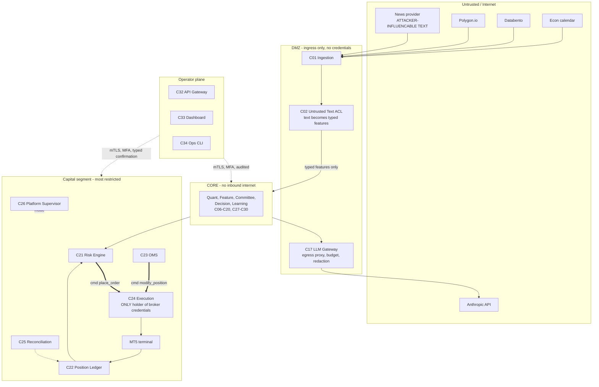

# 16v2 — C4 Container Model (regenerated)

**Supersedes as the working contract:** `../16_C4_Container_Diagram.md`
**Source page status:** unmodified, preserved as the original design-time snapshot
**Delta against:** `../16_C4_Container_Diagram.md` (15 containers), corrected per `../review/R02_C4_Expansion.md` and `../review/R19_Missing_Components.md`
**C4 Level:** L2 Container, with the L1 trust-boundary overlay page 00 does not have
**Governed by:** ADR-0040 (generated artefacts), ADR-0008 (Compose over Kubernetes), ADR-0010 (eleven bounded contexts)
**Status:** Generated artefact v2, design-time. Becomes machine-generated from deployment manifests once they exist

---

## Why this file exists rather than an edit to page 16

Page 16 predicts its own decay in two places. Its Failure Modes section names "diagram/reality drift" and "missing containers", and its Future Expansion section proposes generating the container list from deployment manifests instead of hand-maintaining it. Both predictions were correct, and the second one is now ADR-0040.

This file is the regeneration. It is a sibling rather than a replacement because the overlay rule holds: pages 00-16 are not modified.

**Page 16 lists 15 containers. The real count against page 16 alone is 39.** Twenty-four are new or split, and four of page 16's original fifteen are materially rescoped (11 EXISTS + 4 CHANGED + 6 SPLIT + 18 NEW = 39). That gap is the honest measure of the distance between the current document and an implementable container model, and it is the reason this page needed regenerating before any other.

**2026-08-04 addition:** `../18_Portfolio_Construction.md` (Phase 11, ADR-0043) adds a fortieth container, C40, entirely new — BC12 did not exist at the 2026-08-03 review pass, so it is additive to this file rather than a correction of it. See §3's Decision plane table.

---

## 1. What page 16 got right, and should be preserved

The regeneration keeps all of this. It is worth stating because a 15-to-39 expansion reads like a rejection, and it is not.

- **Technology named per container**, not just a box name. Most L2 diagrams skip this and become useless to the person who has to build it.
- **Two kinds of connection drawn separately**: bus versus critical path. Conflating "everything talks to the bus" with "this is the sequence that matters under latency pressure" is the standard way a container diagram hides the only thing an operator needs during an incident. Page 16 explicitly refuses to do that, and it was right to.
- **Correctly identified as a derived view**, not an independent design decision.
- **The single-page constraint.** An engineer seeing every deployable unit at once has value that survives the container count tripling, which is why §3 below stays one table.

The correction is not to the intent. It is that the list is incomplete, the relationships are undrawn, and the containers carry no criticality, no context ownership, and no deployment grouping.

---

## 2. Level 1 — trust boundaries

Page 00 names actors and external systems. It draws no trust boundary, so nothing in the ADD states which processes may hold broker credentials or where untrusted text is allowed to reach. Both are container-level facts, so they belong here.



Four rules follow, none of which are in the current ADD:

1. **C24 Execution is the only process holding broker credentials.** Nothing else can send an order even if fully compromised.
2. **No inbound internet reaches CORE or VAULT.** Data enters through DMZ adapters only.
3. **All LLM egress goes through C17.** No service calls Anthropic directly (ADR-0031).
4. **Untrusted text terminates at C02.** Prose never crosses into CORE (ADR-0032, closes B5).

Rule 4 is the structural closure of B5. The current design has a live path from a public news feed to a language model that allocates capital. It is not closed by prompt hardening; it is closed by the prose never arriving.

---

## 3. Level 2 — the 39 containers

**Status:** EXISTS in page 16 · **NEW** added by review · **SPLIT** carved out of an existing container · **CHANGED** materially rescoped.
**Tier:** 0 = failure threatens capital · 1 = failure degrades trading · 2 = failure is operational.
**MVS:** in the ten-component minimum viable subset for safe live trading (§6).

### Ingress and reference

| # | Container | Technology | Status | Context | Tier | Group | MVS |
|---|---|---|---|---|---|---|---|
| C01 | Market Data Ingestion | Python asyncio | EXISTS | Market Data | 1 | Edge | |
| C02 | **Untrusted Text ACL** | Python + constrained extraction model | **NEW** | Market Data | 1 | Edge | ● |
| C03 | Data Quality Engine | Python | EXISTS | Market Data | 1 | Edge | |
| C04 | **Instrument & Reference Data Master** | Python + Postgres | **NEW** | Reference Data (BC2) | **0** | Data | ● |
| C05 | **Clock** | Library, not a service | **NEW** | Shared kernel | **0** | (linked in) | ● |

C04 looks like configuration and is Tier 0. Position sizing is arithmetically impossible without contract size, tick value, lot step, and margin, and none of those appear anywhere in pages 00-16. C05 is a library rather than a container, listed here because it is injected into every other one and its absence silently breaks replay determinism.

### Data plane

| # | Container | Technology | Status | Context | Tier | Group | MVS |
|---|---|---|---|---|---|---|---|
| C06 | Feature Materialiser (offline) | Python + Iceberg writer | **SPLIT** from p03 | Feature Store | 1 | Data | |
| C07 | Feature Serving (online) | Python + Redis | **SPLIT** from p03 | Feature Store | 1 | Data | |
| C08 | Lakehouse | Iceberg on MinIO, DuckDB embedded per consumer | **CHANGED** from p03/p13 | Feature Store | 1 | Data | |

The C06/C07 split is what makes the write path and the read path separately ownable, which is the precondition for train/serve skew being detectable. C08's change closes B6: page 03 and page 13 use DuckDB as a shared multi-writer database, which it is not. DuckDB stays, embedded per consumer, reading Iceberg (ADR-0003).

### Quant plane

| # | Container | Technology | Status | Context | Tier | Group | MVS |
|---|---|---|---|---|---|---|---|
| C09 | Regime Engine | Python `arch`, `statsmodels`, `hmmlearn` | EXISTS | Quant Research | 1 | Quant | |
| C10 | Volatility Engine | Python `arch`, `scipy` | EXISTS | Quant Research | 1 | Quant | |
| C11 | Market Structure Engine | Python `smartmoneyconcepts` | EXISTS | Quant Research | 1 | Quant | |
| C12 | Model Training Service | Python, MLflow | **SPLIT** from p07 | Model Lifecycle | 2 | Quant | |
| C13 | Model Inference Service | Python, MLflow artefacts | **SPLIT** from p07 | Model Lifecycle | 1 | Quant | |
| C14 | **Model Monitor** | Python | **NEW** | Model Lifecycle | 1 | Quant | |

C12/C13 split so that training and inference do not share writable state. C14 exists because page 07 names model staleness as a failure mode and assigns detection to page 12's weekly cycle, which means up to seven days of decisions made on a model already known in retrospect to be failing.

### Decision plane

| # | Container | Technology | Status | Context | Tier | Group | MVS |
|---|---|---|---|---|---|---|---|
| C15 | Evidence Graph Service | Python, networkx now, graph store later | **SPLIT** from p09 | Deliberation (BC5) | 1 | Decision | |
| C16 | Committee Service | Python orchestrating desk calls | EXISTS | Deliberation (BC5) | 1 | Decision | |
| C17 | **LLM Gateway** | Python proxy, FastAPI + Redis + Postgres | **NEW** | Deliberation ACL | 1 | Decision | ● |
| C18 | **Prompt & Policy Registry** | Postgres + object storage | **NEW** | Deliberation (BC5) | 1 | Decision | |
| C19 | Decision Saga Service | Python + Postgres | **CHANGED** from p09 | Deliberation (BC5) | 1 | Decision | |
| C20 | **Decision Record Store** | Postgres + MinIO, append-only, hash-chained | **NEW** | Audit | **0** | Decision | ● |
| C40 | **Portfolio Construction Engine** | Python + Redis + Postgres | **NEW (Phase 11)** | Portfolio Construction (BC12) | 1 | Decision | |

C19's change is the verb: it **proposes**, it does not approve (ADR-0011, closes B4). C20 is Tier 0 not because trading stops without it but because an audit trail cannot be reconstructed retroactively: the moment it is missing is the moment it is permanently missing. It is separate from C31 Observability by design (ADR-0039, closes D9), because observability is lossy, downsampled, short-retention, and mutable, and an audit record must be none of those.

### Capital plane

| # | Container | Technology | Status | Context | Tier | Group | MVS |
|---|---|---|---|---|---|---|---|
| C21 | Risk Engine | Python + Redis + Postgres | **CHANGED** | Risk Authorisation (BC6) | **0** | Capital | |
| C22 | **Account & Position Ledger** | Python, event-sourced, Postgres | **NEW** | Portfolio (BC7) | **0** | Capital | ● |
| C23 | **Order & Position Lifecycle Manager (OMS)** | Python + Postgres | **NEW** | Order Execution (BC8) | **0** | Capital | ● |
| C24 | Execution Service | Python + MT5 bridge | **CHANGED** | Order Execution (BC8) | **0** | **Bridge (Windows)** | |
| C25 | **Reconciliation Service** | Python | **NEW** | Portfolio / Execution | **0** | Capital | ● |
| C26 | **Platform Supervisor** | Python | **NEW** | Platform Ops (BC10) | **0** | Capital | ● |

Every container in this plane is Tier 0 and four of six are new. That concentration is the finding: page 16's capital plane is two containers (Risk, Execution) doing the work of six.

C21's change is dual-mode (`PREVIEW` / `DECIDE`), signed single-use approval tokens, versioned limit sets, a three-tier fail-closed kill switch, and rules as an ordered chain of individually versioned units. C24's change is leader election (a standby without a lease is duplicate orders), credential isolation, an `UNKNOWN` order state, and three adapters from day one.

C23 is the largest single functional gap in the ADD. Trace pages 00-16 end to end: trigger, evidence, committee, decision, risk, order, fill, journal. It ends at the fill. Nothing owns moving a stop, trailing, partial profit, time-based exits, structure-invalidation exits, a position modified by hand at the terminal, or a position that exists at the broker and not in the platform.

### Learning and operations

| # | Container | Technology | Status | Context | Tier | Group | MVS |
|---|---|---|---|---|---|---|---|
| C27 | Continuous Learning Service | Python, pandas, MLflow | EXISTS | Learning | 2 | Decision | |
| C28 | **Simulation & Replay Harness** | Python | **NEW** | Learning | 2 live / **0 research** | Quant | ● |
| C29 | **TCA Service** | Python | **NEW** | Order Execution (BC8) | 2 | Capital | |
| C30 | **Cost Governor** | Python + Redis | **NEW** | Platform Ops (BC10) | 2 | Decision | |
| C31 | Observability Stack | Prometheus, Grafana, Loki, Tempo | EXISTS, expanded | Platform Ops (BC10) | 1 | Platform | |
| C32 | **API Gateway / BFF** | FastAPI | **NEW** | Platform Ops (BC10) | 2 | Platform | |
| C33 | Dashboard | Next.js | EXISTS | Platform Ops (BC10) | 2 | Platform | |
| C34 | Ops CLI | Python typer | EXISTS | Platform Ops (BC10) | 1 | Platform | |
| C35 | Scheduler | Python + NATS | **SPLIT** from p00 | Platform Ops (BC10) | 1 | Platform | |
| C36 | Event Bus | NATS JetStream | EXISTS | Platform Ops (BC10) | **0** | Platform | |
| C37 | **Schema Registry** | Git + small read service | **NEW** | Platform Ops (BC10) | 1 | Platform | |
| C38 | **Secrets Manager** | Vault or SOPS+age | **NEW** | Identity | **0** | Platform | |
| C39 | **Identity Provider** | OIDC | **NEW** | Identity | 1 | Platform | |

C38 and C39 are absent from all 17 source pages. The platform holds live broker credentials and has no management story for them. C28 is the only container whose tier depends on the question asked: nothing stops trading if it is down, and without it no claim about look-ahead bias, determinism, or backtest validity is testable at all.

### Counts

| | Page 16 | This file (2026-08-03) | This file + Phase 11 (2026-08-04) |
|---|---|---|---|
| Containers | 15 | **39** | **40** |
| New | — | 16 | 17 (C40 added) |
| Split from an existing container | — | 5 | 5 |
| Materially changed | — | 4 | 4 |
| Carried unchanged | 15 | 14 (C33 Dashboard and C34 CLI were one row in page 16) | 14 |
| Tier 0 | not stated | 11 | 11 (C40 is Tier 1 — its failure mode is fail-closed non-admission, not a capital threat) |
| With a deployment group | not stated | 39 | 40 |
| With an owning bounded context | not stated | 39 | 40 |

---

## 4. Level 2 — relationships

Page 16 lists containers without drawing how they connect. Solid double arrows are **commands** (exactly-one-consumer, ack required). Dotted lines are **synchronous queries** with the timeout shown. Everything else is a pub/sub event.

```mermaid
graph LR
    subgraph Ingress
        C01[C01 Ingestion]
        C02[C02 Text ACL]
        C03[C03 Quality]
        C04[C04 Instrument Master]
    end
    subgraph Data
        C06[C06 Feature Materialiser]
        C07[C07 Feature Serving]
        C08[(C08 Lakehouse<br/>Iceberg + MinIO)]
    end
    subgraph Quant
        C09[C09 Regime]
        C10[C10 Volatility]
        C11[C11 Structure]
        C13[C13 Model Inference]
        C14[C14 Model Monitor]
    end
    subgraph Decision
        C15[C15 Evidence Graph]
        C16[C16 Committee]
        C17[C17 LLM Gateway]
        C18[C18 Prompt Registry]
        C19[C19 Decision Saga]
        C20[(C20 Decision Records)]
    end
    subgraph Capital
        C21[C21 Risk Engine]
        C22[(C22 Position Ledger)]
        C23[C23 OMS]
        C24[C24 Execution]
        C25[C25 Reconciliation]
        C26[C26 Supervisor]
    end

    C01 -->|evt bar.ingested| C03
    C01 --> C02
    C02 -->|typed features only| C06
    C03 -->|evt dataset.scored| C06
    C06 --> C08
    C08 --> C07
    C07 --> C09 & C10 & C11 & C13
    C04 -.specs 10ms.-> C06 & C21 & C24 & C23
    C09 & C10 & C11 & C13 -->|evt published| C15
    C14 -->|evt drift.detected| C21
    C15 -->|evidence snapshot| C16
    C16 <-->|desk calls| C17
    C18 -.resolve prompt as_of.-> C17
    C16 -->|evt recommendation.issued| C19
    C19 -.qry risk.preview 50ms.-> C21
    C19 -->|evt proposal.issued| C21
    C19 --> C20
    C17 --> C20
    C22 -.qry snapshot 30ms.-> C21
    C21 ==>|cmd place_order| C24
    C24 -->|evt order.filled| C22
    C24 -->|evt order.filled| C23
    C23 ==>|cmd modify_position| C24
    C23 -.authorise_exit 100ms.-> C21
    C25 -.continuous.-> C22
    C25 -.broker truth.-> C24
    C25 -->|evt break_detected| C21
    C26 -.mode 5ms.-> C21 & C23 & C24
```

Three things this diagram makes visible that page 16 cannot:

- **The order path is a command, not an event.** The one bold arrow from C21 to C24 carries exactly-once semantics with broker-side dedup on a deterministic `client_order_id`. In page 16 this is a bus subscription, which under at-least-once redelivery is a duplicate live order (B1).
- **The B3 cycle is gone.** Committee desks read an evidence snapshot from C15, not live state from C21 and C24. The dependency graph is acyclic (ADR-0012).
- **C23's exit path goes through C21.** Exits are authorised like entries, with a distinct `EXIT` intent that bypasses entry-blocking rules. A kill switch must never trap the platform in a position it cannot exit (ADR-0019, no tripwire, fixed point).

---

## 5. Deployment grouping

Absent from page 16 entirely, and it is the section that scopes the platform's single largest operational risk.

| Group | Containers | Host | Rationale |
|---|---|---|---|
| **Edge** | C01, C02, C03 | Linux, cloud | The only group with inbound internet |
| **Data** | C04, C06, C07, C08 | Linux, cloud, high IO | Storage locality |
| **Quant** | C09-C14, C28 | Linux, cloud, CPU/GPU | Scales horizontally by symbol |
| **Decision** | C15-C20, C27, C30, **C40** | Linux, cloud | Bursty, cheap to scale. C40 (Phase 11) reads C21 and C22 as published read models only — never a live call — so it deploys and scales independently of the Capital group despite sitting immediately upstream of it in the data flow |
| **Capital** | C21, C22, C23, C25, C26, C29 | Linux, cloud, **isolated network segment, same failure domain** | Risk-to-Ledger latency is on the hot path |
| **Bridge** | C24 + MT5 terminal | **Windows VPS, active/standby with lease** | MT5's Windows-only constraint |
| **Platform** | C31-C39 | Linux, cloud | Shared services |

**Only C24 and the MT5 terminal are Windows-bound.** Page 14 identifies the single VPS as a failure risk; this scopes it precisely. Everything the current design implicitly ties to that box can and should move off it, which turns "the platform runs on one Windows VPS" into "one adapter runs on one Windows VPS."

The standby needs the leader lease to exist **before** the standby does. Two live bridges without a lease is not redundancy, it is duplicate orders.

---

## 6. Minimum viable subset

The smallest set that permits safe live trading on one symbol. Everything else in §3 improves the platform; these ten are the difference between a system that can trade safely and one that can merely trade.

| Order | Container | Why it cannot be deferred past the first live order |
|---|---|---|
| 1 | **C05 Clock** | One hour of work, permanent protection of replay determinism. Do it first because retrofitting it means auditing every call site |
| 2 | **C04 Instrument Master** | Sizing is arithmetically impossible without it |
| 3 | **C22 Position Ledger** | No authoritative book otherwise. Six components each holding their own idea of a position is the current design |
| 4 | **C26 Platform Supervisor** | Modes must be enforced, not described. "Degraded" appears on four pages as a word with no mechanism |
| 5 | **C23 OMS** | Positions must have an owner after the fill |
| 6 | **C25 Reconciliation** | Divergence from broker truth must be detected, not discovered as a loss |
| 7 | **C20 Decision Record Store** | An audit trail cannot be reconstructed retroactively |
| 8 | **C17 LLM Gateway** | Cost control and replay determinism, and the only place the vendor SDK is imported |
| 9 | **C28 Simulation Harness** | Without it, nothing has been validated. It is what makes the PBO/DSR gates mean anything about the system rather than about a model |
| 10 | **C02 Text ACL** | Only if the news feed is connected. **If it is not connected, defer the ACL and do not connect the feed** |

The ordering is dependency-driven, not priority-driven. C05 first because everything else embeds it. C04 before C22 because P&L needs contract specs. C26 before C23 because the OMS gates on mode.

Item 10 is the cheapest safety decision available: not connecting a feed costs nothing and closes B5 completely until the ACL exists.

---

## 7. What makes this file generated

Page 16's Future Expansion proposes generating the container list from deployment manifests. ADR-0040 promotes that from an idea to a requirement. Once `docker-compose.yml` and the service registry exist, this table is produced from them and drift becomes impossible rather than merely discouraged.

Until then this is hand-maintained and carries the same rot risk page 16 named. The mitigation is the new-service checklist: adding a container means adding a row here, in the same commit, alongside the Prometheus scrape target and the CODEOWNERS entry.

---

## 8. Related

- Source page, unmodified: `../16_C4_Container_Diagram.md`
- `15_Event_Catalog_v2.md` — the subjects that flow between these containers
- `../review/R02_C4_Expansion.md` — L1-L4 derivation, the six L4 contracts to freeze now
- `../review/R19_Missing_Components.md` — the case for each new container
- `../review/R05_Interface_Contracts.md` — full contracts for C04, C17, C21, C22, C23, C25, C26, C30
- `../review/R13_Infrastructure.md` — the Iceberg decision and the Windows constraint
- `../decisions/0040-schema-registry-is-the-wire-contract.md` — makes this file generated
- `../decisions/0016-oms-owns-order-and-position-lifecycle.md` — C23
- `../decisions/0011-risk-engine-sole-authorisation-authority.md` — C21, closes B4
- `../decisions/0012-portfolio-state-as-published-read-model.md` — C22, closes B3
