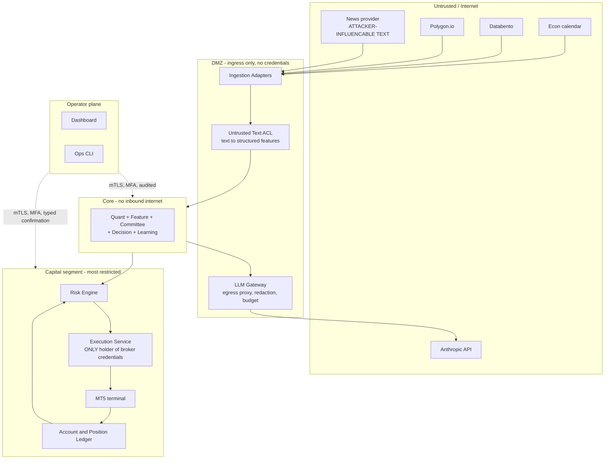
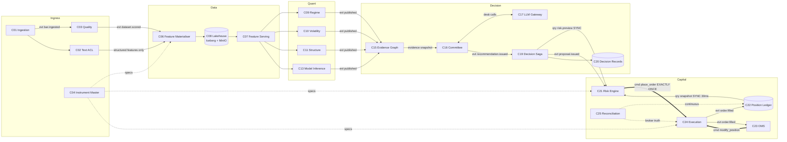
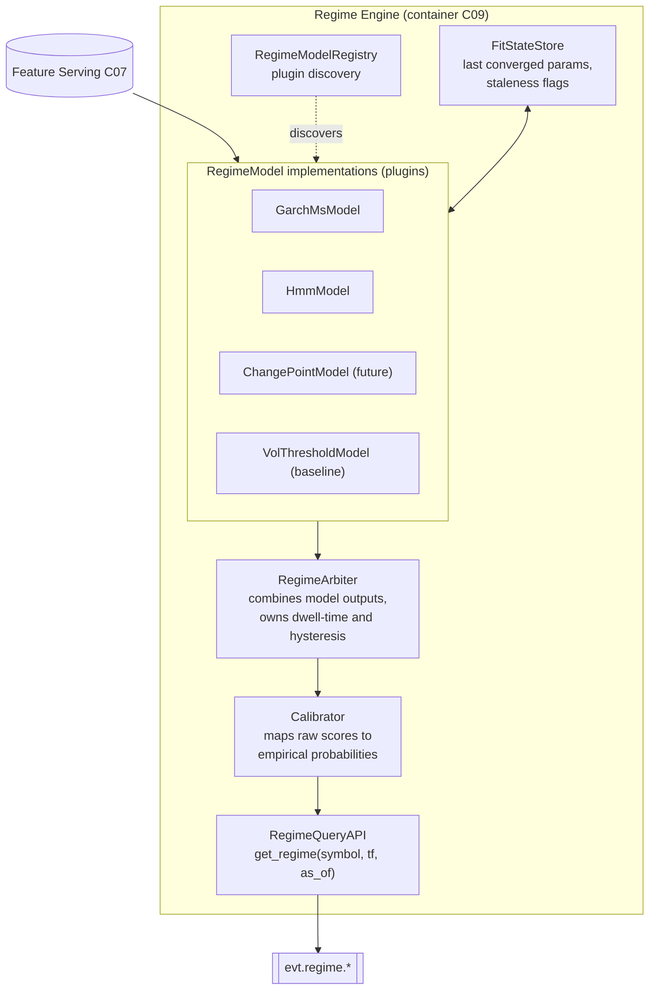
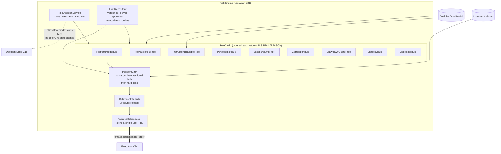
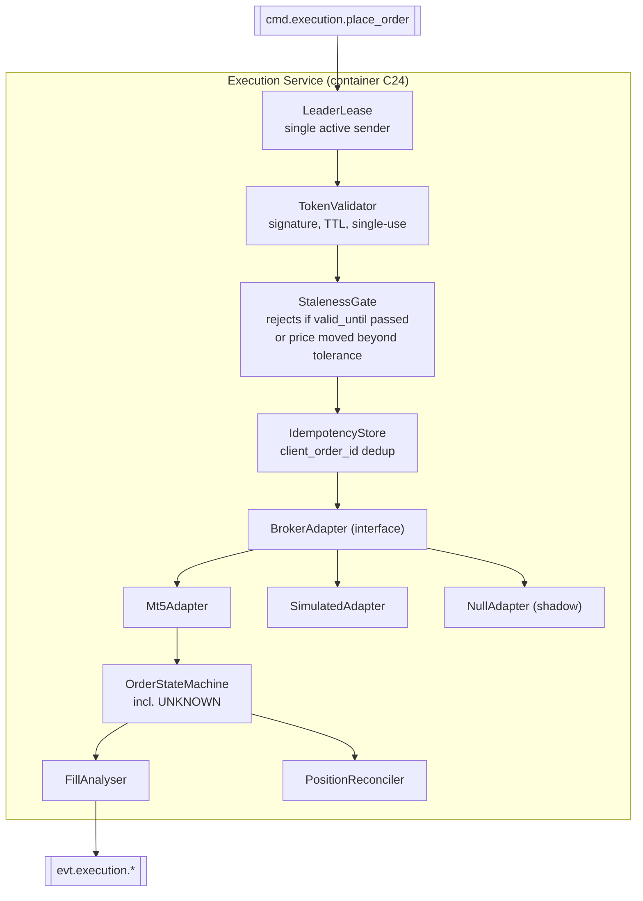

# R02 — C4 Architecture Expansion

**Deliverable:** 2
**Delta against:** `00_Master_Architecture.md` (L1), `16_C4_Container_Diagram.md` (L2), pages 01-12 (de facto L3)
**Status:** Review v1.0

---

## 1. Assessment of the current C4 coverage

| Level | Current state | Gap |
|---|---|---|
| **L1 System Context** | Page 00 is good. Actors and external systems are named. | Only one actor. No trust boundary drawn. External systems are not classified by criticality or by whether they are trusted. No "who can harm us" view. |
| **L2 Container** | Page 16 lists 15 containers with technology. | It is a *list*, not a diagram of relationships. No protocols, no synchronicity, no data stores as containers, no platform services, no deployment grouping. Missing 11 containers. |
| **L3 Component** | Pages 02-08, 10, 11 serve as de facto L3. Genuinely useful. | Uneven: some pages are pipelines (a flow, not components), some are tables. No component has a declared interface. No dependency direction stated. |
| **L4 Code** | Deferred, correctly, since no code exists. | Deferring L4 entirely was the wrong call for the *contract-bearing* components. L4 for an interface is writable before the implementation exists, and doing it now is what prevents the interface from being invented ad hoc during implementation. |

**Position:** L1 needs a trust-boundary overlay. L2 needs a real rebuild with the missing containers. L3 needs interface declarations, not just box names. L4 should be written now for six specific contracts, and only those.

---

## 2. Level 1 — System Context, corrected

### Actors

| Actor | Type | Interactions | Trust |
|---|---|---|---|
| **Operator** | Human, privileged | Monitor, override, halt, clear kill switch, approve deployments, approve risk-limit changes | Fully trusted, but every action is audited and some require typed confirmation |
| **Researcher** | Human, semi-privileged | Run backtests, train models, propose changes. **No production write access.** | Trusted in `dev`/`sim`, no authority in `prod` |
| **Auditor / future self** | Human, read-only | Query the Decision Record Store, reconstruct any historical decision | Read-only, cannot mutate |
| **Automated Scheduler** | System | Triggers cycles, jobs, reviews | Internal |

Page 00 has one actor. Separating Operator from Researcher is the difference between "the person who can lose money" and "the person who can propose an idea", and that split drives the RBAC model in R15. The Auditor role is what makes the audit trail real rather than incidental.

### External systems, classified

| System | Direction | Criticality | Trust | If it fails |
|---|---|---|---|---|
| MT5 terminal / broker | Bidirectional | **Tier 0** (capital) | Semi-trusted, its data is authoritative for position truth but its feed can be wrong | Trading halts for that account. Platform continues. |
| Databento | Inbound | Tier 1 | Trusted, paid, contractual | Fallback to Polygon for OHLCV. No tick fallback. Degrade. |
| Polygon.io | Inbound | Tier 1 | Trusted, paid | Fallback to Databento. Degrade. |
| News provider | Inbound | Tier 2 | **Untrusted content.** The transport is trusted, the *payload text* is attacker-influencable. | Macro Desk abstains. Not a halt condition. |
| Economic calendar | Inbound | Tier 1 for the News Guard blackout | Trusted, but its absence is dangerous, not benign | **Fail closed:** if the calendar is stale beyond N hours, the News Guard blocks all new entries rather than allowing them. Page 10 does not currently state this. |
| Anthropic API | Outbound | Tier 1 | Trusted vendor, non-deterministic output | Committee degrades to no-trade. Explicitly not "trade on quant signals alone". |
| Object storage / MinIO | Bidirectional | Tier 0 for research, Tier 2 for live | Internal | Live trading continues on cached reference data; research halts |

### Trust boundaries (absent from page 00, added)



Four rules that follow from this diagram and are not in the current ADD:

1. **The Execution Service is the only process holding broker credentials.** Nothing else in the platform can send an order even if compromised.
2. **No inbound internet reaches CORE or VAULT.** Data flows in through DMZ adapters only.
3. **All LLM egress goes through one gateway** that enforces budget, redaction, timeout, and retry policy. No service calls Anthropic directly.
4. **Untrusted text terminates at the ACL.** Prose never crosses into CORE.

---

## 3. Level 2 — Container view, rebuilt

### Containers, corrected and completed

Legend: **[EXISTS]** in page 16, **[NEW]** added by this review, **[SPLIT]** carved out of an existing container.

#### Ingress and reference

| # | Container | Tech | Status | Notes |
|---|---|---|---|---|
| C01 | Market Data Ingestion | Python asyncio | EXISTS | Split per-source adapters into a plugin interface (R03 §9) |
| C02 | Untrusted Text ACL | Python + a constrained extraction model | **NEW** | Closes B5 |
| C03 | Data Quality Engine | Python | EXISTS | |
| C04 | **Instrument & Reference Data Master** | Python + Postgres | **NEW** | Contract specs, sessions, holidays, tick/pip value, margin, swap. Blocking dependency for position sizing |
| C05 | **Clock Service** | Library, not a service | **NEW** | Wall clock in prod, simulation clock in sim. Injected everywhere. Makes replay deterministic |

#### Data plane

| # | Container | Tech | Status | Notes |
|---|---|---|---|---|
| C06 | Feature Materialiser (offline) | Python + Iceberg writer | **SPLIT** from page 03 | The only writer to feature tables |
| C07 | Feature Serving (online) | Python + Redis | **SPLIT** from page 03 | Low-latency read path. Separating write from read closes B6 and the train/serve skew risk |
| C08 | Lakehouse | Iceberg on MinIO, DuckDB embedded per consumer | **CHANGED** from page 03/13 | See R13 §3 |

#### Quant plane

| # | Container | Tech | Status |
|---|---|---|---|
| C09 | Regime Engine | Python `arch`, `statsmodels`, `hmmlearn` | EXISTS |
| C10 | Volatility Engine | Python `arch`, `scipy` | EXISTS |
| C11 | Market Structure Engine | Python `smartmoneyconcepts` | EXISTS |
| C12 | Model Training Service | Python, MLflow | **SPLIT** from page 07 |
| C13 | Model Inference Service | Python, MLflow-loaded artefacts | **SPLIT** from page 07 |
| C14 | **Model Monitor** | Python | **NEW** | Drift detection. Page 07 names model staleness as a failure mode and assigns detection to nobody concrete |

#### Decision plane

| # | Container | Tech | Status |
|---|---|---|---|
| C15 | Evidence Graph Service | Python, networkx now, graph store later | **SPLIT** from page 09 |
| C16 | Committee Service | Python orchestrating desk calls | EXISTS |
| C17 | **LLM Gateway** | Python (proxy) | **NEW** | Single egress point, budget, retry, caching, redaction, prompt-version resolution |
| C18 | **Prompt & Policy Registry** | Postgres + object storage | **NEW** | Point-in-time prompt versions. Without it, every Committee backtest is contaminated |
| C19 | Decision Saga Service | Python + Postgres | **RENAMED** from page 09 | Verb changed from approve to propose (B4) |
| C20 | **Decision Record Store** | Postgres + MinIO, append-only, hash-chained | **NEW** | Audit truth, separate from observability (D9) |

#### Capital plane

| # | Container | Tech | Status |
|---|---|---|---|
| C21 | Risk Engine | Python + Redis + Postgres | EXISTS. Now the sole approval authority, with `preview` and `decide` modes |
| C22 | **Account & Position Ledger** | Python, event-sourced, Postgres | **NEW** | Owns the book. Risk consumes a projection |
| C23 | **Order & Position Lifecycle Manager (OMS)** | Python + Postgres | **NEW** | The largest gap in the ADD |
| C24 | Execution Service | Python + MT5 bridge, Windows | EXISTS. Now leader-elected, credential-isolated |
| C25 | **Reconciliation Service** | Python | **NEW** | Continuous, with break reports |
| C26 | **Platform Supervisor** | Python | **NEW** | Owns the platform state machine (NORMAL/DEGRADED/HALTED/RECONCILING/MAINTENANCE) |

#### Learning and operations

| # | Container | Tech | Status |
|---|---|---|---|
| C27 | Continuous Learning Service | Python, pandas, MLflow | EXISTS |
| C28 | **Simulation & Replay Harness** | Python | **NEW** | Same decision code, simulated broker, deterministic clock |
| C29 | **TCA Service** | Python | **NEW** | Implementation shortfall, arrival-price slippage, spread capture |
| C30 | **Cost Governor** | Python + Redis | **NEW** | LLM and vendor spend per decision, admission control |
| C31 | Observability Stack | Prometheus, Grafana, Loki, Tempo | EXISTS, expanded (R12) |
| C32 | **API Gateway / BFF** | FastAPI | **NEW** | Page 00 says "API gateway" in one line and page 16 has no such container |
| C33 | Dashboard | Next.js | EXISTS |
| C34 | Ops CLI | Python typer | EXISTS |
| C35 | Scheduler | Python + NATS | **SPLIT** from page 00's Orchestration Layer |
| C36 | Event Bus | NATS JetStream | EXISTS |
| C37 | **Schema Registry** | Git + a small read service | **NEW** | R01 §7 |
| C38 | **Secrets Manager** | Vault or SOPS+age | **NEW** | Absent from all 17 pages |
| C39 | **Identity Provider** | OIDC | **NEW** | Absent from all 17 pages |

**Page 16 lists 15 containers. The real count is 39.** Twenty-one are new or split. That gap is the honest measure of the distance between the current document and an implementable container model.

### L2 relationship diagram (critical path plus platform)



Bold double arrows are commands (exactly-once semantics, R01 §2). Dotted lines are synchronous queries. Everything else is a pub/sub event.

### Deployment grouping (which containers colocate)

| Group | Containers | Host | Rationale |
|---|---|---|---|
| **Edge** | C01, C02, C03 | Linux, cloud | Only group with inbound internet |
| **Data** | C06, C07, C08 | Linux, cloud, high IO | Storage locality |
| **Quant** | C09-C14, C28 | Linux, cloud, CPU/GPU | Scales horizontally by symbol |
| **Decision** | C15-C20, C30 | Linux, cloud | Bursty, cheap to scale |
| **Capital** | C21, C22, C23, C25, C26 | Linux, cloud, **same failure domain as each other, isolated network segment** | Latency between Risk and Ledger is on the hot path |
| **Bridge** | C24, MT5 terminal | **Windows VPS, active/standby with lease** | MT5's Windows-only constraint. Single point of failure until standby lands |
| **Platform** | C31, C32, C36-C39 | Linux, cloud | Shared services |

Page 14's single-VPS risk is now scoped precisely: only C24 and the MT5 terminal are Windows-bound. Everything else the current design implicitly ties to that box can and should move off it.

---

## 4. Level 3 — Component views

The existing pages 02-11 are decent L3 content. The correction is that each L3 component must declare an **interface**, a **direction of dependency**, and whether it is **replaceable**. Below are the three components where getting L3 right now saves the most rework. Others follow the same pattern in R05.

### L3.1 — Regime Engine (page 04), restructured for extensibility

Page 04 hardcodes a pipeline: GARCH → Markov Switching → HMM → Transition Matrix. Two problems. First, Markov Switching models and HMMs are the same model family; stacking them is not obviously meaningful and the page does not justify it. Second, and architecturally more important, the pipeline is baked into the component, so adding a competing regime model (a simple volatility-threshold classifier, a change-point detector, a clustering approach) means editing the engine rather than registering a plugin.



Key L3 decisions this makes explicit and the current page does not:

- **`RegimeModel` is an interface**, not a pipeline stage. `fit(window) -> FitResult`, `predict(as_of) -> RegimeEstimate`, `is_converged() -> bool`. Every model, including the trivial baseline, implements it.
- **A trivial baseline model is mandatory.** If the GARCH/HMM stack cannot beat a volatility-threshold classifier out of sample, that is a finding, and you cannot discover it without the baseline being a first-class plugin.
- **The Arbiter owns dwell time and hysteresis**, not the models. Page 04 puts the whipsaw damping inside the engine generally; making it the Arbiter's job means it applies uniformly across any future model.
- **Calibration is separate.** A raw HMM posterior is not a calibrated probability. R10 §6 develops this.
- **Fit state is persisted**, so page 04's "return the last converged estimate with `stale: true`" is backed by a real store, not process memory that a restart erases.

The identical pattern applies to the Volatility Engine (`VolModel` interface, `VolArbiter`) and, importantly, to the Market Structure Engine, where `smartmoneyconcepts` becomes one `StructureDetector` implementation behind an interface rather than a hard dependency.

### L3.2 — Risk Engine (page 10), with the dual-mode correction



Three structural points:

- **One rule chain, two modes.** `PREVIEW` runs every rule and returns the verdict without issuing a token or mutating state. `DECIDE` runs the same chain and, on pass, issues a signed approval token. This is how B4 is closed without duplicating logic.
- **The approval token is the actual authorisation artefact.** Signed, single-use, carries `decision_id`, approved size, SL, TP, `valid_until`, and a hash of the limit-set version used. Execution rejects any command without a valid unexpired token. This makes "no trade reaches Execution without passing Risk" a cryptographic property rather than a wiring convention.
- **Limits are a versioned repository**, not config-file constants. Changing a limit is a four-eyes, audited, versioned operation (R15 §5). The token embeds which version approved it, so a post-mortem can prove which limits were in force.

### L3.3 — Execution Service (page 11), with the missing states



What is new versus page 11:

- **LeaderLease.** Page 14 acknowledges the single VPS as a failure risk but proposes a standby without addressing split-brain. Two live bridges without a lease is duplicate orders. The lease (NATS KV or Postgres advisory lock, TTL 5s, renewed every 2s) must exist *before* the standby exists.
- **StalenessGate.** Closes D3. A command whose `valid_until` has passed is rejected and emits `evt.decision.expired.v1`, never executed late.
- **`UNKNOWN` as a first-class order state.** Page 11 names "connectivity loss mid-order, unknown outcome" as a failure mode. That state must exist in the model, not be handled ad hoc. See R07 §4.
- **Three adapters from day one.** Simulated and null adapters are not future work; they are what make the Simulation Harness and shadow mode possible, and building the interface with three implementations from the start is the only way to be sure the interface is actually broker-agnostic.

---

## 5. Level 4 — Code view, written now for six contracts

Page 00's roadmap defers L4 entirely "because no code exists". That reasoning holds for implementation structure. It does not hold for **interfaces that multiple teams or multiple sessions will code against**. Those should be frozen before implementation, because they are the thing implementation will otherwise invent inconsistently.

Write L4 now for exactly these six. Everything else stays deferred.

| # | Contract | Why it cannot wait |
|---|---|---|
| L4.1 | `BrokerAdapter` | Three implementations from day one. If the interface leaks MT5 semantics, broker-agnosticism is lost permanently |
| L4.2 | `DeskContract` (Committee) | Six implementations, all schema-validated, all replay-sensitive. Page 08 defines its fields in prose; it needs types |
| L4.3 | `RiskRule` | Nine implementations, ordered chain, each must be independently testable and independently disableable |
| L4.4 | `FeatureView` | The train/serve skew boundary. If offline and online paths do not share this type, skew is guaranteed |
| L4.5 | `EventEnvelope` | Every service depends on it. It is the shared kernel (R03 §10) |
| L4.6 | `Clock` | Injected everywhere. If any component calls `datetime.now()` directly, replay determinism is silently broken and it will not be discovered for months |

### L4.1 — `BrokerAdapter`

```python
from typing import Protocol, Literal
from decimal import Decimal
from dataclasses import dataclass

OrderSide = Literal["buy", "sell"]
TimeInForce = Literal["gtc", "ioc", "fok", "day"]

@dataclass(frozen=True)
class OrderRequest:
    client_order_id: str          # deterministic, see R01 section 5
    symbol: str                   # platform symbol, NOT broker symbol
    side: OrderSide
    quantity: Decimal            # in instrument units, resolved via Instrument Master
    order_type: Literal["market", "limit", "stop"]
    limit_price: Decimal | None
    stop_price: Decimal | None
    stop_loss: Decimal | None
    take_profit: Decimal | None
    time_in_force: TimeInForce
    max_slippage_bps: int         # adapter MUST reject, not silently accept worse
    account_id: str

@dataclass(frozen=True)
class OrderStatus:
    client_order_id: str
    broker_order_id: str | None
    state: Literal["pending","working","partially_filled","filled",
                   "cancelled","rejected","expired","unknown"]
    filled_quantity: Decimal
    average_price: Decimal | None
    broker_message: str | None
    as_of: "Timestamp"

class BrokerAdapter(Protocol):
    """
    Contract rules, binding on every implementation:
      1. Every method is idempotent with respect to client_order_id.
      2. No method may raise on a timeout. It returns state='unknown'.
         The caller decides. Swallowing this is how duplicate orders happen.
      3. get_order_status is the authority. The return value of place_order
         is a hint, never a confirmation.
      4. Symbol translation happens INSIDE the adapter, via the Instrument
         Master. The platform never sees a broker-specific symbol.
      5. No method mutates platform state. The adapter is a pure boundary.
    """
    def place_order(self, req: OrderRequest) -> OrderStatus: ...
    def cancel_order(self, client_order_id: str) -> OrderStatus: ...
    def modify_order(self, client_order_id: str, *,
                     stop_loss: Decimal | None = None,
                     take_profit: Decimal | None = None) -> OrderStatus: ...
    def get_order_status(self, client_order_id: str) -> OrderStatus: ...
    def list_open_orders(self, account_id: str) -> list[OrderStatus]: ...
    def get_positions(self, account_id: str) -> list["BrokerPosition"]: ...
    def get_account(self, account_id: str) -> "BrokerAccount": ...
    def health(self) -> "AdapterHealth": ...
```

Contract rule 2 is the one that matters most. It is the difference between page 11's stated failure mode being handled and being a latent duplicate-order bug.

### L4.6 — `Clock`

```python
class Clock(Protocol):
    def now(self) -> "Timestamp": ...
    def logical(self) -> int: ...
    async def sleep(self, seconds: float) -> None: ...
    def deadline(self, seconds: float) -> "Deadline": ...

class WallClock(Clock): ...        # prod, paper
class SimulationClock(Clock):      # sim, replay
    """Advances only when the replay harness advances it.
       sleep() returns immediately and advances logical time.
       This is what makes a 5-year backtest run in minutes AND
       produce byte-identical output to a second run."""
```

**Enforcement:** a lint rule that fails CI on any direct `datetime.now()`, `time.time()`, `asyncio.sleep()`, `pd.Timestamp.now()` outside `platform/clock.py`. Without mechanical enforcement this contract erodes within weeks, and the erosion is invisible until a backtest silently uses live time.

The remaining four (L4.2 `DeskContract`, L4.3 `RiskRule`, L4.4 `FeatureView`, L4.5 `EventEnvelope`) are specified in R10 §3, R11 §3, R08 §4 and R01 §4 respectively.

---

## 6. Missing services, consolidated answer to deliverable 2

Twenty-one containers absent from page 16, grouped by what their absence causes:

| Absence causes | Missing containers |
|---|---|
| **Capital loss** | OMS (C23), Reconciliation (C25), Account & Position Ledger (C22), Instrument Master (C04) |
| **Unfalsifiable claims** | Simulation Harness (C28), Clock (C05), Prompt Registry (C18), Model Monitor (C14) |
| **Unauditable decisions** | Decision Record Store (C20), Evidence Graph as a service (C15) |
| **Security exposure** | Text ACL (C02), Secrets Manager (C38), Identity Provider (C39), LLM Gateway (C17), API Gateway (C32) |
| **Operational blindness** | Platform Supervisor (C26), TCA (C29), Cost Governor (C30), Schema Registry (C37) |
| **Correctness under load** | Feature Materialiser/Serving split (C06/C07), Model Training/Inference split (C12/C13) |

Full specifications in R19.

---

## 7. Related

- `R00_Executive_Review.md` (B3, B4, B6)
- `R03_Domain_Model_DDD.md` (contexts these containers implement)
- `R05_Interface_Contracts.md` (contracts for every new container)
- `R19_Missing_Components.md` (full specs)
- Source: `../00_Master_Architecture.md`, `../16_C4_Container_Diagram.md`
