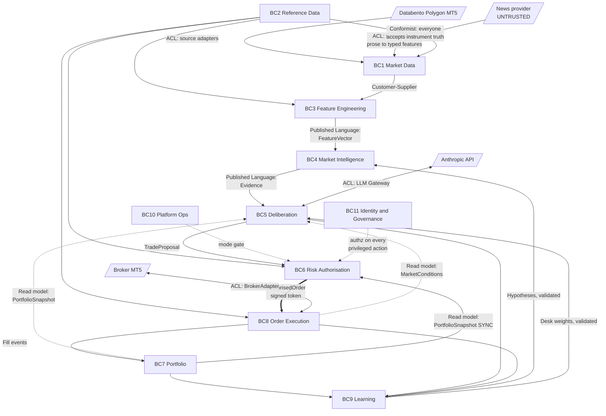

# R03 — Domain-Driven Design

**Deliverable:** 3
**Delta against:** the whole ADD. The current document decomposes by *technical layer*, not by *domain*. This file supplies the domain model that should govern module boundaries, service boundaries, database ownership, and the event namespace.
**Status:** Review v1.0

---

## 1. The core critique

The ADD's decomposition (Data Platform, Quant Research Platform, Decision Intelligence, Risk, Execution, Learning) is a **layered technical decomposition**. It is a reasonable first cut and it maps cleanly to a data flow, which is why the document reads well. But layered decomposition has two known failure modes at this scale, and both are already visible in the ADD:

1. **Concepts smear across layers.** "Position" appears in page 03 (cross-asset features), page 08 (Risk Desk reads portfolio state), page 09 (portfolio impact), page 10 (exposure, correlation), page 11 (fills) and page 12 (trade history). Six pages touch it. No page owns it. When six components each hold their own idea of what a position is, they will disagree, and the disagreement will surface as a risk-limit breach.
2. **Dependency direction follows the data flow rather than the domain**, which is how the 08 → 10 → 09 → 08 cycle (B3) appeared. A layered model has no vocabulary for "the Committee needs to *know about* portfolio state without *depending on* the Risk Engine". A domain model does: it is a read model published by a different context.

The fix is not to discard the layering. It is to overlay bounded contexts on it, and to let the contexts, not the layers, own the data.

---

## 2. Bounded contexts

Eleven contexts. Each owns its data exclusively. No context reads another context's tables. Cross-context communication is by published event, published read model, or an explicit anti-corruption layer.

| # | Bounded Context | Core question it answers | Type |
|---|---|---|---|
| BC1 | **Market Data** | What happened in the market, and can we trust the record of it? | Supporting |
| BC2 | **Reference Data** | What is this instrument, and is it tradable right now? | Supporting (but blocking) |
| BC3 | **Feature Engineering** | What derived quantities describe the market at time T, computable with only information available at T? | Supporting |
| BC4 | **Market Intelligence** | What state is the market in? (regime, volatility, structure, model predictions) | **Core** |
| BC5 | **Deliberation** | Given the evidence, what should we do and why? | **Core** |
| BC6 | **Risk Authorisation** | May this action be taken with this capital right now? | **Core** |
| BC7 | **Portfolio** | What do we own, what is it worth, what did it cost? | **Core** |
| BC8 | **Order Execution** | How do we get from an authorised intent to a confirmed broker state? | **Core** |
| BC9 | **Learning** | Where were we wrong, and what specific change would have helped? | **Core** |
| BC10 | **Platform Operations** | Is the system healthy, and what mode is it in? | Generic |
| BC11 | **Identity & Governance** | Who is allowed to do what, and what did they do? | Generic |

### Context map



The two dotted lines from BC7 and BC8 into BC5 are the fix for B3: the Deliberation context consumes **read models** published by Portfolio and Execution. It has no dependency on Risk Authorisation at all. The cycle is gone.

### Relationship patterns, explicitly

| Upstream → Downstream | Pattern | Why |
|---|---|---|
| Reference Data → everyone | **Conformist** | Instrument truth is not negotiable. Everyone accepts BC2's model verbatim. Any context "adjusting" a tick size is a bug |
| Market Data → Feature Engineering | **Customer/Supplier** | BC3 is a paying customer: it can demand new fields, BC1 must plan for them |
| Feature Engineering → Market Intelligence | **Published Language** (`FeatureVector`) | Multiple engines consume it; it needs a stable, documented, versioned language |
| Market Intelligence → Deliberation | **Published Language** (`Evidence`) | The evidence schema is the contract that makes the "AI never calculates" rule enforceable |
| Portfolio → Deliberation | **Open Host Service, read model** | BC7 publishes a snapshot projection. BC5 consumes it. No coupling to BC7's internals |
| Portfolio → Risk Authorisation | **Open Host Service, synchronous query** | Risk needs the freshest possible answer, so this one is sync with a 30ms fail-closed timeout |
| Risk Authorisation → Order Execution | **Customer/Supplier with a signed contract** | The approval token. BC8 will not act without it |
| External broker → Order Execution | **Anti-Corruption Layer** (`BrokerAdapter`) | Broker models leak badly. This is the single most important ACL in the platform |
| News provider → Market Data | **Anti-Corruption Layer** (text sanitiser) | Closes B5 |
| Anthropic → Deliberation | **Anti-Corruption Layer** (LLM Gateway) | Vendor model IDs, token semantics, error shapes must not leak into domain code |
| Learning → Market Intelligence / Deliberation | **Customer/Supplier, gated** | BC9 proposes; the PBO/DSR gate decides. BC9 has no write authority |

---

## 3. BC4 — Market Intelligence

**Ubiquitous language:** Regime, Volatility Surface, Structure, Confluence, Prediction, Evidence, Staleness, Convergence.

| Element | Type | Notes |
|---|---|---|
| `MarketView` | **Aggregate root** | Identity: `(symbol, timeframe, as_of)`. The complete intelligence picture for one instrument at one point in time. This aggregate is what makes "what did the system know at 14:30" answerable |
| `RegimeEstimate` | Entity, inside `MarketView` | `{state, probability_vector, confidence, model_version, converged, stale}` |
| `VolatilityEstimate` | Entity | `{atr, realised, forecast, expected_move, percentile, tail_risk_with_ci}` |
| `StructureSnapshot` | Entity | `{swings, bos, choch, order_blocks, fvgs, liquidity, mitigation, confidence}` |
| `ModelPrediction` | Entity | `{model_id, model_version, prediction, calibrated_probability}` |
| `Symbol` | **Value object** | Never a bare string. Validated against BC2 |
| `Timeframe` | Value object | Enum-like, with a `duration` and a `bar_close_time(t)` method |
| `Probability` | Value object | Constrained to [0,1], with `to_log_odds()` |
| `Confidence` | Value object | Distinct from Probability. Carries a source and a calibration status |
| `AsOf` | Value object | A business timestamp. **The type system's defence against look-ahead bias**: any function taking data plus an `AsOf` must be provably unable to read rows with `timestamp > as_of` |
| `Staleness` | Value object | `{is_stale, age, expected_max_age, reason}` |
| `MarketViewRepository` | Repository | `get(symbol, timeframe, as_of) -> MarketView`. Point-in-time by construction |
| `RegimeModel`, `VolModel`, `StructureDetector` | **Domain services (plugin interfaces)** | See R02 §4 |
| `RegimeArbiter`, `VolArbiter` | Domain services | Combine plugin outputs, own hysteresis |

**Domain events:** `RegimeClassified`, `RegimeShifted`, `VolatilityForecastPublished`, `VolatilityRecalibrated`, `StructurePublished`, `ConfluenceDetected`, `ModelPredictionMade`, `ModelDriftDetected`.

**Invariants:**
- A `MarketView` is immutable once published. A correction is a new `MarketView` with a new `as_of` or a `supersedes` link, never a mutation. This mirrors page 01's excellent "never mutate raw data" rule and extends it upward, which the ADD does not currently do.
- No estimate may be constructed without an explicit `Staleness`. There is no "unknown freshness" state.
- `confidence` and `probability` are different types and cannot be assigned to each other. This is a compile-time guard against the most common category error in the whole design.

---

## 4. BC5 — Deliberation

**Ubiquitous language:** Cycle, Desk, Opinion, Evidence, Citation, Debate, Consensus, Deadlock, Proposal, Rationale.

| Element | Type | Notes |
|---|---|---|
| `DeliberationCycle` | **Aggregate root** | Identity: `cycle_id` (ULID). Owns the entire lifecycle: convened → evidence assembled → desks polled → consensus → proposal or deadlock. This is the transactional consistency boundary |
| `EvidenceGraph` | Entity, inside the cycle | Immutable once sealed. Content-addressed (`sha256` of the canonical serialisation). See R09 |
| `EvidenceNode` | Entity | `{node_id, kind, value, source_engine, source_version, as_of, staleness, weight}` |
| `DeskOpinion` | Entity | `{desk, stance, calibrated_confidence, citations: [node_id], rationale, abstained, abstain_reason}` |
| `Citation` | **Value object** | `{node_id, node_hash}`. **A citation is a reference, never a copied number.** See §5 |
| `Consensus` | Value object | `{aggregate_stance, pooled_probability, dispersion, method, weights_version}` |
| `TradeProposal` | Entity, the cycle's output | `{direction, size_hint, conviction, evidence_graph_hash, valid_until, rationale_ref}` |
| `Stance` | Value object | Enum: `long`, `short`, `flat`, `abstain` |
| `DeskWeight` | Value object | Versioned, PBO-gated, point-in-time resolvable |
| `PromptVersion` | Value object | `{desk, version, hash, effective_from, effective_to}`. Point-in-time resolvable |
| `DeliberationCycleRepository` | Repository | |
| `ConsensusStrategy` | Domain service (interface) | Log-odds pooling is one implementation, simple weighted vote another. Swappable and A/B-testable |
| `CitationValidator` | Domain service | Enforces §5 |

**Domain events:** `CycleConvened`, `EvidenceGraphSealed`, `DeskOpinionSubmitted`, `DeskAbstained`, `ConsensusReached`, `CycleDeadlocked`, `ProposalIssued`, `ProposalExpired`.

**Invariants:**
- A cycle has exactly one terminal state: `PROPOSAL_ISSUED`, `NO_ACTION`, `DEADLOCKED`, `EXPIRED`, or `ABORTED`. It can never be reopened. A "revised" opinion is a new cycle with a `supersedes` link.
- A `TradeProposal` cannot exist without a sealed `EvidenceGraph` whose hash it carries. This makes the audit trail structural.
- A cycle whose evidence graph contains any node with `staleness.is_stale == true` and `staleness.severity == critical` **cannot** issue a proposal. It must terminate as `NO_ACTION`. Page 08 makes this a soft requirement ("required to be discounted"); it should be a hard invariant for critical staleness.
- If fewer than K desks return a valid opinion (default K=4 of 6), the cycle terminates `NO_ACTION`. Page 08's abstain handling excludes the desk from the vote but does not define a quorum. Without a quorum, four abstentions and two agreeing desks produce a confident-looking unanimous decision from almost no evidence.

**The quorum gap is a genuine finding.** It is exactly the failure mode that a partial LLM outage would produce, and the current design would trade through it.

---

## 5. The "AI never calculates" rule, made structural

Page 09 states the rule and page 08 enforces it by validating that a cited number appears in the desk's inputs. Page 08 then correctly identifies the weakness of its own mechanism: a rounded number produces a false rejection. It offers no fix.

The mechanism is inverted. Detecting hallucinated numbers after the fact is weaker than making them unrepresentable.

### The correction

A desk **never emits a number**. It emits references.

```jsonc
// REJECTED under this design (current page 08 output shape):
{ "reasoning": "Regime is bullish with 78% probability and vol at the 91st percentile" }

// REQUIRED:
{
  "stance": "long",
  "confidence_raw": 72,
  "citations": [
    {"node_id": "regime:XAUUSD:M15:2026-08-03T14:30:00Z:p_bull", "node_hash": "sha256:a1..."},
    {"node_id": "vol:XAUUSD:M15:2026-08-03T14:30:00Z:percentile", "node_hash": "sha256:b7..."}
  ],
  "rationale_template": "Regime is bullish at {{0}} and volatility sits at {{1}}, which favours continuation over mean reversion.",
  "rationale_bindings": [0, 1]
}
```

The rendering layer substitutes the *actual* values from the evidence graph into the template at display time. Consequences:

- A hallucinated number is **not expressible**. The desk can only point at nodes that exist.
- The rounding false-negative disappears entirely. There is nothing to string-match.
- The explanation is guaranteed to match the evidence, which eliminates page 09's "explanation drift from decision" failure mode by construction rather than by convention.
- Counterfactual replay becomes trivial: rebind the same template to a different evidence graph.
- A desk citing a node it was not given is a hard schema violation, detectable without any NLP.

The residual risk is that a desk misuses a legitimate node ("volatility is low" when the cited percentile is 91). That is a *reasoning* error, which is what the Red Team desk (R10 §4) and calibration scoring exist to catch. It is a fundamentally more tractable problem than hallucinated arithmetic.

**This is the highest-leverage single change in the review.** It converts the platform's central architectural claim from a policy into a property.

---

## 6. BC6 — Risk Authorisation

**Ubiquitous language:** Proposal, Rule, Limit, Breach, Authorisation, Token, Kill Switch, Halt, Drawdown, Exposure, Sizing.

| Element | Type | Notes |
|---|---|---|
| `RiskAssessment` | **Aggregate root** | Identity: `assessment_id`. Ties a proposal to an ordered rule evaluation and a verdict |
| `RuleEvaluation` | Entity | `{rule_id, rule_version, verdict, reason, inputs_hash}` |
| `AuthorisedOrder` | **Aggregate root** | The signed token. Identity: `authorisation_id`. Single-use, TTL-bounded |
| `LimitSet` | **Aggregate root** | Versioned, immutable once published, four-eyes approved. Identity: `limit_set_version` |
| `KillSwitchState` | **Aggregate root** | Identity: `(scope, account_id)`. Scope: `platform`, `account`, `symbol`, `strategy` |
| `Money`, `Quantity`, `Price`, `Bps` | Value objects | **Never floats.** `Decimal` with explicit currency/instrument context. A float rounding error in position sizing is a real loss |
| `RiskBudget` | Value object | `{max_loss_per_trade, max_daily_loss, max_drawdown, vol_target}` |
| `Exposure` | Value object | Gross, net, per-symbol, per-sector, per-currency |
| `RiskRule` | Domain service (interface) | Nine implementations, ordered, individually toggleable, individually versioned |
| `PositionSizer` | Domain service | Vol-target → fractional Kelly → hard caps, in that order, each capping the previous |
| `KillSwitchInterlock` | Domain service | Three-tier, fail-closed |

**Domain events:** `TradeAuthorised`, `TradeRejected`, `LimitBreached`, `KillSwitchTriggered`, `KillSwitchCleared`, `LimitSetPublished`, `AuthorisationExpired`.

**Invariants:**
- An `AuthorisedOrder` is single-use. Consuming it is an atomic compare-and-set. A replayed command finds it already consumed and is rejected. This is the second line of defence behind the deterministic `client_order_id`.
- `AuthorisedOrder.valid_until` is always set and always shorter than the shortest bar interval in play.
- A `LimitSet` cannot be modified. A change publishes a new version. The `RiskAssessment` records which version it used.
- The kill switch check is the **last** rule evaluated and is re-checked at token issuance. Between "rules passed" and "token issued" there must be no awaitable operation.
- Rejections are persisted with the same durability as approvals. Page 10 states this; the aggregate makes it structural.

---

## 7. BC7 — Portfolio (new context, closes B3)

This context does not exist in the ADD. Position state is currently smeared across Risk (page 10, "Redis live portfolio state"), Execution (page 11, fills) and Learning (page 12, trade history). Giving it an owner is what breaks the cycle and what makes reconciliation meaningful.

| Element | Type | Notes |
|---|---|---|
| `Account` | **Aggregate root** | Identity: `account_id`. Owns balance, equity, margin, and its positions |
| `Position` | Entity, inside `Account` | Identity: `(account_id, symbol)`. Netting or hedging mode per broker, declared in BC2 |
| `Lot` | Entity | For FIFO/LIFO cost basis. Required for correct realised P&L, absent from the ADD entirely |
| `Trade` | **Aggregate root** | The full round trip: entry fill(s), management actions, exit fill(s), realised P&L, attribution back to `decision_id` |
| `LedgerEntry` | Entity | Append-only, double-entry. Every balance change has a cause and a counterparty account |
| `PortfolioSnapshot` | **Read model / projection** | What BC5 and BC6 consume. Never the aggregate itself |
| `PnL` | Value object | Realised and unrealised, decomposed: price, carry/swap, commission, slippage |
| `CostBasis` | Value object | Method declared per account: FIFO, LIFO, average |

**Domain events:** `PositionOpened`, `PositionIncreased`, `PositionReduced`, `PositionClosed`, `StopMoved`, `TargetAdjusted`, `SwapCharged`, `CommissionCharged`, `EquityMarked`, `ReconciliationBreakDetected`.

**Design decision: this context is event-sourced.** It is the only one that should be. Justification:

- The audit requirement is absolute: you must be able to reconstruct the book at any past instant.
- Reconciliation against broker truth needs a canonical sequence of *what we believed happened*, to diff against *what the broker says happened*.
- Learning (BC9) needs the full history anyway, and event sourcing gives it for free instead of via a separate ETL.
- The write volume is trivially low (tens to hundreds of events per day), so the usual event-sourcing cost objection does not apply.

`PortfolioSnapshot` is a projection rebuilt from the event stream and cached in Redis. **Redis holds the projection, never the truth.** This is a direct correction to page 10, which places live portfolio state in Redis with Postgres as a separate "durable ledger" and does not define which one wins.

**Invariant:** the projection is never written by anything except the projector. Risk reads it. Risk does not update it after an approval. Only a fill updates the book.

---

## 8. BC8 — Order Execution

| Element | Type | Notes |
|---|---|---|
| `Order` | **Aggregate root** | Identity: `client_order_id`. Owns the full state machine including `UNKNOWN` |
| `Fill` | Entity | `{fill_id, quantity, price, timestamp, liquidity_flag, commission}` |
| `ExecutionReport` | Value object | Normalised across brokers by the ACL |
| `SlippageAnalysis` | Value object | `{expected, actual, bps, decomposed: {spread, delay, impact}}`. Page 11 has a single slippage number; decomposition is what makes TCA possible |
| `BrokerAdapter` | **ACL, domain service** | See R02 §5 |
| `OrderStateMachine` | Domain service | R07 §4 |

**Domain events:** `OrderSubmitted`, `OrderAcknowledged`, `OrderPartiallyFilled`, `OrderFilled`, `OrderCancelled`, `OrderRejectedByBroker`, `OrderStateUnknown`, `FillAnalysed`.

**Invariant:** an `Order` may only be created from a valid, unexpired, unconsumed `AuthorisedOrder`. There is no other constructor. This makes page 10's "no trade reaches Execution without passing Risk" a type-level guarantee.

---

## 9. Anti-corruption layers

Five ACLs. Each is a hard boundary where a foreign model is translated into the domain model, and nothing foreign passes through.

### ACL-1 — Broker (`BrokerAdapter`)

Translates: broker symbols → platform `Symbol`; broker lot conventions → `Quantity`; broker error codes → domain outcomes; broker time → `Timestamp` in UTC with the broker's server-time offset resolved.
**Rule:** no MT5 type, error code, or magic constant appears anywhere outside `adapters/mt5/`. A `grep -r "mt5\." --exclude-dir=adapters` returning any hit is a CI failure.

### ACL-2 — Untrusted text (closes B5)

The most important new ACL. Sits between the news provider and everything else.

```
Raw article text
  -> Source reputation tier lookup (BC2 config, not the article)
  -> Structural strip: markup, control characters, zero-width, homoglyphs,
     anything resembling instruction syntax
  -> Length clamp
  -> Constrained extraction (isolated model call, no tools, no platform context,
     output schema-clamped)
  -> Typed output ONLY:
       { sentiment: float[-1,1],
         entities: [enum from a closed vocabulary],
         event_type: enum,
         confidence: float,
         source_tier: enum }
  -> Feature Store Macro category
```

**Rules:**
1. Raw text is archived for audit but is **never** read by any component other than this ACL.
2. The extraction call runs with no tools, no memory, no platform context, and a hard output schema. It cannot be induced to do anything because it can do nothing.
3. Any extraction whose output fails schema validation is discarded and the article is quarantined, not passed through with defaults.
4. `source_tier` comes from configuration keyed by provider and publisher, never from the article's own claims about itself.
5. The Macro Desk's context contains only the typed output. There is no code path from prose to a desk.

### ACL-3 — LLM Gateway

Translates vendor concepts (model IDs, token counts, stop reasons, rate-limit errors, tool-use blocks) into domain concepts (`DeskOpinion`, `DeskAbstained`, `BudgetExceeded`).
**Rule:** no `anthropic` import outside `adapters/llm/`. A model upgrade must be a one-line change in one file, which is exactly what page 08's "prompt/model drift" failure mode requires and does not currently have a home for.

### ACL-4 — Market data sources

Per-source adapters implementing a `MarketDataSource` interface. Handles: schema drift (page 01's listed failure mode), timezone/DST normalisation to UTC, symbol mapping, and provider-specific bar-close conventions (a genuinely common source of silent one-bar offsets between providers).

### ACL-5 — Legacy TradeHub

Pages 06 and 11 both reference reusing TradeHub's `smc-service` and MT5 bridge patterns. Pulling working code across is right; pulling its data model across is not. Any TradeHub integration goes through a translation layer so TradeHub's schema does not become WITrade's schema by accident. This is the ACL that is easiest to skip and most expensive to add later.

---

## 10. Shared kernel

Deliberately minimal. Everything here is depended on by every context, so every change is a breaking change to eleven contexts. The rule is: if it can live in one context, it does not go here.

| In the shared kernel | Justification |
|---|---|
| `Symbol`, `Timeframe`, `Timestamp`, `AsOf` | Universal vocabulary. Cannot be duplicated without creating conversion bugs at every boundary |
| `Money`, `Quantity`, `Price`, `Bps` | Financial primitives. Duplication here means rounding divergence |
| `EventEnvelope` and the correlation/causation types | R01 §4. Every service publishes |
| `Clock` | R02 §5. Injected everywhere |
| `Result[T, E]` / error taxonomy | Consistent failure handling across boundaries |
| `Staleness`, `Confidence`, `Probability` | Semantic types whose confusion is the platform's most likely category error |
| `TenantId`, `AccountId` | Multi-account and eventual multi-tenant partitioning |

| Deliberately NOT in the shared kernel | Why |
|---|---|
| `Position` | BC7 owns it. Other contexts get the read model |
| `Order` | BC8 owns it |
| `RegimeState` | BC4 owns it. BC5 sees it only as an `EvidenceNode` |
| `TradeProposal` | BC5 owns it. BC6 receives it as a published-language DTO, and translates |
| Anything with behaviour tied to one context | By definition |

**Governance:** the shared kernel is a single package with its own CHANGELOG, semantic versioning, and a rule that any change requires sign-off representing every consuming context. In a solo-operator setting that means a written ADR, not a meeting.

---

## 11. Aggregate design rules

Applied consistently across all eleven contexts:

1. **One aggregate per transaction.** A single command modifies exactly one aggregate. Cross-aggregate consistency is eventual, via domain events. The one exception is the outbox row, which commits in the same transaction by design (R01 §8).
2. **Reference other aggregates by identity only.** `Trade` holds a `decision_id`, not a `DeliberationCycle` object. This is what keeps contexts independently deployable.
3. **Aggregates are consistency boundaries, not object graphs.** `DeliberationCycle` is large because every invariant in §4 spans its parts. `Position` is small because its invariants are local.
4. **Invariants live in the aggregate, never in the application service.** A service that validates before calling an aggregate has moved the domain rule out of the domain.
5. **Value objects are immutable and self-validating.** `Probability(1.7)` raises at construction. No downstream check needed.
6. **No aggregate exposes a setter.** State changes are named domain operations: `position.reduce(quantity, price, fill_id)`, never `position.quantity = x`.

---

## 12. Mapping: ADD pages to bounded contexts

For navigating between the two models during implementation.

| ADD page | Bounded context | Container(s) |
|---|---|---|
| 00 Master | (all) | — |
| 01 Ingestion | BC1 Market Data | C01, C02 |
| 02 Quality | BC1 Market Data | C03 |
| 03 Feature Store | BC3 Feature Engineering | C06, C07, C08 |
| 04 Regime | BC4 Market Intelligence | C09 |
| 05 Volatility | BC4 | C10 |
| 06 Structure | BC4 | C11 |
| 07 ML/RL | BC4 | C12, C13, C14 |
| 08 Committee | BC5 Deliberation | C16, C17, C18 |
| 09 Decision Intelligence | BC5 Deliberation | C15, C19, C20 |
| 10 Risk | BC6 Risk Authorisation | C21 |
| 11 Execution | BC8 Order Execution + BC7 Portfolio | C22, C23, C24, C25 |
| 12 Learning | BC9 Learning | C27, C29 |
| 13 Infrastructure | BC10 Platform Ops | C31, C36-C39 |
| 14 Deployment | BC10 + BC11 | CI/CD |
| 15 Event Catalog | (cross-cutting, now generated) | C37 |
| 16 C4 Container | (cross-cutting, now generated) | — |
| **absent** | **BC2 Reference Data** | **C04** |
| **absent** | **BC7 Portfolio (as an owner)** | **C22** |
| **absent** | **BC11 Identity & Governance** | **C38, C39** |

Three contexts have no page in the current ADD. Two of them (Reference Data, Portfolio) are blocking dependencies for position sizing, which page 10 specifies in detail without them.

---

## 13. Related

- `R00_Executive_Review.md` (B3, B4, B5)
- `R01_Event_Architecture.md` (contexts define the subject namespace)
- `R02_C4_Expansion.md` (containers implement contexts)
- `R09_Evidence_Graph.md` (BC5's evidence model in depth)
- `R11_Risk_Architecture.md` (BC6 in depth)
- `R19_Missing_Components.md` (BC2, BC7, BC11 as new services)
