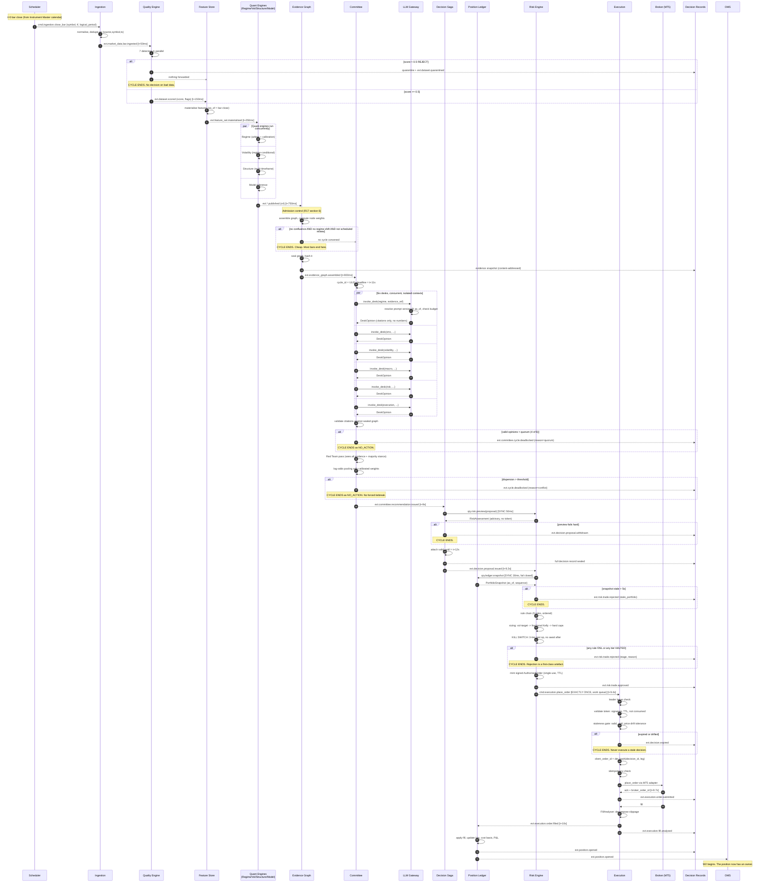
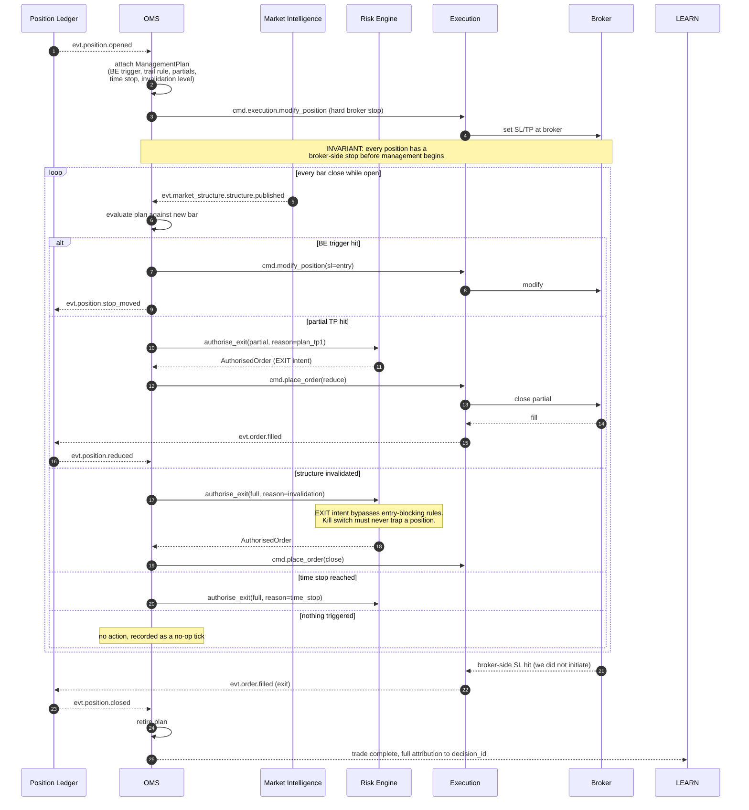
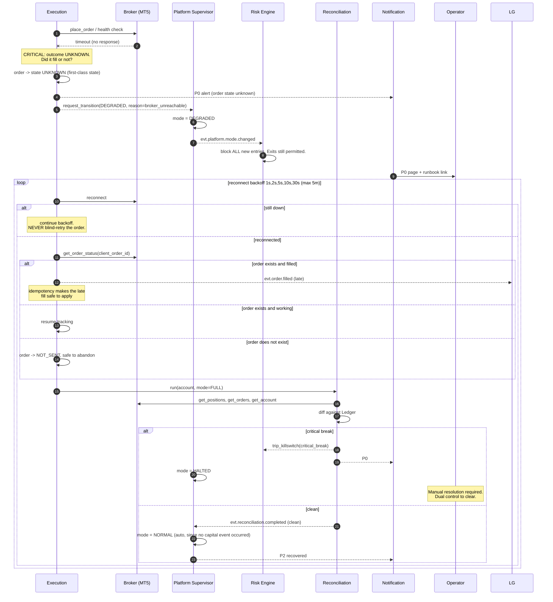
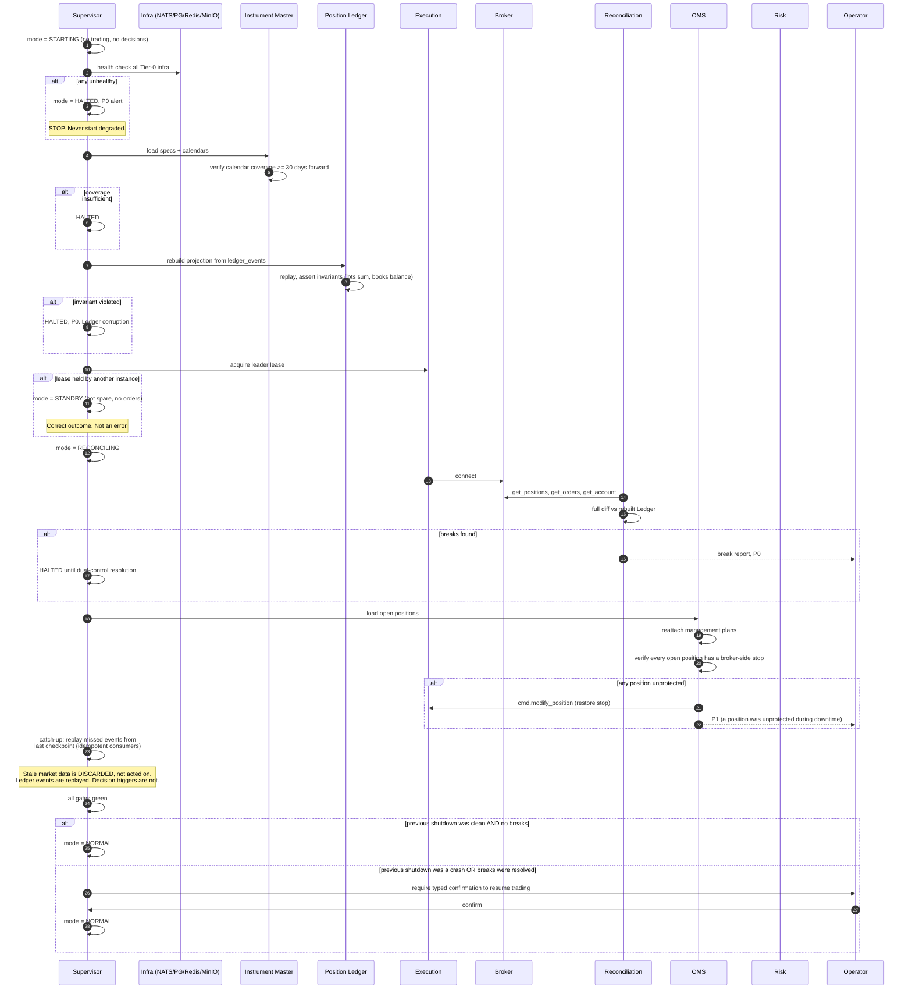
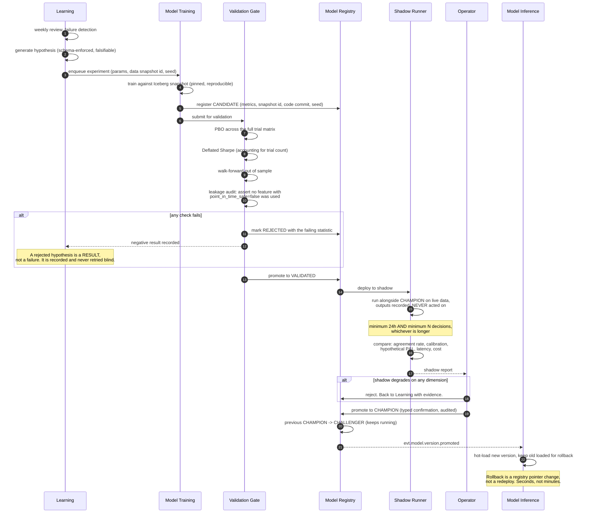
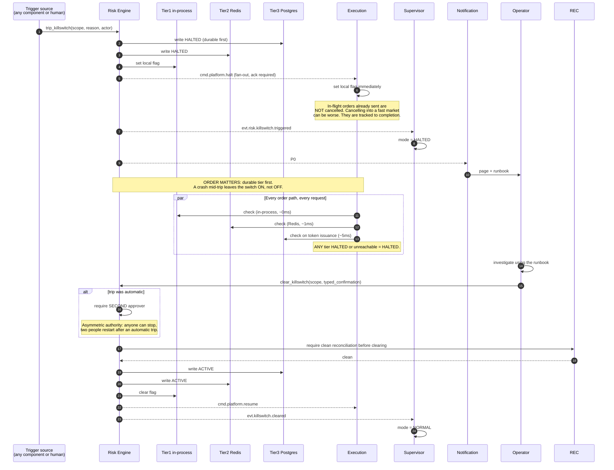
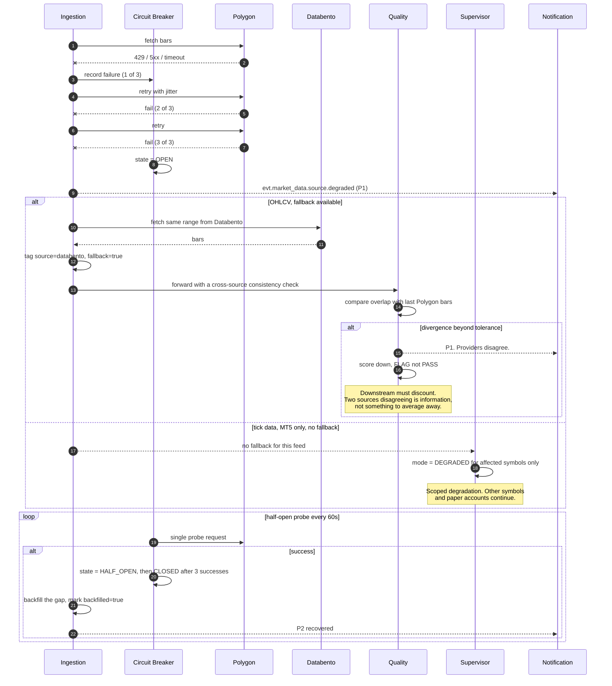
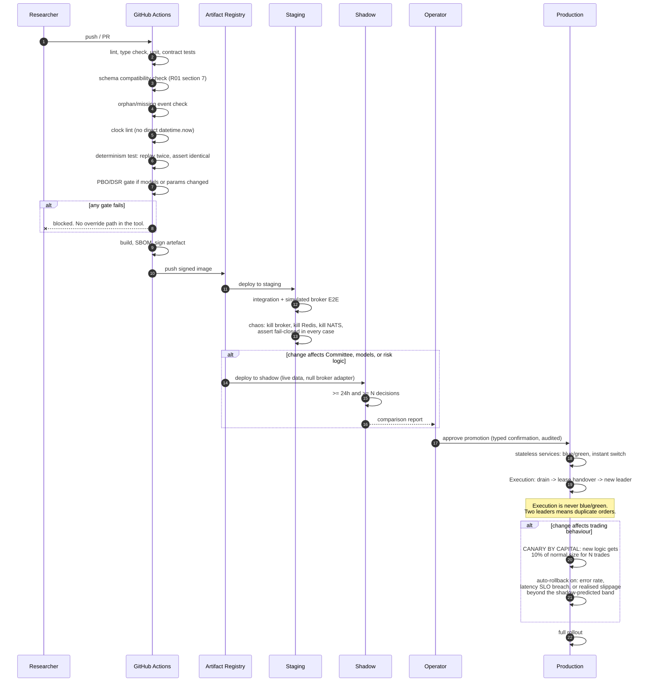
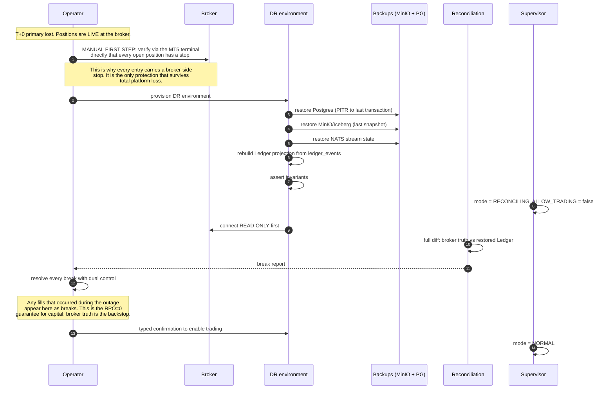
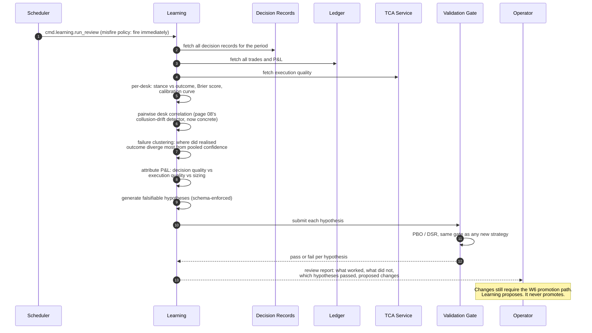

# R06 — Sequence Diagrams

**Deliverable:** 6
**Delta against:** the whole ADD. No page contains a sequence diagram. Every page contains a pipeline, which shows *order* but not *interaction*, *timing*, *failure branches*, or *who waits on whom*.
**Status:** Review v1.0

---

## 1. Why pipelines are not enough

Page 09's `Quant Models → Evidence Graph → Committee Debate → Portfolio Impact → Risk Constraints → Decision → Explanation` reads as one linear flow. It hides four things that determine whether the system works:

1. Which steps are concurrent (six desks are parallel; the pipeline implies serial).
2. Which steps are synchronous calls with timeouts versus async event handoffs.
3. What happens on the failure branch at each step.
4. Where the deadline is enforced.

The eleven workflows below cover the critical paths. Each states its **trigger**, its **deadline**, and its **abort semantics**, because an interaction without a deadline is an interaction that hangs in production.

---

## 2. W1 — Happy path: bar close to journalled trade

**Trigger:** bar close for a tracked `(symbol, timeframe)`.
**Deadline:** 12s from bar close to order acknowledgement. Exceeded means the decision expires unexecuted.
**Abort:** any step may terminate the cycle. Termination is always recorded, never silent.



**Design points this diagram makes visible that the ADD does not:**

- The overwhelming majority of bars terminate at admission control (step ~19) without an LLM call. That is what makes the cost model viable, and it is invisible in page 09's linear pipeline.
- Six termination points, each producing a durable artefact. There is no path where a cycle simply stops with no record.
- The Risk Engine calls the Ledger, not the reverse. This is the fixed dependency direction from B3.
- `valid_until` is set once, in the Decision Saga, and checked last, in Execution. The staleness gate is the only thing standing between an 11-second reasoning cycle and an order placed on a price that no longer exists.

---

## 3. W2 — Position lifecycle management (entirely absent from the ADD)

**Trigger:** `evt.position.opened`, then every bar close while the position is open.
**Deadline:** management decision to broker command, 500ms p99.



The last branch matters: a broker-side stop firing is an exit the platform did not initiate. If the OMS only reacts to its own actions, that position stays "open" in its model forever. Reacting to the Ledger, not to its own commands, is what makes the OMS correct.

---

## 4. W3 — Broker disconnect with open positions

**Trigger:** adapter health check fails, or an order times out.
**This is the highest-stakes failure workflow in the platform.** Page 11 names it; no page sequences it.



Three rules encoded here that the ADD lacks:

1. **Never blind-retry an order after a timeout.** Query status first. Page 11 has this right in principle via idempotent IDs; the sequence makes the ordering explicit.
2. **`UNKNOWN` is a state, not an error.** A timeout does not mean "not sent."
3. **Exits remain permitted in `DEGRADED`.** Only new entries are blocked. Halting exits during a broker problem is how a manageable loss becomes an unmanageable one.

---

## 5. W4 — Cold start

**Trigger:** platform start or restart.
**Deadline:** none. Correctness beats speed. Trading is not permitted until every gate passes.



The distinction in the catch-up step is important and easy to get wrong: replaying ledger events on startup is mandatory (they are facts about capital). Replaying decision triggers is forbidden (they would produce trades based on the market as it was ten minutes ago).

---

## 6. W5 — Graceful shutdown

```mermaid
sequenceDiagram
    autonumber
    participant OP as Operator
    participant SUP as Supervisor
    participant RK as Risk
    participant CM as Committee
    participant EX as Execution
    participant LG as Ledger
    participant BUS as NATS

    OP->>SUP: request_transition(DRAINING, reason)
    SUP->>RK: stop accepting new proposals
    SUP->>CM: finish in-flight cycles, convene no new ones
    CM->>CM: in-flight cycles run to their deadline or complete
    SUP->>EX: no new orders. Track outstanding ones to terminal state.
    EX->>EX: wait for all orders to reach a terminal state<br/>(filled/cancelled/rejected), max 60s
    alt orders still non-terminal after 60s
        EX-->>OP: P1. Shutdown proceeds; these become<br/>UNKNOWN and are reconciled on next start.
    end
    EX->>EX: verify every open position has a broker-side stop
    Note over EX: CRITICAL: positions survive the shutdown.<br/>The broker stop is what protects them.
    LG->>LG: flush outbox, checkpoint projection
    BUS->>BUS: consumers ack outstanding, record sequences
    SUP->>SUP: write clean_shutdown marker
    SUP->>SUP: mode = STOPPED
```

The clean-shutdown marker is what allows W4 to skip the operator confirmation. Without it, every restart requires human intervention, which trains the operator to click through the confirmation reflexively, which defeats it.

---

## 7. W6 — Model retraining and promotion

**Trigger:** scheduled retrain, drift detection, or a validated Learning hypothesis.



Two points the ADD implies but does not sequence: the previous champion becomes a permanently-running challenger rather than being archived (which is what makes "was the change actually an improvement" answerable a month later), and rollback is a pointer flip because the old version is still loaded.

---

## 8. W7 — Kill switch trip and clear



Write order (durable tier first on trip) is not incidental. On clear, the order reverses: in-process last, so a partial failure leaves the switch engaged.

---

## 9. W8 — Data source degradation and failover



The cross-source consistency check on failover is an addition to page 01. Silently switching providers hides the case where they disagree, which is exactly when you most want to know.

---

## 10. W9 — Deployment with canary



Canary by *capital allocation* rather than by request percentage is the correct primitive here. Routing 10% of decisions to a new model tells you almost nothing at this decision volume; sizing every decision at 10% for N trades tells you what you need with bounded loss.

---

## 11. W10 — Disaster recovery

**Scenario:** total loss of the primary environment with open positions at the broker.
**RPO:** 0 for capital events (fills, orders). 5 minutes for market data. **RTO:** 30 minutes to `RECONCILING`, 60 minutes to `NORMAL`.



The critical insight: RPO 0 for capital events is achieved not by replication but by the broker being the authoritative record and reconciliation being able to reconstruct from it. That only works if reconciliation is a first-class service, which is the argument for C25.

---

## 12. W11 — Weekly learning review



---

## 13. Workflow coverage summary

| # | Workflow | Deadline | Fail-safe direction | Priority |
|---|---|---|---|---|
| W1 | Bar close to journalled trade | 12s | No trade | P0 |
| W2 | Position lifecycle | 500ms per action | Broker stop protects | P0 |
| W3 | Broker disconnect | reconnect ≤ 5min | Block entries, permit exits | P0 |
| W4 | Cold start | none | HALTED until every gate green | P0 |
| W5 | Graceful shutdown | 60s drain | Positions protected by broker stops | P1 |
| W6 | Model retraining | days | Champion keeps running | P1 |
| W7 | Kill switch | < 10ms trip | Fail closed | P0 |
| W8 | Source degradation | 3 failures to open | Scoped degradation | P1 |
| W9 | Deployment | 24h shadow | No override in the tool | P1 |
| W10 | Disaster recovery | RTO 60min | Broker truth is the backstop | P1 |
| W11 | Weekly review | weekly, fire-immediately on misfire | Learning cannot promote | P2 |

**Workflows still to be sequenced (P2):** quarantine review and force-release, limit-set change with dual control, symbol onboarding, prompt-version promotion, replay/rewind execution, standby VPS failover.

---

## 14. Related

- `R00_Executive_Review.md`
- `R01_Event_Architecture.md` (commands vs events visible in W1 and W7)
- `R05_Interface_Contracts.md` (degraded-mode fields these sequences realise)
- `R07_State_Machines.md` (states these sequences transition between)
- `R14_Deployment.md` (W9 in depth)
