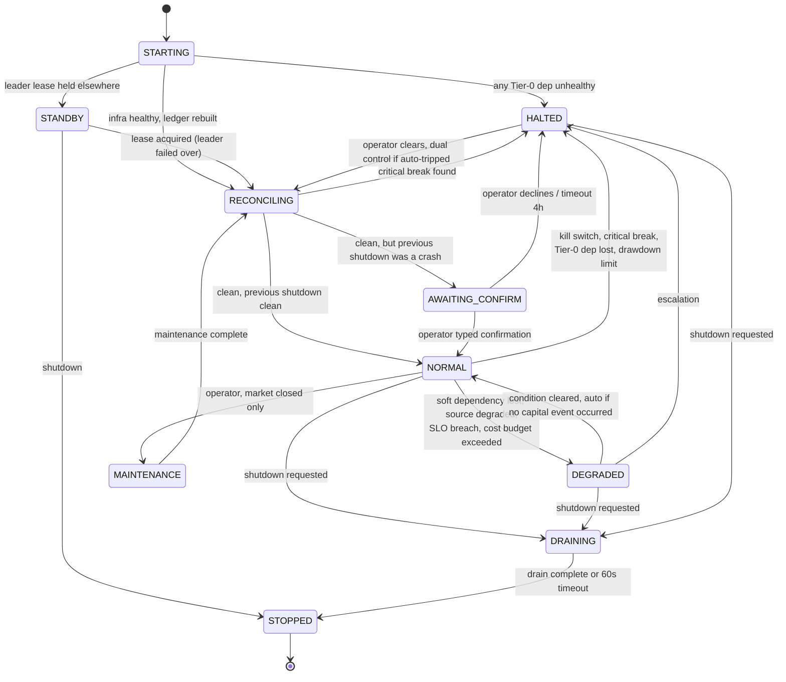
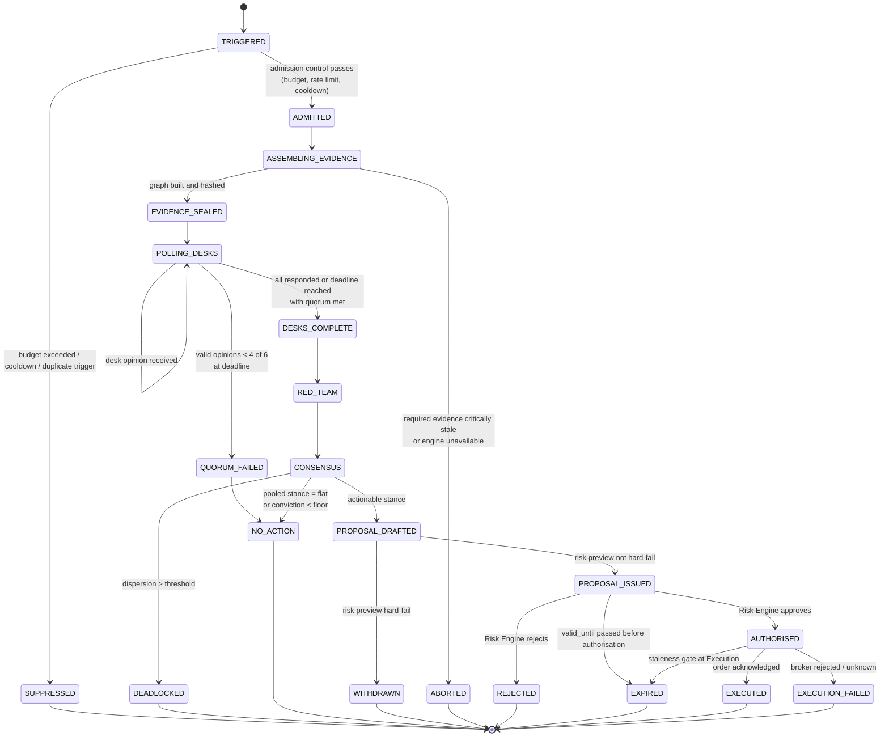
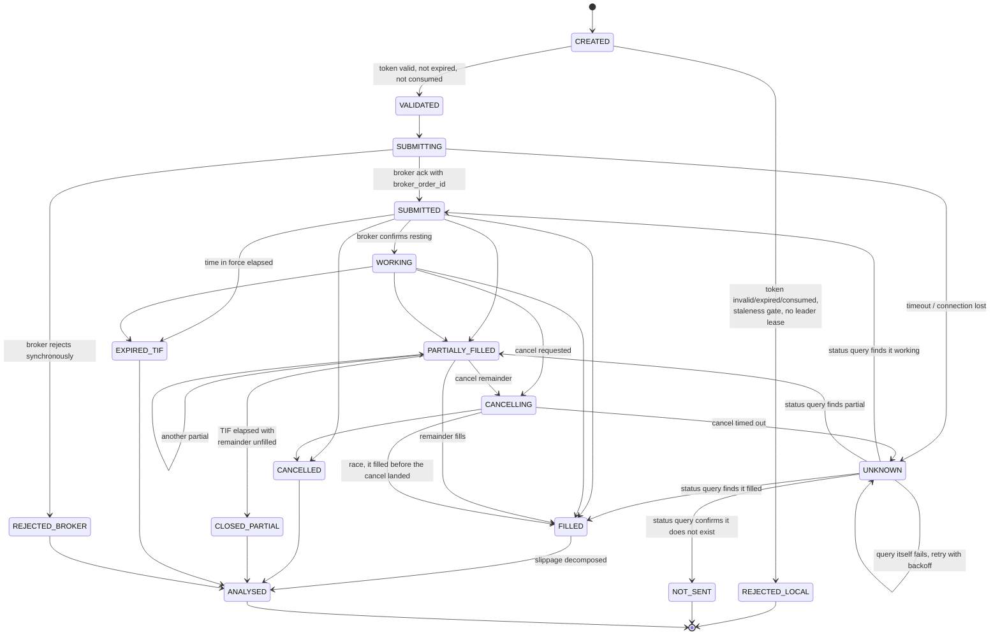
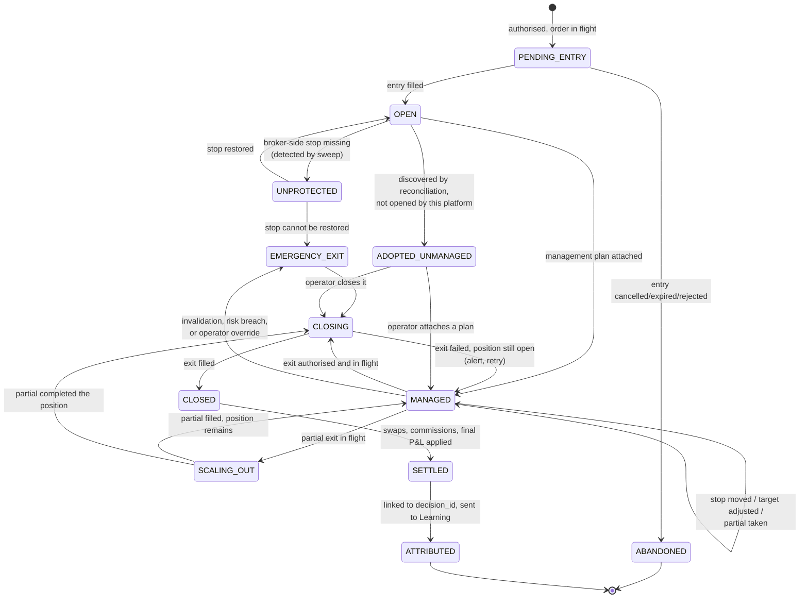
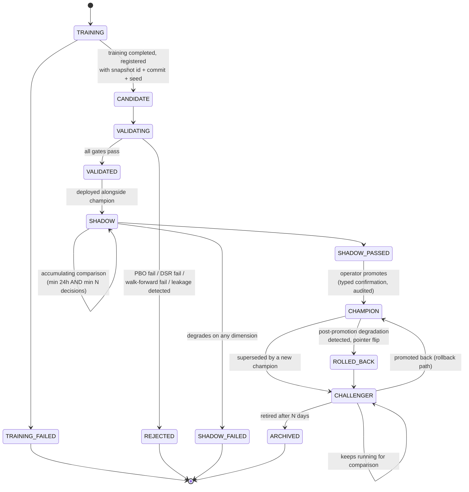
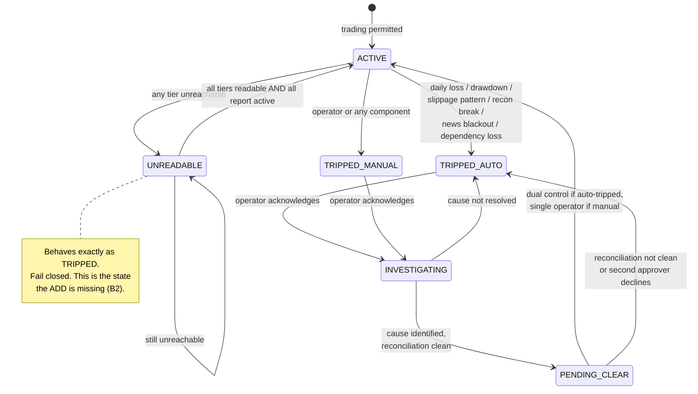
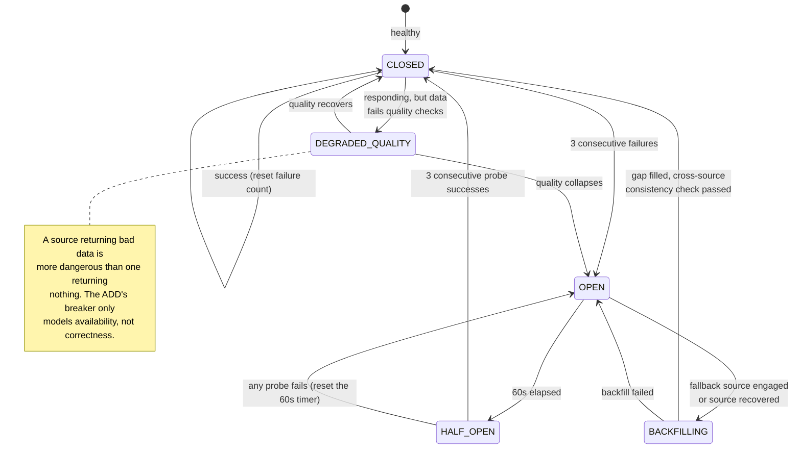
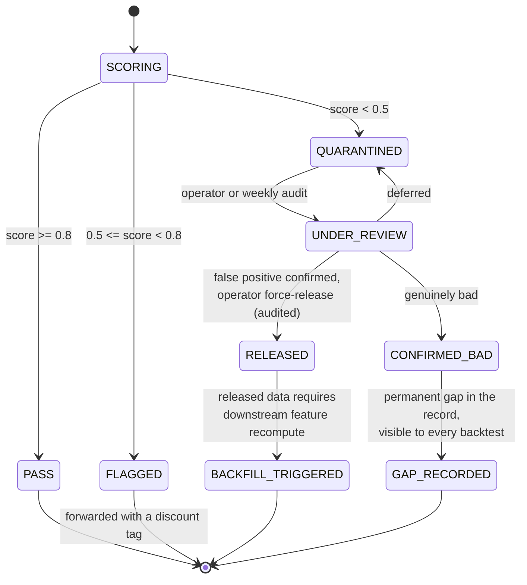
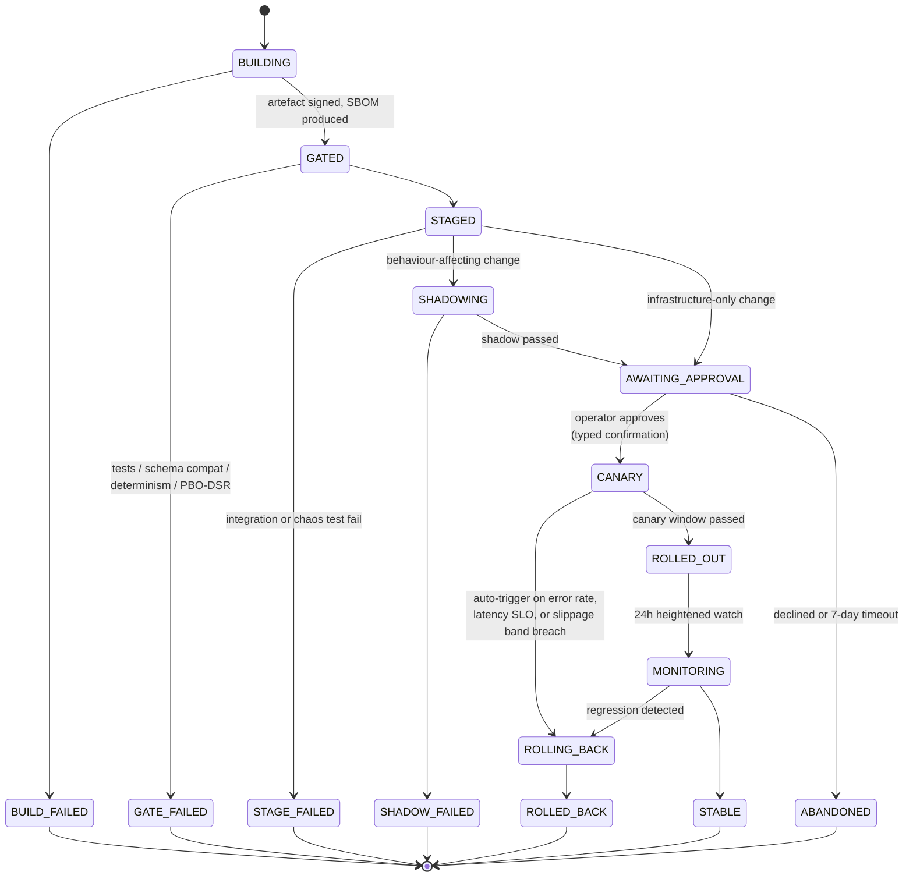

# R07 — State Machines

**Deliverable:** 7
**Delta against:** the whole ADD. No page defines a state machine. Several pages describe states informally ("partial fills are an explicit, first-class state", "kill switch tripped", "model promoted") without enumerating the state set, the transitions, or the guards.
**Status:** Review v1.0

---

## 1. Why this matters more here than in most systems

An informal state description produces code where state is inferred from a combination of nullable fields. In a trading system that pattern produces a specific class of bug: a position that is neither open nor closed, an order that is neither sent nor unsent, a model that is neither shadow nor live. Each of those costs money.

Nine components need formal state machines. For each: the state set, the transition table with guards and side effects, the terminal states, and the illegal transitions that must be assertable in tests.

**Universal rules applied to all nine:**

1. Every state machine has an explicit `UNKNOWN` or equivalent for external-system uncertainty. Absence of an answer is a state, not an error.
2. Every transition is persisted before its side effect is executed, never after. A crash between them must leave the system in the pre-transition state, not in a state whose side effect fired twice.
3. Every transition is auditable: from, to, trigger, actor, timestamp, correlation id.
4. Illegal transitions raise, they do not log-and-continue.
5. Timeouts are transitions, not exceptions. Every non-terminal state has a maximum dwell time and a defined transition when it expires.

---

## 2. SM-1 — Platform mode (new, and the most important)

Nothing in the ADD defines global system state. Without it, "degraded" is a word in prose rather than a condition components can read and act on.

### Permitted actions by mode

| Mode | New entries | Position management | Exits | Deliberation | Ingestion | Research |
|---|---|---|---|---|---|---|
| `STARTING` | No | No | No | No | No | No |
| `STANDBY` | No | No | No | No | Yes (warm) | Yes |
| `RECONCILING` | No | No | **Emergency only, operator-initiated** | No | Yes | Yes |
| `AWAITING_CONFIRM` | No | Yes | Yes | No | Yes | Yes |
| `NORMAL` | Yes | Yes | Yes | Yes | Yes | Yes |
| `DEGRADED` | **No** | Yes | Yes | Yes (recorded, not actioned for entries) | Yes | Yes |
| `HALTED` | No | Yes | **Yes** | No | Yes | Yes |
| `MAINTENANCE` | No | No | No | No | Optional | Yes |
| `DRAINING` | No | Yes | Yes | Finish in flight | Yes | No |
| `STOPPED` | No | No | No | No | No | No |

**The load-bearing row is `HALTED`.** Exits are permitted while halted. A kill switch that prevents closing a losing position is not a safety feature. Page 10 gets the related decision right (the switch does not auto-liquidate) but does not state that manual and automated exits remain possible, which is the more important half.

**Fail-safe rule:** any component that cannot read the current mode within 10 seconds behaves as `HALTED` for entries and `NORMAL` for exits.

---

## 3. SM-2 — Deliberation cycle

Page 08 describes a flow. The state machine adds the deadline, the quorum, and the terminal-state guarantee.

### Terminal states, all nine

`SUPPRESSED`, `ABORTED`, `QUORUM_FAILED→NO_ACTION`, `DEADLOCKED`, `NO_ACTION`, `WITHDRAWN`, `REJECTED`, `EXPIRED`, `EXECUTED`, `EXECUTION_FAILED`.

**Every one of them produces a durable record.** There is no path where a cycle ends silently. This is what makes the deadlock rate, the quorum-failure rate, and the expiry rate observable, and page 08 correctly identifies deadlock rate as a health metric without providing the state to measure it.

### Guards

| Transition | Guard |
|---|---|
| `TRIGGERED → ADMITTED` | cost budget available AND no cycle for this symbol within cooldown AND platform mode permits deliberation |
| `ASSEMBLING → EVIDENCE_SEALED` | every required evidence node present AND no node with `staleness.severity = critical` |
| `POLLING → DESKS_COMPLETE` | valid opinions ≥ quorum (default 4 of 6) AND every opinion's citations resolve to nodes in the sealed graph |
| `CONSENSUS → PROPOSAL_DRAFTED` | pooled stance ≠ flat AND conviction ≥ floor AND dispersion ≤ threshold |
| `PROPOSAL_ISSUED → AUTHORISED` | Risk Engine returns a signed token AND `now < valid_until` |
| `AUTHORISED → EXECUTED` | token unconsumed AND price within drift tolerance AND leader lease held |

### Illegal transitions (assert in tests)

- Any state → `EXECUTED` without passing through `AUTHORISED`.
- `DEADLOCKED` → anything. Terminal.
- Re-entering `POLLING_DESKS` after `DESKS_COMPLETE`. A cycle never re-polls; a revision is a new cycle.
- `PROPOSAL_ISSUED` without a sealed evidence graph hash.

**Maximum dwell:** `POLLING_DESKS` 8s, `ASSEMBLING_EVIDENCE` 1s, `PROPOSAL_ISSUED` 2s, whole cycle 12s. Every expiry is a transition, not a hang.

---

## 4. SM-3 — Order lifecycle

Page 11 names partial fills as first-class and names the unknown-outcome failure. Both need states.

### The four states the ADD is missing

| State | Why it must exist |
|---|---|
| `UNKNOWN` | Page 11's stated failure mode. Without the state, code either assumes not-sent (and re-sends, duplicating) or assumes sent (and loses the position). Both are wrong. |
| `NOT_SENT` | The resolution of `UNKNOWN` that permits a safe retry. Distinguishing it from `REJECTED_BROKER` matters because one is retryable and the other is not. |
| `CLOSED_PARTIAL` | Page 11 says the remainder is "re-queued or cancelled per time-in-force." That is two different terminal outcomes and they must be distinguishable in the record. |
| `CANCELLING → FILLED` | The cancel/fill race. Real, common, and silently mishandled if the transition is not modelled. |

**Non-negotiable:** `UNKNOWN` has no timeout to a "safe" assumption. It resolves only by querying the broker. If the broker is unreachable, the order stays `UNKNOWN`, the platform stays `DEGRADED`, and the operator is paged. Guessing here is how duplicate positions are created.

---

## 5. SM-4 — Trade / position lifecycle

Entirely absent from the ADD. This is the state machine the OMS drives.

### The three states that only exist because reality is messy

| State | Trigger | Why it matters |
|---|---|---|
| `UNPROTECTED` | A periodic sweep finds an open position whose broker-side stop is absent (deleted manually, rejected by the broker, lost in a reconnect) | This is the state in which an unbounded loss becomes possible. It must be detectable, alertable, and short-lived by construction. Without the state, nobody looks. |
| `ADOPTED_UNMANAGED` | Reconciliation finds a position the platform did not open | Manual trades at the terminal, or a position that survived a catastrophic restart. Silently managing it with default rules is worse than flagging it. |
| `EMERGENCY_EXIT` | Invalidation, risk breach, operator override, or unrecoverable `UNPROTECTED` | Distinct from a planned exit because it bypasses entry-blocking rules and uses market orders rather than working the exit. The distinction must be in the record for TCA to be honest. |

**Invariant:** no position remains in `OPEN` or `UNPROTECTED` for more than 60 seconds without an alert. `MANAGED` is the only acceptable steady state for an open position.

---

## 6. SM-5 — Model lifecycle

Page 07 implies candidate → promoted. Five stages plus a permanent challenger.

**Design decisions encoded here:**

- **`CHALLENGER` is a running state, not storage.** The previous champion keeps producing predictions that are recorded and not acted on. That is the only way to answer "was the promotion actually an improvement" a month later, and it costs almost nothing.
- **`ROLLED_BACK` is a pointer flip, not a redeploy.** Both versions are loaded in the inference service.
- **Leakage detection is a gate, not a review item.** The check is mechanical: assert that no feature with `point_in_time_safe = false` appears in the training feature set.
- **This machine governs prompts and desk weights too**, not just ML models (R04 §9). A prompt change is a model change and takes the identical path, which is what page 08's shadow-mode requirement actually implies.

---

## 7. SM-6 — Kill switch

**Scopes:** `platform`, `account`, `symbol`, `strategy`. They are independent state machines and the effective state is the **most restrictive** across all applicable scopes. A symbol-scoped trip does not require halting the platform, and a platform trip overrides everything.

**Asymmetric authority, restated because it is the point:** transition to `TRIPPED` is available to every component and every human, with no confirmation. Transition to `ACTIVE` after an automatic trip requires two humans and a clean reconciliation.

---

## 8. SM-7 — Data source / circuit breaker

Page 01 describes 3-failures-to-open and 60s half-open. Formalised, with the additions that matter.

`DEGRADED_QUALITY` is the addition. Page 01's breaker opens on failures; page 02 scores quality; nothing connects them. A source that is up and returning subtly wrong data will never trip the breaker as designed, and it is the more dangerous case.

---

## 9. SM-8 — Data quality routing

Page 02's PASS/FLAG/REJECT with the missing lifecycle around REJECT.

Two additions to page 02:

- **`RELEASED` must trigger a downstream backfill.** Force-releasing quarantined data without recomputing the features derived from the gap leaves the Feature Store permanently inconsistent, and page 02 does not mention it.
- **`GAP_RECORDED` makes gaps first-class.** A backtest over a period containing a confirmed gap must know, because the alternative is a backtest that silently interpolates over a real market event.

---

## 10. SM-9 — Deployment / release

`AWAITING_APPROVAL` has a 7-day timeout to `ABANDONED`. A release sitting in a pending state indefinitely is how a stale artefact gets promoted weeks later against a codebase that has moved on.

---

## 11. Coverage and priority

| # | State machine | Owner | Persisted in | Priority |
|---|---|---|---|---|
| SM-1 | Platform mode | Platform Supervisor | Postgres + Redis + in-process | **P0** |
| SM-2 | Deliberation cycle | Decision Saga | Postgres, one row per cycle | **P0** |
| SM-3 | Order lifecycle | Execution | Postgres, one row per client_order_id | **P0** |
| SM-4 | Trade / position | OMS | Postgres, one row per position | **P0** |
| SM-5 | Model lifecycle | Model Registry | MLflow + Postgres | P1 |
| SM-6 | Kill switch | Risk Engine | Postgres + Redis + in-process | **P0** |
| SM-7 | Data source breaker | Ingestion | Redis (rebuildable) | P1 |
| SM-8 | Data quality routing | Quality Engine | Postgres | P1 |
| SM-9 | Deployment | CI/CD | GitHub + Postgres | P2 |

**Implementation recommendation:** a single small state-machine library used by all nine, with a declarative transition table, mandatory persistence-before-side-effect, an audit hook, and automatic generation of the Mermaid diagram from the table. That last point is what stops these diagrams from drifting the way pages 15 and 16 are predicted to.

**Testing requirement:** for each machine, a property test asserting that from every state, every event either produces a declared transition or raises. Undeclared silent no-ops are how state machines rot into nullable-field checks.

---

## 12. Related

- `R00_Executive_Review.md` (B2)
- `R05_Interface_Contracts.md` (invariants these machines enforce)
- `R06_Sequence_Diagrams.md` (sequences that drive these transitions)
- `R11_Risk_Architecture.md` (SM-6 in depth)
- `R19_Missing_Components.md` (OMS and Supervisor, which own SM-1 and SM-4)
- `../diagrams/` — Excalidraw visual companion for all nine machines (SM1-SM9)
