# R08 — Data Lineage

**Deliverable:** 8
**Delta against:** `01_Data_Ingestion.md`, `02_Data_Quality_Engine.md`, `03_Feature_Store.md`, `09_Decision_Intelligence_Layer.md`, `12_Continuous_Learning.md`
**Status:** Review v1.0

---

## 1. What the ADD has and what it lacks

The ADD describes a data *flow* well. It does not describe *lineage*, and the two are different:

- **Flow** answers "what goes where." Pages 01-03 answer this.
- **Lineage** answers "given this decision, prove exactly which inputs produced it, and given this input, find everything downstream that must be recomputed if it changes."

Lineage is what makes three things possible that the ADD promises and cannot currently deliver: point-in-time correctness verification (page 03), counterfactual replay (page 09's future expansion), and the impact analysis needed when a data source is discovered to have been wrong for a week.

**The specific gap:** page 03 asserts point-in-time correctness is "enforced at the query layer" without describing the mechanism (finding D8). Lineage plus Iceberg snapshots is that mechanism.

---

## 2. The lineage chain, stage by stage

Each stage below states: the artefact, its identity, its immutability, what is recorded, and what breaks without the record.

```mermaid
graph TB
    S0["S0 EXTERNAL EVENT<br/>the market actually did something"]
    S1["S1 RAW PAYLOAD<br/>vendor response, byte-exact"]
    S2["S2 NORMALISED TICK/BAR<br/>platform schema, UTC"]
    S3["S3 QUALITY VERDICT<br/>score + detector breakdown"]
    S4["S4 CANONICAL BAR<br/>the accepted record"]
    S5["S5 FEATURE VALUE<br/>versioned definition applied"]
    S6["S6 ENGINE OUTPUT<br/>regime / vol / structure / prediction"]
    S7["S7 EVIDENCE NODE<br/>weighted, staleness-tagged"]
    S8["S8 SEALED EVIDENCE GRAPH<br/>content-addressed"]
    S9["S9 DESK OPINION<br/>citations only"]
    S10["S10 CONSENSUS"]
    S11["S11 PROPOSAL"]
    S12["S12 RISK ASSESSMENT<br/>rule-by-rule"]
    S13["S13 AUTHORISATION<br/>signed token"]
    S14["S14 ORDER"]
    S15["S15 FILL"]
    S16["S16 POSITION / LOT"]
    S17["S17 CLOSED TRADE<br/>realised P&L"]
    S18["S18 ANALYTICS<br/>attribution, TCA, calibration"]
    S19["S19 HYPOTHESIS"]
    S20["S20 VALIDATED CHANGE"]
    S21["S21 PROMOTED ARTEFACT<br/>model / prompt / weight / limit"]

    S0-->S1-->S2-->S3-->S4-->S5-->S6-->S7-->S8-->S9-->S10-->S11-->S12-->S13-->S14-->S15-->S16-->S17-->S18-->S19-->S20-->S21
    S21-.->S6
    S21-.->S9
    S21-.->S12
    S18-.->S5

    classDef immutable fill:#1a3a2a,stroke:#4a8
    class S1,S4,S8,S13,S15,S17 immutable
```



Green nodes are immutable-by-construction. The dotted lines back from S21 are the learning loop, and they are the reason every artefact must be point-in-time versioned: a promoted artefact changes how S6, S9 and S12 behave from that moment forward, and a replay of an older decision must use the older artefact.

### Stage table

| # | Artefact | Identity | Immutable | Recorded | Without it |
|---|---|---|---|---|---|
| S1 | Raw payload | `sha256(payload)` | **Yes**, object-locked in `raw` | Vendor, endpoint, request params, response headers, receipt time, byte-exact body | You cannot prove a vendor sent what you claim, and cannot reprocess after a parser bug |
| S2 | Normalised tick/bar | `(source, symbol, timeframe, event_time)` | Yes | Parser version, normalisation rules applied, timezone source, `raw_ref` | A parser change silently rewrites history |
| S3 | Quality verdict | `(dataset_id, detector_set_version)` | Yes | Every detector's `(triggered, severity, detail)`, composite score, routing decision, thresholds used | You cannot audit a quarantine decision, and page 02's weekly false-positive audit has no data |
| S4 | Canonical bar | `(symbol, timeframe, event_time)` + Iceberg snapshot | **Yes**, correction is a new snapshot | Which S2 record won when sources disagreed, and why | "Which price did we actually use" is unanswerable |
| S5 | Feature value | `(symbol, timeframe, as_of, feature_name, feature_version)` | Yes | Definition hash, input bar snapshot id, computation code version | Page 03's definition-drift failure mode has no detection |
| S6 | Engine output | `(symbol, timeframe, as_of, engine, model_version)` | Yes | Fitted params ref (MLflow), input feature versions, convergence status, staleness | You cannot reproduce a regime call |
| S7 | Evidence node | `node_id` = `{kind}:{symbol}:{tf}:{as_of}:{field}` | Yes | Source engine, source version, value, weight, staleness | Citations have nothing to point at (R03 §5) |
| S8 | Sealed graph | `sha256(canonical(graph))` | **Yes** | Full node set, edges, weights, seal time | The decision has no provable input set |
| S9 | Desk opinion | `(cycle_id, desk)` | Yes | Prompt version, model version, evidence hash, citations, raw LLM response, tokens, latency | Page 08's model-drift failure mode is undetectable |
| S12 | Risk assessment | `assessment_id` | Yes | Every rule verdict, limit-set version, portfolio snapshot ref and its sequence | "Why was this allowed" is unanswerable |
| S13 | Authorisation | `authorisation_id`, signed | **Yes** | Signature, TTL, approved size, SL/TP, assessment ref | The authorisation chain is unverifiable |
| S15 | Fill | `(broker_order_id, fill_sequence)` | **Yes** | Broker response verbatim, expected vs actual, decomposed slippage | TCA is impossible |
| S17 | Closed trade | `trade_id` | **Yes** | Full leg history, realised P&L decomposition, `decision_id` | Attribution to the decision that caused it is lost, which is the entire input to Learning |

---

## 3. The two lineage directions

Both must be queryable. They serve different questions and are used at different times.

### Backward lineage (forensic): "how did this decision happen?"

```
trade_id
  -> decision_id
     -> authorisation_id -> assessment_id -> limit_set_version
                                          -> portfolio_snapshot(sequence)
     -> cycle_id -> [desk_opinion x6] -> prompt_version, model_version
                 -> evidence_graph_hash
                    -> [evidence_node xN]
                       -> engine_output(engine, model_version, fitted_params_ref)
                          -> [feature_value xM](feature_version, definition_hash)
                             -> canonical_bar(iceberg_snapshot_id)
                                -> normalised(parser_version)
                                   -> raw_payload(sha256)
```

**Requirement:** every one of these hops is a stored foreign key, not a reconstruction by timestamp proximity. Timestamp-based joins are how lineage silently becomes wrong.

**Target:** one query, sub-second, from `trade_id` to the complete input set. This is the query the operator runs after a loss and the query an auditor runs after anything.

### Forward lineage (impact): "what does this affect?"

```
"Polygon returned wrong XAUUSD bars 2026-07-14 to 2026-07-16"
  -> canonical bars in that range
     -> features derived from them
        -> engine outputs using those features
           -> evidence nodes
              -> decision cycles
                 -> trades placed
                    -> P&L attributed
                 -> models trained on that period
                    -> currently promoted models affected
                       -> every decision made by those models since
```

Forward lineage is what turns a vendor incident from "we should probably look into that" into a bounded, actionable list. Without it, the honest response to a discovered data error is to retrain everything, which is both expensive and usually unnecessary.

---

## 4. Implementation: three mechanisms, not one

Lineage is often attempted as a single graph database. That is the wrong shape here. Three mechanisms, each cheap, each covering a different granularity.

### M1 — Iceberg snapshots (dataset granularity)

This is the payoff for the storage decision in R13 §3.

- Every table write creates a snapshot with a monotonic ID.
- Every consumer records the snapshot ID of every input table.
- `SELECT ... FOR SYSTEM_VERSION AS OF <snapshot_id>` reproduces the exact input state.
- **Point-in-time correctness becomes a storage property**, not caller discipline. Page 03's most dangerous failure mode is closed by the substrate rather than by a query-layer convention.

```python
# The contract that makes this work
result = engine.compute(
    features=feature_store.read(
        symbol=sym, timeframe=tf,
        as_of=cycle.as_of,               # business time filter
        snapshot_id=cycle.input_snapshots["features"],  # physical version
    )
)
# Both are required. as_of alone allows reading a row that was
# BACKFILLED later with a corrected value. snapshot_id pins the
# version of history that was visible at decision time.
```

That distinction (`as_of` filters business time, `snapshot_id` pins the version of the record) is subtle and is the thing that most backtests get wrong. A bar corrected three days later is legitimately present in today's table with yesterday's timestamp. Only the snapshot pin excludes it.

### M2 — Explicit reference columns (record granularity)

Every artefact row carries the identity of its direct inputs. Not a join by time, a stored key.

```sql
CREATE TABLE evidence_nodes (
  node_id           TEXT PRIMARY KEY,
  cycle_id          TEXT NOT NULL REFERENCES cycles,
  source_engine     TEXT NOT NULL,
  source_version    TEXT NOT NULL,
  input_snapshot_id BIGINT NOT NULL,
  feature_versions  JSONB NOT NULL,   -- {"technical.rsi": "v2", ...}
  fitted_params_ref TEXT,             -- mlflow://...
  value             JSONB NOT NULL,
  as_of             TIMESTAMPTZ NOT NULL,
  staleness         JSONB NOT NULL,
  weight            NUMERIC NOT NULL
);
```

This covers the decision path, where record-level precision is required and volume is low (hundreds of cycles per day, not millions).

### M3 — Column-level lineage graph (definition granularity)

Registered declaratively when a feature is defined, not inferred from code.

```python
@feature(
    name="technical.rsi", version="v2",
    inputs=["bars.close"],
    lookback_bars=14,
    point_in_time_safe=True,
    online_serving=True, max_staleness="1 bar",
)
def rsi_v2(bars: BarSeries) -> Series: ...
```

The registry builds the DAG from these declarations. It answers "what depends on `bars.close`" without parsing code and without runtime tracing. `lookback_bars` also gives the backfill planner the exact warm-up window, which is otherwise guessed.

**Deliberately not recommended:** runtime lineage tracing (wrapping every dataframe operation). It is expensive, fragile, and produces lineage at a granularity nobody queries.

---

## 5. Point-in-time correctness: the full mechanism

Page 03 calls look-ahead leakage "the single most dangerous failure mode in the whole platform" and is right. Here is the defence in depth it needs, five layers, because any single layer will eventually be bypassed.

| Layer | Mechanism | Catches |
|---|---|---|
| **L1 Type system** | `AsOf` is a distinct type. Any function reading data takes it explicitly. There is no `get_features(symbol)` overload without it | Accidental omission at the call site |
| **L2 Query layer** | The repository filters `WHERE event_time <= as_of` AND pins `snapshot_id`. Callers cannot construct a raw query; the repository is the only path | The corrected-bar-backfilled-later case that `as_of` alone misses |
| **L3 Feature registry** | `point_in_time_safe: bool` per feature. Training pipelines reject any feature set containing an unsafe feature unless it is explicitly a label | Forward-looking features used as inputs |
| **L4 Clock injection** | No `datetime.now()` anywhere. In `sim`, the clock cannot advance past the simulation's current bar | Code reading wall time inside a backtest |
| **L5 Adversarial test** | A CI test that runs a known-leaky feature through the pipeline and asserts it is caught. Plus a shuffle test: randomise labels, retrain, assert performance collapses to chance | Everything the first four missed, and the case where leakage exists but nobody wrote a rule for it |

**L5 is the one most often skipped and the most valuable.** A model that still performs well on shuffled labels is reading the future through a channel nobody anticipated. It is the only test that catches unknown leakage paths.

**Additional requirement the ADD does not state:** the LLM memory path is also a leakage vector. Page 08 gives each desk "last N committee cycles for this symbol." In a replay of a historical period, that memory must contain only cycles that occurred before the replayed timestamp, and the prompt version must be the one live at that time (R04 §5). Otherwise every Committee backtest is contaminated by prompts tuned on the outcomes being tested. This is a subtle, severe, and entirely unaddressed leak in the current design.

---

## 6. Lineage-driven operations

Three operations that only become possible once lineage exists. Each is a real scenario for this platform.

### O1 — Vendor data correction

```
1. Vendor announces XAUUSD bars were wrong 07-14 to 07-16
2. Forward lineage: list affected bars, features, engine outputs,
   cycles, trades, and trained models
3. Ingest corrected data as a NEW Iceberg snapshot. Never overwrite.
4. Recompute features for the range; new feature versions, old retained
5. For each affected trained model: was the corrupt window material?
   If yes, retrain and re-validate. If no, record the assessment.
6. For each affected trade: recompute what the decision WOULD have been.
   This is a counterfactual, recorded for Learning, never used to
   restate P&L. Realised P&L is realised.
7. Publish an incident record linking all of it
```

Step 6 is the discipline that matters: lineage lets you learn from the corrected counterfactual without ever rewriting the financial record.

### O2 — Model rollback with data implications

Rolling back a model is a pointer flip (SM-5). But if the model was trained on data that has since been corrected, the previous version was trained on data that no longer exists in the current table. Lineage records the training snapshot, so the rollback is to a fully reproducible artefact rather than to "whatever that model was."

### O3 — Decision dispute

An operator asks "why did the system go long into CPI?" One backward-lineage query returns: the evidence graph, each desk's opinion and prompt version, the consensus computation, every risk rule verdict, the limit set in force, the news-blackout rule's evaluation and why it did not fire, and the portfolio snapshot sequence. This is the question that gets asked after every bad trade, and the ability to answer it in seconds rather than days is most of the value of the whole lineage effort.

---

## 7. Storage cost, honestly

Lineage metadata is often abandoned on cost grounds. It should not be here, because the volumes are small.

| Tier | Volume estimate | Retention | Note |
|---|---|---|---|
| Raw payloads | ~2-10 GB/month per symbol at tick level | 2 years hot, then cold | The only genuinely large tier. Compress and tier aggressively |
| Canonical bars + features | ~100 MB/month per symbol | Forever | Parquet/Iceberg, trivially small |
| Decision-path lineage (S7-S17) | **~50 MB/month total** | Forever | Hundreds of cycles per day. This is nothing |
| LLM call records | ~500 MB/month | 2 years | Prompts and responses. Compresses ~10x |
| Iceberg snapshot metadata | Negligible | Expire snapshots older than 1 year for non-audit tables | |

**The entire decision-path lineage, which is where all the forensic value is, costs under a gigabyte per year.** There is no cost argument for not having it.

---

## 8. Gaps in the current ADD, summarised

| # | Gap | Page | Fix |
|---|---|---|---|
| G1 | Point-in-time correctness asserted with no mechanism | 03 | §5, five layers |
| G2 | No snapshot/version pinning on any read | 01, 03 | M1, Iceberg |
| G3 | Feature definition hash not recorded, so drift is undetectable | 03 | M3, registry |
| G4 | Evidence has no identity, so citations cannot be references | 09 | S7 node IDs, R03 §5 |
| G5 | No link from a trade back to the decision that caused it | 11, 12 | S17 carries `decision_id` |
| G6 | Quality detector outputs not persisted, so the weekly audit page 02 requires has no data | 02 | S3 |
| G7 | LLM memory and prompt versions are a leakage vector in replay | 08 | §5, point-in-time prompt registry |
| G8 | No forward lineage, so a data incident has unbounded scope | all | M3 + O1 |
| G9 | Corrections described as "a new validated version" (page 01) with no mechanism for propagating them downstream | 01 | O1 |

---

## 9. Related

- `R00_Executive_Review.md` (B6, D8)
- `R03_Domain_Model_DDD.md` (§5, citations as references)
- `R09_Evidence_Graph.md` (S7 and S8 in depth)
- `R13_Infrastructure.md` (Iceberg decision)
- `R04_Platform_Services.md` (PS-05 Feature Registry, PS-06 Metadata Registry)
- Source: `../03_Feature_Store.md`
