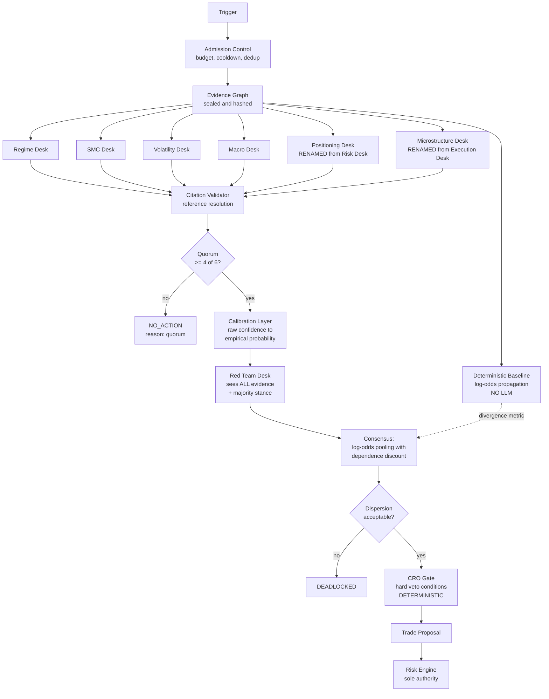

# R10 — AI Investment Committee

**Deliverable:** 10
**Delta against:** `08_AI_Investment_Committee.md`
**Status:** Review v1.0

---

## 1. Assessment

Page 08 is the strongest page in the ADD and the one with the most at stake. Four decisions on it are correct and should be preserved verbatim:

1. **Separate API calls per desk, not one mega-prompt.** The isolation boundary is enforced by the context window rather than by prompt text. This is the right instinct and most implementations get it wrong.
2. **The Portfolio Manager is an orchestrator, not a seventh opinion.** Avoids the common failure where a "PM agent" simply overrides the committee and the other five calls become theatre.
3. **Deadlock resolves to no-trade with the asymmetry explicitly justified.** Correct and well-argued.
4. **A failed desk output is treated as abstain, not as neutral.** Neutral is a vote; abstain is not. The distinction is subtle and page 08 gets it right.

Seven material weaknesses follow. Each is addressed below.

| # | Weakness | Severity |
|---|---|---|
| W1 | Citation validation by string matching, whose false-negative problem page 08 identifies and does not solve | High |
| W2 | No quorum. Four abstentions plus two agreeing desks produces a confident-looking decision from almost no evidence | **Critical** |
| W3 | Self-reported LLM confidence treated as if calibrated | High |
| W4 | Weighted vote over correlated opinions, with the correlation acknowledged and uncorrected | High |
| W5 | Memory is recency-based, which is both uninformative and a replay leak | High |
| W6 | No adversarial component. Six desks all reasoning toward a conclusion with nobody arguing against it | High |
| W7 | Desks read one engine each, which is correct for isolation but leaves nobody able to see a cross-engine contradiction | Medium |
| W8 | The circular dependency of the Risk and Execution desks (B3) | **Critical** |

---

## 2. Revised committee structure



### Desk changes

| Old | New | Reason |
|---|---|---|
| Risk Desk (reads page 10) | **Positioning Desk** (reads the Portfolio read model) | Closes B3. It reasons about current exposure and correlation, not about risk limits. Limits are deterministic and belong to the Risk Engine, not to an opinion |
| Execution Desk (reads page 11) | **Microstructure Desk** (reads the Market Conditions read model) | Closes B3. It reasons about spread, depth, session liquidity, and expected execution cost, not about the Execution Engine |
| — | **Red Team Desk** (new) | Sees the full evidence graph and the majority stance. Its only job is to construct the strongest case against acting |
| — | **CRO Gate** (new, deterministic) | Not an LLM. A set of hard conditions that veto regardless of committee conviction |

The two renames are not cosmetic. They change what the desk is *about*, from "what does the Risk Engine think" (a dependency on a downstream service) to "what does the current book imply" (a read model). That is what breaks the cycle.

---

## 3. The desk contract, corrected (L4.2)

Page 08's six-field contract, with the four fields it is missing and the two that change.

```python
@dataclass(frozen=True)
class DeskInput:
    cycle_id: str
    as_of: AsOf
    graph_slice: GraphSlice        # own nodes + edge-connected nodes,
                                   # edge types visible, other engines'
                                   # raw values NOT visible (W7 fix)
    precedents: list[PrecedentNode] # similarity-based, as_of-filtered (W5 fix)
    prompt_version: PromptVersion   # point-in-time resolved
    deadline: Deadline

@dataclass(frozen=True)
class DeskOpinion:
    desk: DeskId
    stance: Literal["long", "short", "flat"]
    conviction_raw: int              # 0-100 SELF-REPORTED. Never used directly.
    citations: list[Citation]        # node_id + node_hash. NO free numbers.
    rationale_template: str          # with {{n}} placeholders
    rationale_bindings: list[int]    # indices into citations
    counter_considerations: list[Citation]   # NEW: what argues against
                                             # its own stance. Mandatory.
    would_change_mind_if: str        # NEW: falsifiability statement
    abstained: bool
    abstain_reason: AbstainReason | None
```

### The four new or changed fields

| Field | Why |
|---|---|
| `citations` replaces free-text numbers | W1. Hallucinated numbers become inexpressible (R03 §5) |
| `counter_considerations` **mandatory** | A desk that cannot name any evidence against its own stance is either not looking or is overconfident. Empty is permitted only when the desk abstains. This single field does more for calibration than any prompt instruction |
| `would_change_mind_if` | Forces a falsifiable statement. Also directly usable by the OMS as an invalidation condition for the resulting position, which is a genuinely valuable byproduct |
| `conviction_raw`, explicitly marked as unusable directly | W3. Renaming it from `confidence` to `conviction_raw` is deliberate: it signals in the type that this number has not been calibrated |

### Abstention reasons, enumerated

`SCHEMA_VIOLATION`, `CITATION_UNRESOLVABLE`, `EVIDENCE_CRITICALLY_STALE`, `EVIDENCE_INSUFFICIENT`, `LLM_TIMEOUT`, `LLM_ERROR`, `BUDGET_EXCEEDED`, `INJECTION_SUSPECTED`.

Enumerated rather than free text because abstention rate by reason is a health metric. A rising `EVIDENCE_INSUFFICIENT` rate means the engines are degrading; a rising `SCHEMA_VIOLATION` rate means the model or prompt has drifted. Page 08 identifies both as failure modes and provides no signal for either.

---

## 4. Red Team Desk and CRO Gate

### Red Team Desk (LLM, sees everything)

Page 08 lists an adversarial second pass under Future Expansion, to be evaluated "once desk-level calibration is stable." That ordering is backwards: the Red Team is what *produces* calibration data, because it is the only component whose accuracy is directly measurable (did the objection it raised turn out to matter).

| Property | Value |
|---|---|
| Input | The **full** evidence graph, the majority stance, and every desk's rationale |
| Task | Construct the strongest available case that this trade is wrong. Not a devil's advocate exercise: cite specific evidence |
| Output | `{objection_strength: 0-100, objections: [Citation], scenario: str, historical_precedent: [PrecedentNode]}` |
| Effect | Objection strength above threshold forces `DEADLOCKED`. Below threshold, it reduces pooled conviction proportionally |
| Scoring | Tracked separately: when the Red Team objected strongly and was overruled, what happened? This is the single most valuable calibration dataset the platform generates |

The Red Team is deliberately exempt from the isolation rule that governs the six desks. Isolation exists to make each desk's reasoning traceable to one deterministic source. The Red Team's job is precisely to find cross-source contradiction, which requires seeing across sources. Different job, different constraint.

### CRO Gate (deterministic, not an LLM)

A small set of hard conditions that veto regardless of committee conviction. Distinct from the Risk Engine: the Risk Engine asks "does the portfolio permit this," the CRO Gate asks "is this trade the kind of trade we do."

| Condition | Rationale |
|---|---|
| Evidence quality: any critical-severity stale node | Do not act on a picture you know is broken |
| Conviction below floor after Red Team adjustment | A marginal trade is not worth the transaction cost or the tail risk |
| Regime confidence below floor | If you do not know what market you are in, do not take a directional view |
| High-impact event within the blackout window | Duplicates the Risk Engine's news guard deliberately. Two independent implementations of the most commonly-catastrophic rule is correct redundancy |
| Correlation with existing book above threshold | Adding a seventh correlated position is one position, not seven |
| Cumulative same-direction exposure at cap | |
| Post-drawdown cooling period active | After a defined drawdown, new entries pause regardless of signal quality. The best signals often appear during drawdowns, and that is exactly when judgement is worst |

Deterministic and testable. No LLM involvement. The CRO Gate is what stops a persuasive committee from talking itself into a trade the platform's own policy forbids.

---

## 5. Calibration layer (W3)

A language model's self-reported confidence is not a probability. It is a token distribution artefact that correlates loosely with correctness and is systematically overconfident. Using it directly as a vote weight, which page 08 does, means the vote is weighted by a quantity with unknown units.

### Mechanism

1. Every desk opinion is recorded with its `conviction_raw` and, once the trade resolves, its outcome.
2. Per desk, fit an isotonic regression from `conviction_raw` to empirical hit rate. Isotonic rather than Platt scaling because it makes no parametric assumption and monotonicity is the only property that must hold.
3. `conviction_calibrated = isotonic_desk(conviction_raw)`.
4. Refit weekly, PBO-gated like any other learned parameter (page 12's no-shortcut rule applies).
5. Until a desk has ≥100 resolved opinions, use a shrunk prior: `0.5 + 0.3 x (raw/100 - 0.5)`. Heavy shrinkage toward chance, because an uncalibrated desk should barely move the pooled result.

### Metrics this produces (all new, all necessary)

| Metric | Meaning | Alert |
|---|---|---|
| Brier score per desk | Overall calibration quality | Rising trend over 4 weeks |
| Reliability diagram per desk | Where the desk is over- or under-confident | Visual, reviewed weekly |
| Expected calibration error | Single-number summary | ECE > 0.15 flags the desk for prompt review |
| Resolution | Does the desk discriminate at all? | Near-zero resolution means the desk adds nothing and should be removed |

**Resolution is the metric that matters most and is the one nobody measures.** A desk that says "bullish, 70" on every cycle has perfect calibration if it is right 70% of the time and contributes exactly zero information. Only resolution catches that, and it is the honest test of whether six desks are better than three.

---

## 6. Consensus mechanism (W4)

Page 08 uses a weighted vote with tunable per-desk weights. Replace with log-odds pooling with an explicit dependence correction.

```
pooled_logodds(LONG) =
    prior_logodds(LONG | regime, session)          # measured base rate
  + SUM over desks d:
        w_d x independence_d x logodds(conviction_calibrated_d | stance_d)
  - red_team_penalty
```

| Term | Source |
|---|---|
| `prior_logodds` | Measured base rate of profitable long setups in this regime and session. **Not 0.5.** Using 0.5 assumes the market is a coin flip conditional on nothing, which is both false and needlessly discards known structure |
| `w_d` | Learned desk weight, PBO-gated (page 08's existing mechanism, retained) |
| `independence_d` | From the evidence graph's `SHARES_MODEL_WITH` structure (R09 §4). Two desks reading nodes that share a fitted GARCH model each get discounted. **This is the fix for the correlation page 08 acknowledges and does not correct** |
| `red_team_penalty` | Proportional to objection strength |

### Dispersion and deadlock

Deadlock is currently triggered by "disagreement beyond a configurable threshold." Make the measure explicit: **weighted standard deviation of per-desk log-odds contributions**. Two distinct failure shapes must be distinguished:

| Shape | Meaning | Response |
|---|---|---|
| High dispersion, high |mean| | Strong disagreement between confident desks | `DEADLOCKED`. This is the genuine conflict case |
| Low dispersion, low |mean| | Everyone agrees there is nothing here | `NO_ACTION`. Healthy. Should be the most common non-suppressed outcome |
| Low dispersion, high |mean| | Genuine consensus | Proceed |
| High dispersion, low |mean| | Desks disagree and cancel out | `NO_ACTION`, but tracked separately. A rising rate here means the desks are noise, not signal |

Page 08 conflates the second and fourth cases as "no trade." They are diagnostically very different and tracking them separately is how you learn whether the committee is working.

### The baseline comparison

The deterministic graph baseline (R09 §5) is computed on every cycle. Track:

- **Agreement rate** between the baseline and the pooled committee result.
- **Conditional accuracy** when they agree versus when they disagree.

If the committee never beats the baseline on the disagreement cases, the LLM layer is expensive decoration and should be reduced to a Red Team plus the CRO Gate. This is the test that makes the committee's existence falsifiable, and no version of the current architecture can run it.

---

## 7. Debate rules

Page 08 has no debate; it has parallel independent opinions and a vote. That is a defensible design (it preserves independence, which is the whole point of six desks) and should mostly be kept. One bounded exception is worth adding.

### Round 1: independent, parallel, isolated

As designed. No desk sees any other desk's output. This is the round that preserves independence, and independence is what makes pooling meaningful.

### Round 2 (conditional): targeted rebuttal

Triggered **only** when two desks with high calibrated conviction hold opposite stances. Not on every cycle.

- The two conflicting desks each receive the other's rationale and citations, and only those.
- Each may revise its stance once, and must state what changed its mind or explicitly state that nothing did.
- A desk that revises without naming a specific citation that caused the revision has its revision rejected and its original stance kept. This blocks the sycophancy failure where a model simply agrees with whatever it was last shown.
- Maximum one round. No convergence loop.
- Cost: two extra calls, only on genuinely conflicting cycles. Bounded.

**Guard:** round 2 is disabled entirely if the platform is in `DEGRADED` mode or the cost budget is above 80%. Debate is a luxury.

---

## 8. Failure handling

| Failure | Page 08's handling | Corrected handling |
|---|---|---|
| Desk output schema-invalid | Abstain, logged | Same, plus reason code `SCHEMA_VIOLATION`, plus a rate metric with an alert threshold |
| Desk cites a non-existent value | Hard rejection | **Inexpressible** with reference-based citations. If the reference does not resolve, `CITATION_UNRESOLVABLE` |
| LLM timeout | Not specified | Abstain with `LLM_TIMEOUT`. Per-desk 8s deadline. The cycle does not wait past its own deadline |
| Vendor outage | Not specified | Circuit breaker in the LLM Gateway. All desks abstain, quorum fails, `NO_ACTION`. **Explicitly no fallback to quant-only trading** |
| Fewer than quorum valid opinions | **Not handled** | `NO_ACTION`, reason `quorum`. W2, the critical gap |
| All desks agree suspiciously often | Correlation monitored by Learning | Same, plus resolution metric per desk, plus the independence discount making it arithmetically self-limiting |
| Model version change | Mandatory shadow run | Same, and now enforceable because the prompt registry pins the model version per prompt version |
| Prompt injection in evidence | Not addressed | Impossible after the text ACL (R03 §9). Gateway adds a second check; a hit is `INJECTION_SUSPECTED` and a P1 alert |
| Budget exhausted mid-cycle | Not addressed | The cycle completes with the desks already called; remaining desks abstain with `BUDGET_EXCEEDED`. Quorum applies. Never a half-considered decision presented as complete |

---

## 9. Escalation rules

Page 08 has no escalation concept. Four conditions should escalate to the human operator rather than resolving automatically.

| Condition | Escalation | Rationale |
|---|---|---|
| Red Team objection strength ≥ 80 but pooled conviction also ≥ 80 | Notify, do not block. Record as a `HIGH_CONFLICT` decision and track its outcomes separately | These are the most informative trades in the dataset, either way |
| Deadlock rate over a rolling window exceeds 2x baseline | P1 alert | Page 08 correctly names deadlock rate as a health metric. This is the threshold that operationalises it |
| Any desk's ECE exceeds 0.25 | P2, desk flagged for prompt review, weight floored | A badly calibrated desk actively degrades the pool |
| Proposal conviction ≥ 95 | **Always notify.** | Near-certainty is more often a bug than an insight. Treating extreme confidence as a signal to look rather than a signal to size up is a standing institutional practice for good reason |

---

## 10. Portfolio Manager responsibilities, restated

Page 08 defines the PM as an orchestrator implemented as a workflow, not an LLM. Correct, kept. The full responsibility list:

1. Own the `DeliberationCycle` aggregate and its state machine (R07 §2).
2. Enforce admission control before any spend.
3. Request the sealed evidence graph and verify the seal.
4. Resolve point-in-time prompt versions and desk weights for `as_of`.
5. Dispatch desks in parallel with individual deadlines.
6. Enforce quorum.
7. Invoke calibration, then Red Team, then pooling, then the CRO Gate.
8. Enforce the cycle deadline and terminate to a defined terminal state.
9. Seal the decision record before publishing anything.
10. **Never override the outcome.** The PM has no discretion. If the PM could override, the committee is decoration.

Point 10 is worth stating in the page explicitly. The single most common way this architecture degrades in practice is a PM that starts adding "judgement".

---

## 11. Conflict resolution summary

| Conflict | Resolver | Outcome |
|---|---|---|
| Two desks disagree, both low conviction | Pooling | Cancels out, low pooled conviction, likely below floor |
| Two desks disagree, both high conviction | Round 2 rebuttal, then dispersion check | Usually `DEADLOCKED` |
| Evidence contradicts across engines | Graph contradiction handling (R09 §6) | Weights reduced; if severe, cycle ends before desks are called |
| Committee versus deterministic baseline | Neither wins; divergence is recorded as a metric | Both proceed to the CRO Gate |
| Committee versus CRO Gate | **CRO Gate wins.** Deterministic beats reasoned | `NO_ACTION` |
| Proposal versus Risk Engine | **Risk Engine wins, always** | Rejection recorded with stage and reason |
| Red Team versus majority | Majority proceeds with reduced conviction, unless objection ≥ threshold | Escalated and tracked |

The precedence order, top to bottom: **Risk Engine > CRO Gate > Red Team > pooled committee > individual desk.** Deterministic layers always outrank reasoned ones. This is the same principle as page 09's governing rule, extended to conflict resolution.

---

## 12. Cost model

Page 08 has no cost analysis. At scale this determines whether the design is viable.

| Item | Per cycle |
|---|---|
| 6 desks x ~4k input tokens + ~800 output | ~29k tokens |
| Red Team (full graph, larger context) | ~8k tokens |
| Round 2 (conditional, ~15% of cycles) | ~10k tokens amortised to ~1.5k |
| **Total** | **~38k tokens per cycle** |

With admission control, the expected cycle count is what actually matters:

| Trigger regime | Cycles/day/symbol | Note |
|---|---|---|
| Every bar (no admission control) | 96 on M15 | Untenable and unnecessary |
| Confluence + regime shift + scheduled fallback | **~6-12** | Page 06's confluence gate is already the right primitive. This is the design |

At ~10 cycles/day/symbol and 5 symbols, ~1.9M tokens/day. Meaningful but bounded, and the Cost Governor makes it enforceable rather than hoped for. The important architectural point: **admission control is not an optimisation, it is what makes the committee affordable at all**, and page 08 does not mention it.

---

## 13. Related

- `R00_Executive_Review.md` (B3, B5)
- `R03_Domain_Model_DDD.md` (§4 BC5 invariants, §5 citations as references)
- `R09_Evidence_Graph.md` (graph slices, weighting, contradiction)
- `R05_Interface_Contracts.md` (LLM Gateway contract)
- `R17_Performance.md` (§6 admission control)
- Source: `../08_AI_Investment_Committee.md`
