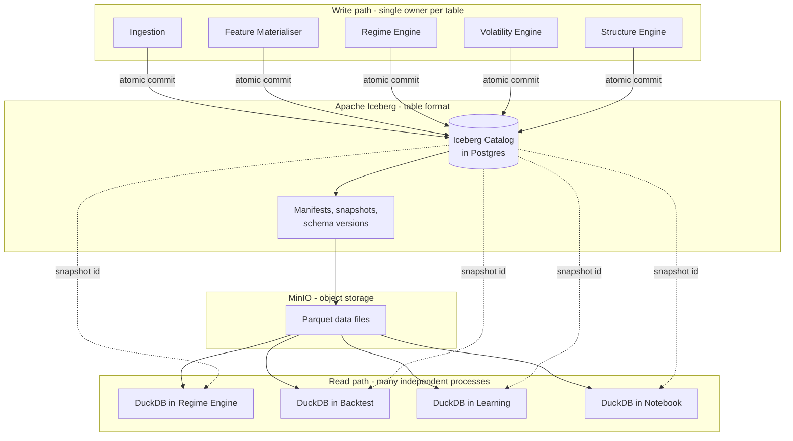

# R13 — Infrastructure Review

**Deliverable:** 13
**Delta against:** `13_Infrastructure_Platform.md`
**Status:** Review v1.0

---

## 1. Verdict per component

Page 13's storage-tier rule (Postgres = ACID ledgers, DuckDB/Parquet = analytical, MinIO = blobs) is a genuinely good architectural boundary and should be kept. The specific verdicts:

| # | Technology | Verdict | Reason |
|---|---|---|---|
| 1 | **FastAPI** | **Keep** | Correct for a Python-first platform. Async, typed, Pydantic-native, OpenAPI for free |
| 2 | **Docker** | **Keep** | Correct unit of deployment. Note the Windows/Linux split (§7) |
| 3 | **NATS JetStream** | **Keep, with a documented tripwire** | Right for control and moderate-volume events. Not right as a permanent event log if replay-from-genesis becomes routine (§4) |
| 4 | **DuckDB** | **Keep, change its role** | Excellent embedded query engine. **Fatally wrong as a shared multi-writer database, which is how the ADD uses it** (B6) |
| 5 | **Postgres** | **Keep, expand** | Under-used. It should absorb more than page 13 assigns it (§3) |
| 6 | **MinIO** | **Keep, expand and harden** | Becomes the lakehouse substrate, not just an artefact store. Single-node deployment is not acceptable (§3) |
| 7 | **MLflow** | **Keep, with the gate extracted** | Good registry. The promotion gate must not be an MLflow tag convention (§5) |
| 8 | **Prometheus** | **Keep** | Correct |
| 9 | **Grafana** | **Keep** | Correct |
| 10 | **GitHub Actions** | **Keep** | Correct. Note the self-hosted Windows runner requirement (§7) |
| 11 | — | **Add: Iceberg** (table format) | The fix for B6 and the mechanism for point-in-time correctness |
| 12 | — | **Add: Redis** | Named on pages 03 and 10 but absent from page 13's map. An oversight |
| 13 | — | **Add: Loki + Tempo** | Logs and traces (R12) |
| 14 | — | **Add: secrets backend** | Absent from all 17 pages |
| 15 | — | **Add: OIDC provider** | Absent |

**Nothing needs replacing. One thing needs re-scoping (DuckDB) and four things need adding.** That is a good outcome for a pre-implementation stack review and reflects well on the original choices.

---

## 2. The DuckDB problem, stated precisely (B6)

Page 03: the Feature Store "is a schema within" page 01's DuckDB warehouse. Pages 04, 05, 06 write their outputs back into it. Page 07 trains from it. Backtests read it concurrently. Page 16 lists "Feature Store: DuckDB + Parquet" as an independently deployable container.

DuckDB is an **embedded, in-process, single-writer** engine. It is not a database server. The specifics:

| Constraint | Consequence for the ADD as written |
|---|---|
| One process may hold a write lock on a database file | The Feature Materialiser, the Regime Engine, the Volatility Engine and the Structure Engine cannot all write. Whichever starts second fails |
| Concurrent readers are permitted only with no writer, or via a read-only attach | A running backfill blocks live feature serving |
| No network protocol | "Independently deployable container" is not achievable. Every consumer must share a filesystem |
| Network filesystems are explicitly unsupported for the database file | Multi-host deployment is not possible |

This is not a scaling concern that appears later. It fails on day one of multi-service deployment.

---

## 3. The storage architecture, corrected

### The fix: Iceberg on MinIO, DuckDB as the query engine

### What this buys, against what the ADD needs

| Property | Why it matters here |
|---|---|
| **ACID multi-writer** with optimistic concurrency | Multiple engines commit to different tables, and to the same table, safely. Closes B6 |
| **Snapshot isolation and time travel** | `SELECT ... FOR SYSTEM_VERSION AS OF <snapshot>`. **This is the mechanism page 03's point-in-time correctness claim needs and does not have** (D8). It is the single strongest argument for the change |
| **Schema evolution** | Adding a feature column does not rewrite history. Page 01's schema-drift failure mode gets a real answer |
| **Partition evolution** | Repartitioning as volume grows does not require a migration |
| **Hidden partitioning** | Queries do not need to know the partition scheme, so partitioning can change without breaking every consumer |
| **Engine independence** | DuckDB today; Spark, Trino, Polars or DataFusion later without a data migration |
| **Snapshot expiry and compaction** | Small-file problem (which tick data will produce quickly) is a maintenance job, not a redesign |

### What it costs

| Cost | Assessment |
|---|---|
| A catalog to run | Postgres-backed JDBC catalog. Postgres already exists. Minimal |
| Python Iceberg tooling is less mature than the JVM ecosystem | `pyiceberg` covers read, write, snapshot, time travel, expiry. Sufficient for this workload. Verify current capability before committing (ADR-003) |
| One more concept to learn | Real, and roughly a day. Against permanently correct point-in-time semantics, it is a good trade |
| Slightly more complex writes | Commits go through the catalog rather than writing a file. This is the point |

**Alternative considered and rejected:** Delta Lake. Comparable capability, better JVM tooling, weaker Python-native story. Iceberg has the stronger multi-engine future and better catalog abstraction. Either is far better than raw Parquet. Decide in ADR-003, but decide before writing code, because migrating a lakehouse later is expensive.

**Alternative considered and rejected: TimescaleDB / Postgres for everything.** Simpler operationally and genuinely tempting at this scale. Rejected because feature backfills and backtests over years of bars are analytical workloads that will contend with the transactional workload on the same instance, and because the time-travel semantics of Iceberg snapshots map directly onto the platform's most important correctness requirement.

### The three-tier rule, restated

Page 13's rule is good and is preserved with one addition:

| Tier | Technology | Contents | Rule |
|---|---|---|---|
| **Transactional** | Postgres | Ledgers, journals, sagas, limits, quarantine, outbox, catalog, audit | ACID required, low volume, point lookups |
| **Analytical** | Iceberg on MinIO, queried by DuckDB | Bars, features, engine outputs, backtest results | Append-mostly, high volume, scan-heavy, **time travel required** |
| **Blob** | MinIO direct | Raw payloads, model artefacts, evidence graphs, prompts | Immutable, content-addressed, object-locked |
| **Ephemeral (new)** | Redis | Projections, caches, leases, counters, budgets | **Nothing durable. Everything rebuildable** |

The fourth tier is the addition. Page 13 omits Redis entirely despite pages 03 and 10 depending on it, and the omission is exactly what allowed the kill switch to end up in a store with no durability guarantee.

### MinIO hardening

A single-node MinIO holding the only copy of the audit trail is worse than no audit trail, because it produces false confidence. Required:

1. Erasure coding across ≥4 drives, **or** replication to a second object store.
2. Object lock in compliance mode on `raw` and `decisions` (R04 §13).
3. Versioning on every bucket.
4. Tested restore, quarterly. An untested backup is a hypothesis.

---

## 4. NATS: keep, with a tripwire

NATS JetStream is the right choice now:

- Sub-millisecond publish latency, which the ADD's 5ms hot-path budget needs.
- Work queues, which are what commands require (R01 §2).
- KV store, usable for the leader lease.
- One binary, trivial to operate.
- Subject hierarchy maps cleanly onto the naming convention.

Where it is weaker than Kafka/Redpanda for this platform:

| Concern | Assessment |
|---|---|
| Long-term retention as a system of record | JetStream file storage works, but multi-year retention with compaction is not what it is designed for |
| Replay from genesis | Possible, but the tooling is thinner |
| Consumer lag observability | Adequate, less rich |
| Exactly-once semantics | Not native. Achieved via the idempotency design in R01 §5, which is required regardless |

**Recommendation:** NATS only, for now. **Do not** run both NATS and Kafka. The event volume here (thousands of events per day on the decision path, plus a tick stream that is explicitly droppable) does not justify a second messaging system, and operating two is a real cost for a solo operator.

**Tripwire for migration** (recorded in ADR-004): promote to Redpanda if any of these becomes true.
1. Replay-from-genesis becomes a routine operation rather than a recovery procedure.
2. Retention on the `TRADING` or `DECISION` streams needs to exceed 2 years with a compaction requirement.
3. A second consumer group needs independent replay of the same stream at different offsets, routinely.
4. Tick volume exceeds ~50k messages/second sustained.

**Architectural insulation:** the event log is behind a thin `EventBus` interface with `publish`, `subscribe`, `replay_from`, and `ack`. NATS-specific types do not appear in domain code. That makes the tripwire actionable rather than theoretical.

---

## 5. Postgres: expand its role

Page 13 assigns Postgres three things (risk ledger, journal, quarantine). It should own considerably more, because at this scale a well-used Postgres removes the need for several other components.

| Workload | Why Postgres |
|---|---|
| Event store for BC7 Portfolio | Low volume, needs ACID, needs point-in-time query. Exactly its strength |
| Transactional outbox | Must be in the same transaction as the state change. There is no alternative |
| Inbox / idempotency | Same |
| Saga state (decision cycles) | Row per cycle, state machine transitions |
| Iceberg catalog | The JDBC catalog is the standard, well-supported choice |
| Instrument specs and calendars | Small, relational, versioned |
| Limit sets | Small, versioned, ACID |
| Decision records + hash chain | Append-only with revoked UPDATE/DELETE at the role level |
| Scheduler job store and advisory locks | APScheduler's Postgres job store, plus `pg_advisory_lock` for leadership |
| Metadata registry | Small relational catalog |
| Prompt registry | Versioned text with effective dates |

**Deployment:** one primary with streaming replication to a standby, point-in-time recovery enabled with WAL archiving to MinIO, `synchronous_commit = on` for the capital-path schemas. Logical separation by schema, not by instance, until measured contention justifies otherwise.

**The specific requirement:** for the ledger and decision-record schemas, `synchronous_commit = on`. A fill acknowledged and then lost on a crash is exactly the divergence the whole reconciliation apparatus exists to catch, and it is cheaper to prevent than to detect.

---

## 6. MLflow: keep, extract the gate

MLflow is the right registry. Two corrections:

1. **The promotion gate must not live in MLflow.** A gate implemented as "the model has a `validated=true` tag" is a gate that anyone can pass by setting a tag. Extract it into a small Validation Gate service that runs PBO, DSR, walk-forward, and the leakage assertion, and which is the only thing permitted to transition registry stages. MLflow records the outcome; it does not decide it.
2. **The registry holds more than ML models** (R04 §9): fitted GARCH/HMM parameters (which pages 04 and 05 already correctly propose), desk prompts, desk weight sets, and consensus strategy versions. All of them need point-in-time resolution and shadow validation, and all of them take the same lifecycle (R07 §6).

**Artefact storage** points at MinIO, which page 13 already specifies. Correct.

---

## 7. Compute topology and the Windows constraint

The MT5 Windows dependency is real and is the sharpest constraint in the infrastructure. Page 14 acknowledges the single VPS as a risk. The correction is to make the constraint as small as possible.

### Minimise the Windows surface

Only two things must run on Windows: the MT5 terminal process and the thin bridge that talks to it. Everything else that the current design implicitly colocates there (the SMC engine, per page 06's note about the existing TradeHub pattern) should move to Linux.

| Host | Runs | Why |
|---|---|---|
| **Windows VPS (active)** | MT5 terminal + Execution bridge only | Hard platform constraint |
| **Windows VPS (standby)** | Same, warm, **not** holding the lease | Failover |
| **Linux, cloud** | Everything else, 37 of 39 containers | No constraint, better tooling, cheaper |

### Split-brain prevention (the critical addition)

Two Windows VPSs running the bridge without coordination is duplicate orders, which is unbounded loss. Required before the standby exists:

- **Leader lease** in NATS KV or a Postgres advisory lock. TTL 5s, renewed every 2s.
- The bridge **refuses to send any order** without a currently-held lease. Not a warning, a refusal.
- Lease loss triggers immediate transition to `STANDBY` mode (R07 §2) and an alert.
- Failover is automatic to `STANDBY`, but transition from `STANDBY` to active requires acquiring the lease **and** a clean reconciliation.

**Sequencing point:** the lease must be built before the standby, not with it. A standby without a lease is strictly more dangerous than no standby.

### Windows operational specifics

- Bridge runs as a Windows Service via `nssm` (page 14's existing choice, correct).
- MT5 terminal auto-restart with a watchdog, because it does crash.
- Self-hosted GitHub Actions runner on Windows for building and testing the bridge, since the MT5 Python library cannot run in a Linux CI container. This is an operational cost worth naming.
- The bridge is the only Windows codebase. Keeping it small (under ~1500 lines) is a design constraint, not an aspiration, because every line there is harder to test and harder to deploy.

---

## 8. Container orchestration

**Recommendation: Docker Compose, with a defined tripwire to Kubernetes.**

Justification: at 39 containers on 2-3 hosts operated by one person, Kubernetes' operational overhead exceeds its benefit. Compose with health checks, restart policies, resource limits, and profiles (per environment) covers what is needed.

**Tripwire to Kubernetes** (ADR-009): more than 3 hosts, or horizontal autoscaling becomes necessary, or more than one person operates the platform, or multi-tenancy arrives.

**Required regardless of orchestrator:**

| Requirement | Reason |
|---|---|
| Resource limits on every container | One runaway backtest must not starve the Risk Engine. This is a correctness requirement, not a tidiness one |
| Restart policy `unless-stopped` for stateless, `on-failure` with a limit for stateful | A crash-looping ledger service must stop and alert, not restart forever |
| Health checks wired to the readiness endpoints (R12 §7) | |
| Explicit dependency ordering | Postgres and NATS before everything; Instrument Master before Risk; Ledger before Risk |
| Separate networks per trust zone (R02 §2) | The capital segment is not reachable from the edge |
| Pinned image digests, not tags | `:latest` in a trading system is how an unreviewed change reaches production |

---

## 9. Environment sizing

| Environment | Hosts | Notes |
|---|---|---|
| **dev** | 1 laptop | Compose, all services, simulated broker, seeded data |
| **sim** | 1 cloud VM | Backtest and replay. Sized for CPU, no broker connection at all |
| **shadow** | shares prod infra | Live data, null broker adapter, separate `env` tag on every message |
| **paper** | 1 Linux + 1 Windows | Full stack, MT5 demo account. **Structurally identical to prod** |
| **prod** | 2 Linux + 2 Windows | Plus managed Postgres if available |

**Paper must be structurally identical to prod, not a subset.** The most common source of production surprises is a paper environment that omits a component (usually the reconciliation service or the leader lease) precisely because that component seemed unnecessary without real money.

---

## 10. What is deliberately not added

| Considered | Rejected because |
|---|---|
| Kubernetes | Operational cost exceeds benefit at this scale (§8) |
| Kafka alongside NATS | Two messaging systems for a workload one handles (§4) |
| A dedicated graph database | Postgres CTEs are adequate at this cycle volume (R09 §9) |
| A service mesh | mTLS via an internal CA is sufficient below ~50 services |
| Airflow / Dagster | Choreography plus one saga plus a scheduler covers the flows (R01 §13) |
| A feature-store product (Feast, Tecton) | The Iceberg-plus-registry design covers the requirement with less operational surface, and the online store is a Redis cache |
| A separate time-series database for market data | Iceberg with proper partitioning handles this volume. A TSDB would be a fourth storage tier for no gain |
| Temporal | One long-running workflow does not justify it. Tripwire at three (R01 §13) |

Each of these is a defensible choice at a larger scale. Adopting them now would be adopting the operational cost without the workload that justifies it.

---

## 11. Infrastructure map, corrected

| Category | Technology | Backs |
|---|---|---|
| Compute / API | FastAPI, Docker | Every service |
| Messaging | **NATS JetStream** | Events (7 streams) and commands (work queue), R01 §6 |
| Transactional store | **Postgres** | Ledger event store, outbox/inbox, sagas, limits, decision records, Iceberg catalog, instrument master, prompt registry, scheduler, metadata |
| Table format | **Apache Iceberg** *(new)* | ACID, schema evolution, **time travel = point-in-time correctness** |
| Query engine | **DuckDB** *(role changed)* | Embedded, per-process, read-only over Iceberg |
| Object storage | **MinIO** *(hardened)* | Lakehouse files, raw payloads, artefacts, evidence blobs, backups. Erasure coded, object-locked |
| Cache / ephemeral | **Redis** *(added to the map)* | Projections, feature cache, leases, budgets, kill-switch tier 2. **Nothing durable** |
| ML lifecycle | **MLflow** + **Validation Gate** *(gate extracted)* | Models, fitted params, prompts, weight sets |
| Metrics | Prometheus + Grafana | R12 |
| Logs | **Loki** *(new)* | R12 §5 |
| Traces | **Tempo + OpenTelemetry** *(new)* | R12 §6 |
| Secrets | **SOPS + age** *(new)* | R04 §4 |
| Identity | **OIDC provider** *(new)* | R04 §2 |
| Policy | **OPA** *(new)* | R04 §3 |
| CI/CD | GitHub Actions + a self-hosted Windows runner | R14 |
| Orchestration | Docker Compose | §8 |

---

## 12. Related

- `R00_Executive_Review.md` (B6)
- `R08_Data_Lineage.md` (Iceberg snapshots as the lineage mechanism)
- `R14_Deployment.md` (environments and CI/CD)
- `R16_ADR_Register.md` (ADR-003 Iceberg, ADR-004 NATS, ADR-009 orchestration)
- Source: `../13_Infrastructure_Platform.md`
