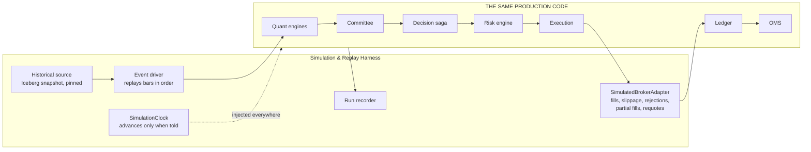

# R19 — Missing Components

**Deliverable:** 19
**Delta against:** the whole ADD, principally `16_C4_Container_Diagram.md` (15 containers listed; 39 required)
**Status:** Review v1.0

---

## 1. Ranked by consequence of absence

| Rank | Component | Consequence if never built | Priority |
|---|---|---|---|
| 1 | **Order & Position Lifecycle Manager (OMS)** | The platform can open positions and has no owner for anything after that | **P0** |
| 2 | **Instrument & Reference Data Master** | Position sizing is arithmetically impossible; DST and session handling has no source of truth | **P0** |
| 3 | **Account & Position Ledger** | No authoritative book; six components each hold their own idea of a position | **P0** |
| 4 | **Simulation & Replay Harness + Clock** | No claim about look-ahead bias, determinism, or backtest validity is testable | **P0** |
| 5 | **Platform Supervisor** | No global mode; "degraded" is a word rather than a condition components can act on | **P0** |
| 6 | **Reconciliation Service** | Divergence from broker truth is discovered by accident, usually as a loss | **P1** |
| 7 | **Decision Record Store** | Audit truth lives in the observability tier and is lossy | **P1** |
| 8 | **Prompt & Policy Registry** | Every Committee backtest is contaminated by future prompt tuning | **P1** |
| 9 | **LLM Gateway** | No cost control, no vendor isolation, no replay determinism, no call record | **P1** |
| 10 | **Untrusted Text ACL** | A live prompt-injection path from a public feed to capital allocation | **P0** |
| 11 | **Model Monitor** | Page 07 names model staleness as a failure and assigns detection to a weekly review | P1 |
| 12 | **TCA Service** | Execution quality is a single slippage number, undecomposed and unactionable | P2 |
| 13 | **Cost Governor** | A trigger storm produces an unbounded bill | P2 |
| 14 | **Schema Registry** | The wire contract is prose in a document that predicts its own rot | P1 |
| 15 | **API Gateway / BFF** | Every service is directly reachable from the operator plane | P1 |
| 16 | **Secrets Manager + Identity Provider** | Broker credentials with no management story | **P0/P1** |

Detailed specifications for 6, 9, 16 (Instrument Master, Ledger, OMS, Reconciliation, Supervisor, LLM Gateway, Cost Governor) are in R05. This file covers the remaining new subsystems and states the case for each.

---

## 2. Simulation & Replay Harness, with the Clock

**The single most important missing piece for research validity.**

### The problem

The ADD mentions backtesting on the research workstation (page 14), a market simulator inside the ML/RL layer for RL training (page 07), and PBO/DSR validation gates (pages 07, 12). What it does not have is a harness that runs **the actual production decision path** against historical data.

Consequences:

- The RL simulator (page 07) and the live path are different code. A policy trained against one and deployed to the other has an unquantified gap.
- The PBO/DSR gate validates *model* performance, not *system* performance. A model can pass while the system that uses it loses money to slippage, latency, or a risk rule the backtest never ran.
- Page 03's point-in-time claim, page 09's counterfactual replay, and page 12's hypothesis validation all depend on being able to replay the system, and nothing provides that.

### Design

### Non-negotiable properties

| Property | Why |
|---|---|
| **Identical code path** | Only the Clock and the BrokerAdapter differ. If any other component is swapped, the harness is testing a different system |
| **Deterministic** | Two runs with the same `replay_run_id` and seed produce byte-identical output. A CI test, not an aspiration |
| **LLM calls served from cache** | A cache miss in `sim` on a call recorded in the original run is a **hard error**, not a live call. Otherwise a replay silently becomes a live experiment with different results |
| **Snapshot-pinned inputs** | Every input table pinned by Iceberg snapshot ID (R08 M1) |
| **Realistic broker pathology** | The simulated adapter injects requotes, partial fills, rejections, timeouts, and slippage drawn from the recorded live distribution. A simulator that always fills perfectly validates nothing |
| **No production side effects** | `env=sim` interlock; every message tagged; a separate namespace |

### Three modes

| Mode | Purpose |
|---|---|
| **Backtest** | Historical period, full system, produces the P&L and statistics that feed PBO/DSR |
| **Counterfactual** | One historical decision, re-run with a different model, prompt, or parameter version. Page 09's future expansion, available immediately |
| **What-if** | Current live state plus a hypothetical proposal, run through Risk in preview mode. Powers pre-trade impact analysis |

### The Clock

A shared-kernel type (R02 §5, L4.6) with a CI lint banning direct wall-clock calls. This is the cheapest and highest-value single piece of discipline in the whole implementation: an hour of work that permanently protects replay determinism.

---

## 3. Order & Position Lifecycle Manager (OMS)

Full contract in R05 §5. The case for it, stated plainly:

**The current architecture is entirely entry-biased.** Trace the ADD end to end: trigger, evidence, committee, decision, risk, order, fill, journal. It ends at the fill. Nothing in 17 pages owns:

- Moving a stop to breakeven
- Trailing a stop
- Taking partial profit
- Time-based exits
- Exiting because the structural thesis was invalidated
- A position modified manually at the MT5 terminal
- A position closed by the broker (margin, stop-out) that the platform did not initiate
- A position that exists at the broker and not in the platform

For most discretionary and systematic strategies, **exit management contributes as much to the outcome as entry selection**. A platform with a six-desk AI committee for entries and nothing at all for exits is optimising the wrong half.

**Additional structural consequences:** the trade lifecycle state machine (R07 §5) has no home; the `UNPROTECTED` state (an open position with no broker-side stop) is undetectable; and Learning receives entry attribution without management attribution, so it cannot distinguish a bad entry from a badly-managed good entry.

---

## 4. Instrument & Reference Data Master

Full contract in R05 §3. The case:

Page 10 specifies volatility-adjusted position sizing, fractional Kelly, and exposure limits. Every one of those computations requires: contract size, tick size, tick value, minimum lot, lot step, margin requirement, and the account currency conversion. None of these appear anywhere in the ADD.

Page 01 names DST transitions as a failure mode and page 02 has a DST detector, but no component owns the trading calendar that both depend on. Page 06 has "grid parameters stored as versioned per-symbol config" without saying where that config lives or who versions it.

**Concrete failure without it:** the broker changes `contract_size` on a CFD. Nothing detects it. Every position sized after that moment is wrong by that ratio, and it will be discovered from the P&L rather than from a check.

**Also blocking:** the Scheduler cannot compute bar-close times without a calendar (R04 §12), and the Risk Engine's lot rounding (R11 §3) cannot round without a lot step.

---

## 5. Account & Position Ledger

Full contract in R05 §4. The case:

Page 10 puts "live portfolio state" in Redis with Postgres as a "durable ledger" and never says which wins. Page 11 produces fills. Page 12 reads trade history. Pages 03, 08 and 09 all read some form of position state. **Six components, no owner.**

The specific risks:
- Redis is not durable. A restart loses the book unless it is rebuildable, and nothing describes a rebuild.
- No lot-level cost basis, so realised P&L on partial closes cannot be computed correctly.
- No double-entry, so the books can silently fail to balance.
- Reconciliation has nothing canonical to diff against.
- Learning's attribution depends on a complete trade record that nothing produces.

**And it is the component that breaks the B3 cycle.** Once the Ledger owns the book and publishes a read model, the Committee's Positioning Desk reads a projection instead of calling the Risk Engine, and the dependency graph becomes acyclic.

---

## 6. Platform Supervisor

Full contract in R05 §9. The case:

The ADD uses the word "degraded" repeatedly (pages 01, 02, 04, 05) without a mechanism. Page 01's circuit breaker degrades a source. Page 04 serves stale regime data. Page 02 flags low-quality data. In every case the page says downstream consumers "are required to" discount or handle it. **Nothing enforces any of it, and there is no shared notion of how degraded the platform currently is.**

The Supervisor makes mode a first-class, readable, enforced condition (R07 §2). Every order-capable component gates on it, fail-safe. It is also what gates the startup sequence (R06 W4): without it, "do not trade until reconciliation is clean" has nobody to enforce it.

---

## 7. Decision Record Store

**Purpose:** be the immutable, provable record of every decision, separate from observability.

**Why separate from the Journal-in-Monitoring design (page 13):** observability is lossy, downsampled, short-retention, and mutable by design. An audit record must be none of those. Page 13 puts the Journal in Postgres alongside operational ledgers with no immutability guarantee, which means the record you would need in a dispute sits in a table anyone can update.

**Design:**

| Property | Mechanism |
|---|---|
| Append-only | `UPDATE` and `DELETE` revoked at the Postgres role level. Enforced by the database, not by discipline |
| Tamper-evident | Hash chain: each record carries `sha256(prev_hash \|\| canonical(record))`. Daily checkpoint hash published to a separate store |
| Content-addressed blobs | Evidence graphs, prompts, LLM responses stored in MinIO with object lock, referenced by hash |
| Complete | Every decision cycle, every risk assessment, every order and fill, every kill-switch action, every limit change, every override |
| Queryable | By `correlation_id`, `decision_id`, `trade_id`, time range, actor |
| Restorable independently | Its own backup and restore path, tested separately from the operational database |

**Test of correctness:** if the entire observability stack were deleted, the platform's forensic and legal record must be intact.

---

## 8. Prompt & Policy Registry

**Purpose:** make prompts, desk weights, and consensus strategy versions point-in-time resolvable artefacts with the same lifecycle as models.

**The problem it solves is subtle and severe.** Page 08 makes desk weights tunable by Learning and prompts implicitly editable. Page 12 proposes revising desk prompts based on outcomes. Nothing versions either with an effective date.

Consequence: replay a decision from three months ago and the desks use **today's** prompts, which were tuned on the outcomes of the very trades being replayed. Every Committee backtest is contaminated in the optimistic direction, and the contamination is invisible: the backtest runs, produces plausible numbers, and is wrong.

This is a look-ahead bias vector that page 03's careful feature-level treatment does not cover, because it operates through the prompt rather than through the data.

**Design:** every prompt, weight set, and strategy version stored with `{version, hash, effective_from, effective_to, model_pin, eval_scores}`. Resolution is always `resolve(desk, as_of)`. Changes take the full model lifecycle (R07 §6), including shadow. The registry is what makes page 08's mandatory-shadow-run rule enforceable rather than procedural.

---

## 9. Model Monitor

**Purpose:** detect model degradation continuously, not weekly.

Page 07 names model staleness as a failure mode and assigns detection to page 12's weekly Continuous Learning cycle. A model can degrade materially in a day. Weekly detection means up to seven days of decisions made on a model known, in retrospect, to be failing.

**Monitors:** prediction distribution shift (PSI against the training distribution), input feature drift, live hit rate against the backtest confidence interval, calibration decay, convergence failure rate, and staleness against `max_staleness`.

**Actions:** the degradation ladder in R11 §6, up to and including the correlated-degradation kill-switch trip, which is the control that matters most and which nothing currently owns.

---

## 10. TCA Service

**Purpose:** decompose execution cost into actionable components.

Page 11 records `slippage_bps` as a single number. That number cannot tell you whether the cost came from a wide spread (an instrument or session choice), from decision-to-order latency (a platform problem), or from market impact (a sizing problem). Three different causes, three different fixes, one undifferentiated number.

**Decomposition:** implementation shortfall from the decision price, split into spread cost, delay cost (evidence timestamp to order submission), and impact cost (submission to fill).

**The feedback loop that makes it worth building:** if realised slippage consistently exceeds the assumption used in position sizing, the effective risk per trade is higher than intended. TCA output feeds back into the sizing model automatically rather than waiting for a weekly review to notice (R11 §8).

---

## 11. Schema Registry

**Purpose:** be the machine-checkable wire contract, replacing the prose payload summaries in page 15.

Page 15 explicitly states that hand-maintained catalogs rot and proposes auto-generation as future expansion. Promote it. The registry plus the CI checks in R01 §7 mechanically catch: orphan events, missing publishers, incompatible schema changes, naming convention violations, and unregistered subjects. Every one of these is a failure mode page 15 names and cannot detect.

Pages 15 and 16 then become **generated artefacts**, which is the only way documentation of this kind stays true over ten years.

---

## 12. Two components that would be genuinely new capability

Not required for correctness, but each meaningfully improves the platform. Recommended for P2/P3 consideration.

### Strategy Portfolio Manager (P3)

The ADD assumes one strategy. As soon as there are two (a trend strategy and a mean-reversion strategy, or two symbols with different logic), capital allocation *between* them becomes a distinct problem from position sizing *within* one.

Responsibilities: cross-strategy correlation, allocation weights (informed by the `alpha-combine` and `capital-allocator` patterns already in the skill pack), a strategy-level kill switch (turn off one strategy without halting the platform), and per-strategy attribution.

**Recommendation:** design the account and position model with a `strategy_id` dimension from day one, even with one strategy. Adding that dimension later means a data migration across the ledger, the journal, and every analytic. The service itself can wait.

### Exit Committee (P3)

A natural extension once entry calibration is stable. The same committee architecture, scoped to a different question: given an open position and current evidence, should it be held, reduced, or closed?

The argument for it is that exits are a genuinely different reasoning problem (path-dependent, anchored by the entry, subject to disposition bias) and are currently handled by static rules in the OMS. The argument for deferring it is that exit rules should be proven mechanically before adding reasoning on top.

**Sequencing:** build the OMS with rule-based management first. Record every management decision and its counterfactual. Once there is enough data to evaluate whether reasoning would have beaten the rules, build the Exit Committee against that evidence. This is the right order and it depends on the OMS existing, which is why the OMS is rank 1.

---

## 13. Complete container list

39 containers, per R02 §3. Page 16 lists 15.

| Group | Containers | New |
|---|---|---|
| Ingress and reference | C01 Ingestion, **C02 Text ACL**, C03 Quality, **C04 Instrument Master**, **C05 Clock (library)** | 3 |
| Data | **C06 Feature Materialiser**, **C07 Feature Serving**, C08 Lakehouse | 2 split |
| Quant | C09 Regime, C10 Volatility, C11 Structure, **C12 Model Training**, **C13 Model Inference**, **C14 Model Monitor** | 1 new, 2 split |
| Decision | **C15 Evidence Graph**, C16 Committee, **C17 LLM Gateway**, **C18 Prompt Registry**, C19 Decision Saga, **C20 Decision Records** | 4 new, 1 split |
| Capital | C21 Risk, **C22 Position Ledger**, **C23 OMS**, C24 Execution, **C25 Reconciliation**, **C26 Platform Supervisor** | 4 |
| Learning and ops | C27 Learning, **C28 Simulation Harness**, **C29 TCA**, **C30 Cost Governor**, C31 Observability, **C32 API Gateway**, C33 Dashboard, C34 CLI, **C35 Scheduler**, C36 Event Bus, **C37 Schema Registry**, **C38 Secrets**, **C39 Identity** | 8 new, 1 split |

**21 of 39 are new or split out.** That is the honest measure of the gap between the current document and an implementable container model, and it is why the container diagram (page 16) is the page most in need of regeneration after this review.

---

## 14. Minimum viable subset

If everything above cannot be built, this is the smallest set that permits safe live trading with one symbol. The rest can follow.

| Must exist before the first live order | Why |
|---|---|
| C04 Instrument Master | Sizing is impossible without it |
| C22 Position Ledger | No authoritative book otherwise |
| C23 OMS | Positions must have an owner |
| C25 Reconciliation | Divergence must be detected, not discovered |
| C26 Platform Supervisor | Modes must be enforced, not described |
| C02 Text ACL | Only if the news feed is connected. If it is not, defer the ACL and do not connect the feed |
| C05 Clock | One hour of work, permanent protection |
| C28 Simulation Harness | Without it, nothing has been validated |
| C20 Decision Records | The audit trail cannot be reconstructed retroactively |
| C17 LLM Gateway | Cost control and replay determinism |

Ten components. Everything else in the list improves the platform; these ten are the difference between a system that can trade safely and one that can trade.

---

## 15. Related

- `R00_Executive_Review.md` (§5 missing subsystems summary)
- `R02_C4_Expansion.md` (§3 full container list)
- `R05_Interface_Contracts.md` (contracts for the P0 components)
- `R07_State_Machines.md` (lifecycles the OMS and Supervisor own)
- Source: `../16_C4_Container_Diagram.md`
