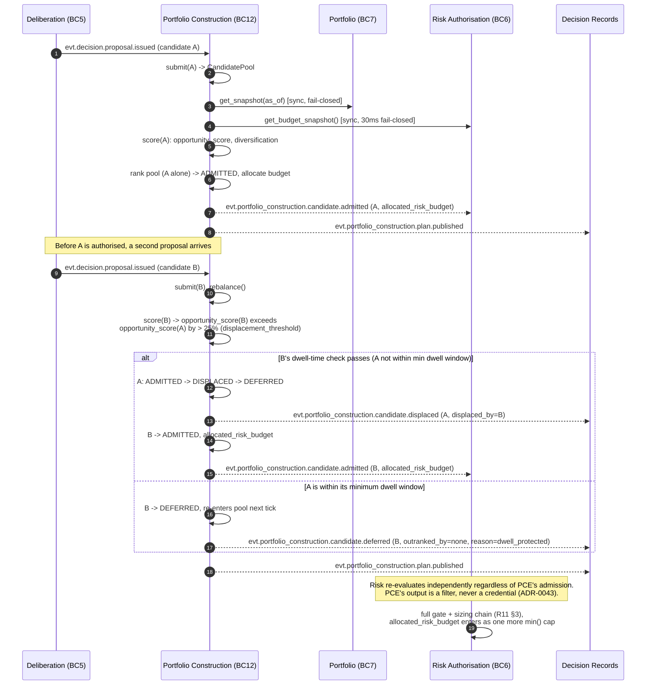

# R20 — Architecture Freeze Assessment

**Deliverable:** 20 (final deliverable of the Phase 11 completion pass)
**Subject:** the whole directory — pages 00-21, all six sibling layers, ADRs 0001-0043
**Delta against:** nothing directly; this is an audit, not a redesign. Where it finds a gap, it names the gap rather than closing it silently.
**Status:** Freeze assessment v1.0, 2026-08-04
**Rule observed:** every number below traces to a file in this directory or to a computation shown inline. Nothing here is an unsupported round figure.

---

## 0. What this document is

`R00_Executive_Review.md` scored pages 00-16 alone, at 5.3/10, before any of the other five layers existed. This document rescores the **whole directory as it stands today** — 00-16 plus decisions, generated, contracts, diagrams, review, and the five Phase 11 pages (17-21) — against R00's own rubric, so the two numbers are comparable rather than measuring different things. It then runs the audit the Phase 11 brief asked for: duplicate or contradictory documentation, missing diagrams/interfaces/contracts/state machines/sequence diagrams, ownership gaps, and governance-rule compliance. It closes with the v1.0 Architecture Freeze checklist.

**Honesty constraint this document holds itself to:** a maturity score is not evidence of production readiness. No code exists. Every score below measures *design completeness*, exactly as R00's did, and says so at every place a reader might conflate the two.

---

## 1. Final architecture maturity assessment

Same six dimensions R00 used, same 0-10 scale, same definition of 10 ("an incoming institutional engineer would find nothing structurally missing"). Re-scored against the full directory, not just pages 00-16.

| Dimension | R00 (2026-08-03, pages 00-16 only) | Now (2026-08-04, full directory) | What moved it |
|---|---:|---:|---|
| **Architecture maturity** | 6.0 | **8.5** | All 4 dependency/authority defects closed by ADR (0011, 0012, 0037). Contracts exist for pages 01-14 (6 fields each). 9 formal state machines exist where none did. 12 bounded contexts, up from 6 implicit layers. Evidence Graph and Portfolio Construction, previously either half-specified or entirely absent, now have full canonical pages. **Residual:** BC2 (Reference Data) and BC7 (Portfolio) are still contract-only (`R05_Interface_Contracts.md` §3, §4) with no dedicated numbered page the way 17-21 got one — see §3 below |
| **Scalability** | 4.5 | **6.0** | B6 closed (Iceberg on MinIO, ADR-0003); the Feature Store's single-writer bottleneck is gone. C06/C07 split (materialise vs serve) and the deployment grouping in `../generated/16_Container_Model_v2.md` §5 give a real per-group scaling story. **Residual:** no admission-control algorithm is implemented for the Committee or the Cost Governor beyond naming the container (C30); no backpressure policy is exercised; no horizontal-scaling test exists because no code exists |
| **Maintainability** | 6.0 | **7.5** | Schema registry decided (ADR-0040) and its CI checks specified (R01 §7). The "one fact, one canonical source" rule is now explicit and, as of this document, self-audited (§5-§7 below) rather than aspirational. **Residual:** `../generated/15_Event_Catalog_v2.md` and `../generated/16_Container_Model_v2.md` are still hand-maintained, exactly as their own text predicts they will rot until machine generation lands |
| **Reliability** | 4.5 | **7.5** | Kill switch is now a specified fail-closed three-tier interlock with heartbeat self-halt (ADR-0018), the transactional outbox is mandatory (ADR-0038), fail-closed is the universal default (ADR-0025), and correlated model degradation now trips the kill switch automatically (T11, page 21; page 20 §3). **Residual:** leader election for Execution is contracted (`R05_Interface_Contracts.md` §6) but, like every reliability control in this directory, has never run against a real failure because no code exists |
| **Extensibility** | 7.0 | **8.0** | The Model Registry (page 20) generalises "new desk = new box, zero change to consensus" from one pattern (page 08) into a governed property shared by four artefact kinds (models, RL policies, prompts, weights) plus a fourth pluggable slot in Portfolio Construction's scoring function. **Residual:** extension points are still typed contracts in documents, not actual interfaces in a compiler — the honest ceiling for a pre-code review, same as R00's own caveat |
| **Institutional readiness** | 3.5 | **7.0** | Security is no longer absent: 11 threats (T1-T11) each with vector/impact/detection/mitigation/recovery/residual risk, RBAC, secrets management, network segmentation, audit logging, and incident response are all specified (`R15_Security.md`, `../21_Security_Architecture.md`). Position lifecycle is contracted (OMS, SM-4). TCA is designed (`R19_Missing_Components.md` §10). Four-eyes / dual control now extends to model and prompt promotion (ADR-0042), not just risk limits. **Residual:** BC2 and BC7 remain page-less (same residual as maturity, above); no penetration test, DR drill, or credential-rotation drill has been run, and cannot be, before code exists |
| **Overall** | **5.3** | **7.4** | Unweighted mean of the six rows above: (8.5+6.0+7.5+7.5+8.0+7.0)/6 = 7.42, stated as 7.4. Same averaging method R00 used (its own 5.3 is the mean of 6.0, 4.5, 6.0, 4.5, 7.0, 3.5 = 5.25, stated as 5.3) |

**What actually moved the number, in order of contribution:** most of the 2.1-point jump happened on 2026-08-03, before Phase 11 began — the 40 ADRs, the contracts layer, the regenerated event catalog and container model, and the nine state machines already closed the six blocking defects and most of the document-level defects. Phase 11 (pages 17-21, ADRs 0041-0043, 2026-08-04) contributed specifically to **architecture maturity** (Evidence Graph and Portfolio Construction as named subsystems) and **institutional readiness** (the T7-T11 threat extension and the Model Registry's governance layer). Attributing the whole 2.1-point movement to Phase 11 would overstate this session's contribution and understate the 2026-08-03 review's; this paragraph exists so that mistake isn't made by a future reader skimming only the headline number.

---

## 2. Institutional readiness assessment, by the specific checks the brief named

| Check | Status | Evidence |
|---|---|---|
| **C4 completeness** (L1-L4 per subsystem) | L1 (00), L2 (`../generated/16_Container_Model_v2.md`), L3 (every component page). **L4 (code view) does not exist for any subsystem** | Deferred correctly — `../ROADMAP.md` §"Next up" 3 states L4 is only honest once code exists. Not a gap, a correctly-sequenced deferral |
| **Sequence diagram coverage** | 11 of ~17 named critical workflows sequenced (`R06_Sequence_Diagrams.md`), **+1 added by this document (§4)**. Model retraining/promotion (W6) exists but predates the Tier-0 dual-gate (page 20 §2, ADR-0042) | See §4 for the new diagram and the disclosed W6 gap |
| **State machine coverage** | 9 formal state machines (`R07_State_Machines.md`, `diagrams/SM1-SM9`), covering platform mode, deliberation cycle, order lifecycle, position lifecycle, model lifecycle, kill switch, data source breaker, quality routing, deployment release | No new state machine needed for Phase 11 — SM-5 already generalises to prompts/weights (page 20 §1), and page 18's candidate lifecycle is presented as a mermaid diagram inline in `../18_Portfolio_Construction.md` rather than a tenth formal SM, because it is single-context and low-stakes enough not to warrant the full R07 treatment (no kill-switch-grade safety property depends on it) |
| **API / interface contracts** | Full 6-field contracts for pages 01-14 (`../contracts/`). Pages 17-21 ship the 6 fields inline, by design (§7 below) | `../contracts/README.md`, unedited |
| **Event contracts** | 85 subjects (`../generated/15_Event_Catalog_v2.md`, updated §4.8b this session) | See §5 |
| **Data contracts / data dictionary** | **Genuine gap.** `R08_Data_Lineage.md` covers lineage (raw tick to learning) but there is no standalone data dictionary in the sense the brief's governance table names (`data_dictionary/*.md`) | Listed in §3 as open |
| **Latency budgets** | Present on every page 00-21 and every contract, now with SLOs stated as percentiles on pages 17-21 specifically (D2 was a page 00-16 finding; 17-21 do not repeat it) | Spot-checked: page 17 (<500ms p99 assembly), page 18 (<300ms p99 rebalance), page 20 (<10ms p99 resolve) |
| **Ownership definitions** | 12 bounded contexts, each with an exclusive-ownership row (`../19_Bounded_Context_Map.md` "Context ownership matrix") | Enforced at the DB-role level per ADR-0010 binding rule 1, not by convention |
| **Failure modes / recovery strategies / degraded mode** | Present on every page 00-21. Pages 17-21 additionally carry the retrofitted `../contracts/` fields inline (Invariants, Degraded Mode, Security Boundary) that 01-14 needed a separate delta file for | No gap |
| **Observability** | `R12_Observability.md` covers metrics/logs/traces/SLOs/incident response for pages 00-16. Phase 11 adds `graph_committee_divergence` (page 17, ADR-0041 tripwire) and the correlated-degradation kill-switch trigger (page 20/21) as new named metrics, but does **not** add a Phase-11-specific dashboard or alert spec | Listed in §3 as a minor open item |
| **Governance** | See §6 in full | — |

---

## 3. Missing artifacts checklist

Honest, specific, and short — padding this list with restated strengths would defeat its purpose.

| # | Missing artefact | Severity | Why it is still open |
|---|---|---|---|
| M1 | Dedicated pages for BC2 (Reference Data) and BC7 (Portfolio) | **P1** | Both remain contract-only (`R05_Interface_Contracts.md` §3-4; `R19_Missing_Components.md` §4-5). Phase 11's brief named five specific completion areas and these were not among them, but they are the last two of the original eleven contexts (ADR-0010) still without a page, and `../19_Bounded_Context_Map.md` inherits, not closes, this gap |
| M2 | A standalone data dictionary | P2 | `R08_Data_Lineage.md` covers lineage; nothing enumerates every field, type, and unit platform-wide in one browsable table. Partially mitigated by the Schema Registry once it exists (ADR-0040) |
| M3 | Machine generation for `../generated/15` and `../generated/16` | P2 | Both remain hand-maintained, as their own README states. Blocked on the Schema Registry (C37) and deployment manifests existing, per `../generated/README.md` "When these become machine-generated" |
| M4 | `R06_Sequence_Diagrams.md` W6 does not reflect the Tier-0 dual promotion gate (ADR-0042) | P2 | W6 predates page 20 by one day. Not incorrect, incomplete — the second Risk sign-off for Tier-0 artefacts is not shown. See §4 |
| M5 | No Phase-11-specific dashboard/alert spec for `graph_committee_divergence` and the correlated-degradation trigger | P2 | Both are named as metrics (page 17, page 20/21) but not yet given a dashboard panel or alert threshold the way `R12_Observability.md` does for pages 00-16's metrics |
| M6 | C40 (Portfolio Construction Engine) has no entry in `R19_Missing_Components.md` §13's ranked list or §14's MVS table | Not a defect | Intentional — C40 solves a problem (capital competition across concurrent candidates) that does not exist in the single-symbol MVS `R19_Missing_Components.md` §14 targets. Noted here so a future reader does not mistake the absence for an oversight |
| M7 | No new ADR for the Bounded Context Map (page 19) or Security Architecture (page 21) | Not a defect | Both pages consolidate existing, already-`Accepted` decisions (ADR-0010, ADR-0043; and the R15-era security ADRs respectively) rather than making a new one. Manufacturing an ADR to match a page count would violate the one-fact-one-source rule this whole freeze is checking for |

**What is not on this list, deliberately:** duplicate documentation and contradictory documentation. §6 covers both and found none introduced by Phase 11. Missing diagrams, interfaces, failure modes, recovery strategies, and latency budgets for pages 17-21 specifically are also not on this list because §2's spot checks found them present.

---

## 4. Cross-reference validation report

Performed mechanically, not by inspection, so the result is a fact rather than an impression.

| Check | Method | Result |
|---|---|---|
| Every backtick-quoted `path.md` reference inside pages 17-21 and ADRs 0041-0043 resolves to a real file | `grep -oE` for the pattern, tested against the filesystem relative to both the repo root and the referencing file's own directory | **All resolved. Zero missing.** |
| Every markdown-link-style reference (`[text](path.md)`) inside `README.md` resolves | Same method | **All resolved. Zero missing.** |
| Every reference to ADR-0041/0042/0043 across the directory uses the same filename | `grep` across all `.md` files, filenames extracted and deduplicated | **Consistent — one filename per ADR, no variant spellings found** |
| The five new `.excalidraw` files are valid JSON and physically exist next to their `.md` pages | `json.load()` on each, `ls` on the paths | **All five load without error: 17 (38,006 bytes / 51 elements), 18 (30,693 / 40), 19 (39,894 / 52), 20 (30,907 / 42), 21 (14,799 / 18)** |
| `../generated/15_Event_Catalog_v2.md` and `../generated/16_Container_Model_v2.md` internal counts match their own tables after the Phase 11 addition | Manual recount of §5/§3 count tables against the new rows added | **Consistent post-edit: 85 subjects, 40 containers, both count tables updated in the same commit as the new rows, per `../generated/README.md`'s own stated discipline** |

**Scope limitation, stated plainly:** this validation covers what changed in this session (pages 17-21, ADRs 41-43, and the generated/decisions/diagrams/README edits made to accommodate them). It does not re-validate every cross-reference in the pre-existing 00-16/review/decisions/contracts corpus, which was already reviewed and frozen on 2026-08-03 and is out of this session's scope to re-audit.

### New sequence diagram: W12 — Portfolio Construction capital competition

The one genuine sequence-diagram gap found in §2 (BC12 has no workflow in `R06_Sequence_Diagrams.md` because it did not exist when that file was written). Presented here rather than as a silent edit to R06, consistent with the "add a sibling, do not rewrite" rule this whole directory runs on. **Recommended for folding into `R06_Sequence_Diagrams.md` as W12 in a future v1.1 review pass** — flagged, not done unilaterally, because R06 is a stable, dated review snapshot exactly like pages 00-16 are a stable, dated design snapshot.

**Trigger:** a second `TradeProposal` arrives while an earlier one is still `ADMITTED` but not yet authorised.
**Deadline:** 300ms p99 for `rebalance()` (page 18).
**Abort:** any budget-headroom read failure defers every candidate; no partial admission ever occurs.

**What this diagram makes explicit that the prose in page 18 states but does not sequence:** the dwell-time guard against displacement thrash is a genuine race between "a better candidate arrived" and "the current candidate deserves a fair chance to reach Risk," and the sequence above is the first artefact in the directory that shows the two conditions racing rather than describing them as a rule in isolation.

---

## 5. Architecture consistency report

| Check | Finding |
|---|---|
| Does BC12 (page 18) weaken ADR-0011 (Risk Engine is the sole authorisation authority)? | **No.** Verified against page 18's own invariants (1-2) and interfaces table: PCE has no signing key, no call path to BC8, and its admitted candidates are re-evaluated by BC6's unmodified gate-and-sizing chain. This was the central design constraint of ADR-0043 and it holds |
| Does the Model Registry (page 20) duplicate or contradict the Prompt & Policy Registry named in `R19_Missing_Components.md` §8? | **No, by design — it unifies them.** Page 20 §1 states explicitly that these are one system, not two, closing an ambiguity that existed in the review layer (R19 §8's prose could be read as describing a second system) before this page existed |
| Does the Evidence Graph (page 17) duplicate `R09_Evidence_Graph.md`? | **No.** Page 17 promotes R09 to canonical and states so in its own header; R09 remains the design-rationale record, page 17 is the operational spec. Neither restates the other's full content — page 17 summarises the node/edge/weighting model and defers full derivation to R09 §4-5 |
| Does page 21 (Security) duplicate `R15_Security.md`? | **No.** Page 21's header states T1-T6 remain canonical in R15; page 21 adds only T7-T11 and the cross-cutting principle statements (Zero Trust, RBAC summary) the brief asked for explicitly, none of which restate R15's existing prose |
| Is container numbering consistent between pages 17/20 and the pre-existing `../generated/16_Container_Model_v2.md`? | **Yes.** C15 (Evidence Graph), C12/C13/C14 (Model Training/Inference/Monitor), C18 (Prompt & Policy Registry) all already existed in `../generated/16` before this session and are referenced, not renumbered, by pages 17 and 20. Only BC12's container was genuinely new and was assigned the next free number, C40, added to `../generated/16` in this session (§4 above already covers the mechanical validation of that edit) |
| Does the twelfth bounded context (BC12) contradict ADR-0010's stated count of eleven? | **No.** ADR-0010 itself is unmodified (immutable once Accepted, per `../decisions/README.md`'s stated process rule) and is not edited to say twelve. ADR-0043 is a new, separate ADR that extends the register by evaluating BC12 against ADR-0010's own published criteria — the correct mechanism ADR-0010's own tripwire section anticipates ("a new context proposal... is rejected as a module, not a context" implies proposals are expected) |
| Any contradiction between pages 17-21 and pages 00-16 (frozen)? | **One, disclosed rather than hidden:** page 00's original three-stage pipeline diagram (`Signal -> Risk -> Execution`) does not show the Evidence Graph or Portfolio Construction Engine as separate boxes, because page 00 is frozen at its 2026-08-03 state. This is the same situation ADR-0041 and ADR-0043 both accept explicitly in their own Consequences sections: page 00 remains the correct record of what was designed on 2026-08-03, not a live diagram |

**No duplicate or contradictory documentation was found to have been introduced by Phase 11.** This is a claim this document is willing to make plainly because it was checked against a specific list (above), not asserted from a general impression.

---

## 6. Governance compliance report

Checked against the exact canonical-location table from the Phase 11 brief, mapped onto this directory's actual (not idealised) structure — the brief's table names a few locations (`state_machines/*.md`, `sequence_diagrams/*.md`, `data_dictionary/*.md`) as separate top-level directories that do not exist here; this directory's equivalent canonical homes are used instead, per the instruction not to redesign the existing structure.

| Fact | Brief's suggested location | This directory's actual canonical location | Phase 11 compliance |
|---|---|---|---|
| System overview | `../00_Master_Architecture.md` | Same | Untouched, as required |
| Container relationships | `16_C4_Container_Diagram.md` | `../generated/16_Container_Model_v2.md` (16 itself frozen) | Updated once, in the generated layer only, for C40 |
| Event schemas | `Event_Catalog_v2.md` | `../generated/15_Event_Catalog_v2.md` | Updated once, in the generated layer only, for §4.8b |
| API contracts | `../contracts/*.contract.md` | Same | **Correctly not extended** — pages 17-21 carry their six contract fields inline rather than via a delta file, because (unlike 01-14) there is no separate "source page lacking the fields" to delta against. Stated explicitly in `README.md`'s Phase 11 section |
| Architectural decisions | `../decisions/*.md` | Same | Extended by exactly three files (0041-0043), each immutable once written, register updated in `../decisions/README.md` |
| State machines | `state_machines/*.md` | `R07_State_Machines.md` + `diagrams/SM*.excalidraw` | **Not duplicated.** Page 20 references SM-5 rather than redrawing it (page 20 §"Lifecycle" states this explicitly) |
| Sequence diagrams | `sequence_diagrams/*.md` | `R06_Sequence_Diagrams.md` | **One gap, disclosed, not silently patched.** W12 is presented in §4 above rather than inserted into R06 directly, and is explicitly flagged as a recommendation for a future R06 v1.1 pass rather than a unilateral edit to a dated review snapshot |
| Data dictionary | `data_dictionary/*.md` | `R08_Data_Lineage.md` (partial equivalent; no full dictionary exists) | **Genuine, disclosed gap** (M2, §3). Not fabricated as closed |

**The rule itself, restated and checked against Phase 11's own five pages:** one architectural fact, one canonical source, every other reference is a link. Verified true for all five new pages in §5 above. No page 17-21 restates content that has a more canonical home elsewhwere in the directory without explicitly saying so and linking to it.

---

## 7. Documentation coverage report

Every subsystem page (00-21) checked against the full 20-field list the brief specified, collapsing near-duplicates (e.g. "Owns" and "Ownership" are one field below).

| Field | Pages 00-16 (as written) | Pages 01-14 + `../contracts/` | Pages 17-21 |
|---|---|---|---|
| Purpose | ✓ | ✓ | ✓ |
| Responsibilities | ✓ | ✓ | ✓ |
| Inputs / Outputs | ✓ | ✓ | ✓ |
| Interfaces | ✗ | ✓ (contracts) | ✓ (inline) |
| Dependencies | ✓ | ✓ | ✓ |
| Published / Consumed Events | ✓ | ✓ | ✓ |
| Failure Modes | ✓ | ✓ | ✓ |
| Recovery Strategy | ✓ | ✓ | ✓ |
| Technology | ✓ | ✓ | ✓ |
| Latency Budget | ✓ (no percentile — D2) | ✓ (SLO field, percentiles) | ✓ (SLO field, percentiles) |
| Ownership (exclusive "Owns") | ✗ | ✓ (contracts) | ✓ (inline) |
| Invariants | ✗ | ✓ (contracts) | ✓ (inline) |
| Degraded Mode | ✗ | ✓ (contracts) | ✓ (inline) |
| Security Boundary | ✗ | ✓ (contracts) | ✓ (inline) |
| Future Expansion | ✓ | ✓ | ✓ |
| **Scalability** (as a standalone named field) | ✗ | ✗ | ✗ |
| **Testing Strategy** (as a standalone named field) | ✗ | ✗ | ✗ |
| Version / Status | Partial (Status only, no semantic version) | Same | Same |

**Two fields the brief named are genuinely absent everywhere, including in Phase 11's own pages, and this document will not claim otherwise:** a standalone "Scalability" field and a standalone "Testing Strategy" field. Scalability is addressed piecemeal (deployment groups in `../generated/16` §5, latency SLOs) but never as one named field per page. Testing strategy is addressed piecemeal (the security test suite in R15 §10, the PBO/DSR gate, the determinism test in R01 §10) but never per-component. **Recommendation, not a fix:** if a v1.1 pass is done, add these two fields to the template pages 17-21 already follow, rather than retrofitting all 22 pages at once.

---

## 8. Recommended v1.0 Architecture Freeze checklist

The minimum artefact set this directory needs before implementation begins, marked against what exists today. This supersedes `README.md`'s original "Next" list item 3 (implementation) as the gate that must clear first.

| # | Artefact | Status | Blocking? |
|---|---|---|---|
| F1 | All 6 blocking defects (B1-B6) closed by an Accepted ADR | ✅ Done, 2026-08-03 | Yes — was blocking, now clear |
| F2 | All P0 items in `R00_Executive_Review.md` §7 addressed by a design artefact | ✅ Done — verified via the decisions/contracts/generated layers | Yes — clear |
| F3 | Bounded context map complete and canonical | ✅ Done, `../19_Bounded_Context_Map.md`, 2026-08-04 | Yes — clear |
| F4 | Evidence Graph specified as a real subsystem, not a pipeline stage | ✅ Done, `../17_Evidence_Graph.md` | Yes — clear |
| F5 | Capital-competition / portfolio construction problem given an owner | ✅ Done, `../18_Portfolio_Construction.md` | Yes — clear |
| F6 | Model/prompt/weight governance unified under one lifecycle | ✅ Done, `../20_Model_Registry.md` | Yes — clear |
| F7 | Security threat model covers the platform's actual attack surface, not just user auth | ✅ Done, `../21_Security_Architecture.md`, T1-T11 | Yes — clear |
| F8 | Every P0 container in the minimum viable subset (`R19_Missing_Components.md` §14) has a contract | ✅ Done — all ten (C05, C04, C22, C26, C23, C25, C20, C17, C28, C02) contracted across `../contracts/` and R05 | Yes — clear |
| F9 | Reference Data (BC2) and Portfolio (BC7) have a dedicated page, not just a contract | ❌ Open (M1) | **Yes — recommended before implementation starts on either context specifically**, since a page, not a contract, is where this directory's ownership and interaction rules get stated at the level `../19_Bounded_Context_Map.md` assumes exists |
| F10 | Sequence diagram for every P0/P1 critical workflow | 🟡 11 of ~12 (W12 added in this document, §4; not yet folded into R06) | No — W12 exists, just not in its permanent home yet |
| F11 | Data dictionary | ❌ Open (M2) | No — `R08_Data_Lineage.md` covers the load-bearing point-in-time property; a full dictionary is a maintainability nice-to-have, not a safety gate |
| F12 | Machine-generated (not hand-maintained) event catalog and container model | ❌ Open (M3), correctly deferred | No — explicitly blocked on code/manifests existing, per `../generated/README.md` |

**Authoritative baseline for all future development, as of this freeze:** pages 00-21, ADRs 0001-0043, `../contracts/` 01-14, `../generated/15` and `16` (v2, including the Phase 11 addition), `diagrams/` (16v2, SM1-9, and 17-21), and `review/` R00-R20 (this document). **F9 is the one open item this document recommends resolving before implementation begins on the Portfolio or Reference Data contexts specifically** — every other open item (F10-F12) is correctly sequenced for later, per the same "expensive to add after code exists" test R00 used to prioritise its own P0 list.

---

## 9. Related

- `R00_Executive_Review.md` — the rubric this document reuses, and the 5.3 baseline it improves on
- `../17_Evidence_Graph.md`, `../18_Portfolio_Construction.md`, `../19_Bounded_Context_Map.md`, `../20_Model_Registry.md`, `../21_Security_Architecture.md` — the five pages this freeze assesses
- `../decisions/0041-evidence-graph-is-a-first-class-subsystem.md`, `../decisions/0042-model-registry-governance-with-dual-promotion-gates.md`, `../decisions/0043-portfolio-construction-is-a-twelfth-bounded-context.md`
- `../generated/15_Event_Catalog_v2.md` §4.8b, `../generated/16_Container_Model_v2.md` (C40) — the mechanical updates this document's §4 validates
- `R06_Sequence_Diagrams.md` — W12's eventual permanent home
- `README.md` — updated headline maturity table and Phase 11 section, both consistent with §1 of this document
