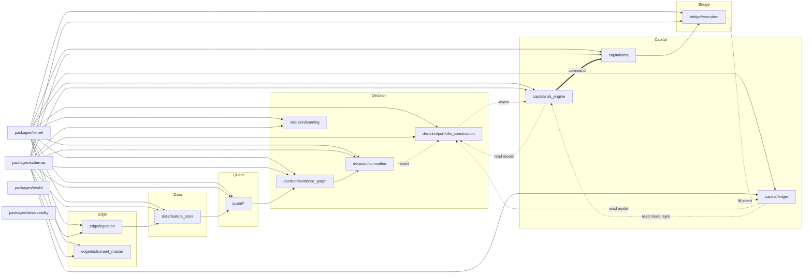

# Package Blueprint

**Blueprint deliverable:** B.2
**Scope:** every one of the 12 bounded contexts (`../Architecture/19_Bounded_Context_Map.md`), translated into a package layout
**Status:** Blueprint v1.0, 2026-08-04

---

## 1. The template, worked in full for one context

Every bounded context's package follows the identical internal shape. **BC6 Risk Authorisation is the worked example**, chosen because `../Architecture/contracts/README.md` already names it the file with the largest concentration of things expensive to get wrong — the same reason applies here.

```
services/capital/risk_engine/
├── pyproject.toml
├── src/risk_engine/
│   ├── __init__.py
│   ├── api/                      # PUBLIC interface — the only importable surface
│   │   ├── __init__.py           # exports: evaluate(), get_budget_snapshot()
│   │   └── models.py             # RiskAssessment, AuthorisedOrder DTOs (wire types, from packages/schemas)
│   ├── domain/                   # INTERNAL — never imported outside this package
│   │   ├── aggregates.py         # RiskAssessment, AuthorisedOrder, LimitSet, KillSwitchState
│   │   ├── rules/                # The ordered gate chain (Architecture/review/R11 §3)
│   │   │   ├── platform_mode.py
│   │   │   ├── kill_switch_precheck.py
│   │   │   ├── instrument_tradable.py
│   │   │   ├── news_blackout.py
│   │   │   ├── drawdown_gate.py
│   │   │   ├── exposure_limit.py
│   │   │   ├── correlation_limit.py
│   │   │   ├── liquidity.py
│   │   │   ├── model_risk.py
│   │   │   ├── var_limit.py
│   │   │   └── proposal_validity.py
│   │   ├── sizing/                # The monotonic-reduction chain (R11 §3 phase 2)
│   │   └── kill_switch/           # Three-tier interlock (ADR-0018)
│   ├── adapters/                  # Outbound — the only place infra clients are constructed
│   │   ├── postgres.py
│   │   ├── redis.py
│   │   └── event_bus.py
│   └── config.py
├── tests/
│   ├── unit/                      # One file per rule in domain/rules/ — each rule independently testable
│   ├── contract/                  # Verifies api/models.py DTOs match packages/schemas exactly
│   └── fail_closed/                # The chaos-suite subset specific to this package
└── README.md                      # Points to Architecture/10_Risk_Portfolio_Platform.md — never restates it
```

**Dependency rule, enforced by CI, not by convention:** `domain/` never imports from `adapters/`. `api/` never imports from `domain.rules` directly — it calls a single `RiskEvaluationService` that owns rule ordering internally, so the ordered-gate-chain invariant (R11 §3: gates before sizing before issuance, in the stated order) is enforced by one function's internal structure, not by every caller remembering the order.

---

## 2. Package layout, summarised across all 12 contexts

| Bounded context | Package path | Public API surface | Internal-only modules |
|---|---|---|---|
| BC1 Market Data | `services/edge/ingestion/`, `services/edge/quality/` | `get_bars()`, `get_quality_score()` | Source adapters, DST detector, quality detectors |
| BC2 Reference Data | `services/edge/instrument_master/` | `get_spec()`, `is_tradable()`, `cluster_of()` | Calendar engine, contract-spec cache |
| BC3 Feature Engineering | `services/data/feature_store/` | `get_features()` | Feature materialiser, point-in-time query engine |
| BC4 Market Intelligence | `services/quant/regime/`, `.../volatility/`, `.../structure/`, `.../model_inference/` | `get_view()` per engine | GARCH/HMM fits, structure detectors, model artefacts |
| BC5 Deliberation | `services/decision/evidence_graph/`, `.../committee/` | `assemble()`, `slice()`, `convene()`, `get_proposal()` | Node/edge builders, desk orchestration, consensus engine |
| **BC12 Portfolio Construction** | `services/decision/portfolio_construction/` | `submit()`, `rebalance()`, `get_plan()` | Scoring model, ranking/allocation, displacement logic |
| BC6 Risk Authorisation | `services/capital/risk_engine/` | `evaluate()`, `get_budget_snapshot()` | See §1 in full |
| BC7 Portfolio | `services/capital/ledger/` | `get_snapshot()` | Event-sourced aggregate, projector |
| BC8 Order Execution | `services/bridge/execution/`, `services/capital/oms/` | `submit()` | Broker adapter (MT5), order state machine |
| BC9 Learning | `services/decision/learning/` | `propose_change()` | Hypothesis generator, precedent index |
| BC10 Platform Operations | `services/platform/supervisor/`, `.../scheduler/`, `.../gateway/` | `get_mode()` | Circuit breakers, mode state machine |
| BC11 Identity & Governance | `services/platform/identity/`, `.../secrets/` | `authorize()`, `record()` | RBAC engine, audit log writer |

**Note the naming applied from `../Architecture/freeze/Naming_Standard.md` §3.2: BC7's package is `ledger`, never bare `portfolio` — reserving that word for BC12's package, `portfolio_construction`. This is the one place this blueprint actively diverges from a literal reading of the bounded-context prose name, and it does so by design, per the freeze's own naming recommendation.**

---

## 3. Shared modules

| Package | Contents | Who may depend on it |
|---|---|---|
| `packages/kernel` | `Symbol`, `Timeframe`, `Timestamp`, `AsOf`, `Money`, `Quantity`, `Price`, `Bps`, `EventEnvelope`, `Clock`, `Result[T,E]`, `Staleness`, `Confidence`, `Probability`, `TenantId`, `AccountId` | Every service, no exceptions (ADR-0014) |
| `packages/schemas` | Generated Pydantic models, one per event subject and per API DTO | Every service that publishes or consumes an event, or exposes an API |
| `packages/testkit` | Fixed-seed fixtures, chaos-suite helpers, replay-determinism assertions | Every service's `tests/` directory |
| `packages/observability` | Structured logging setup, tracer initialisation, standard metric names | Every service |

**Governance on `packages/kernel` specifically, per ADR-0014:** any change requires a written ADR, not a PR review alone — a breaking change here breaks all twelve contexts simultaneously.

---

## 4. Dependency rules, enforced

1. `services/*` may import `packages/kernel`, `packages/schemas`, `packages/testkit`, `packages/observability`. Nothing else.
2. `services/*` may **never** import another `services/*` package directly. Cross-service communication is the event bus (`packages/schemas` for the payload shape) or a published HTTP/gRPC client generated from `../Architecture/contracts/`.
3. `research/` may import any `services/*` public `api/` module (read-only usage: calling `get_features()`, not writing to `domain/`). No `services/*` package may import from `research/`, ever — this is the one-way boundary that keeps a notebook experiment from becoming a hidden production dependency.
4. `apps/dashboard` and `apps/cli` call services only through `services/platform/gateway` (BFF pattern, C32) — never a direct service-to-service call from a client app.

## 5. Ownership and testing strategy, per package

Every package's `README.md` states: which bounded context it implements, which `../Architecture/` page is its source of truth, and its own test command. Testing strategy at the package level follows `Testing_Blueprint.md`'s pyramid — unit tests inside `domain/`, contract tests verifying `api/` against `packages/schemas`, and (for BC5, BC6, BC8, BC12 specifically — the capital-and-decision path) a mandatory `tests/fail_closed/` suite exercising every dependency-failure branch named in that context's `../Architecture/` page's Degraded Mode section.

## 6. Versioning strategy

- **`packages/kernel` and `packages/schemas`:** semantic versioning, every service pins an exact version, a bump is a coordinated PR across every consumer (rare, by design — ADR-0014's governance).
- **`services/*`:** each service versions independently, tagged at deploy time, following the model/prompt lifecycle pattern already established for artefacts (`../Architecture/20_Model_Registry.md`) — a service version is itself an artefact with a shadow/canary path (`Deployment_Blueprint.md`).
- **Event schemas:** `.v1`, `.v2` suffixes on the subject itself (already the convention in `../Architecture/generated/15_Event_Catalog_v2.md`), never a breaking change to a `.v1` schema in place.

---

## 7. Package dependency diagram



**No arrow in this diagram is a Python import between two `services/*` packages.** Every cross-service edge is either an event (dotted), a command (double line), or a synchronous read-model query — matching `../Architecture/19_Bounded_Context_Map.md`'s relationship-pattern table exactly, one layer down at the package level.

---

## 8. Related

- `Repository_Architecture.md` — the top-level layout this document details
- `Service_Catalog.md` — per-service operational detail (deployment, scaling, SLOs) this document's package layout does not cover
- `../Architecture/19_Bounded_Context_Map.md` — the twelve contexts this blueprint packages
- `../Architecture/decisions/0014-shared-kernel-limited-to-seven-types.md` — the governance rule §3-4 implement
- `../Architecture/freeze/Naming_Standard.md` §3.2 — the BC7/BC12 naming mitigation applied in §2
