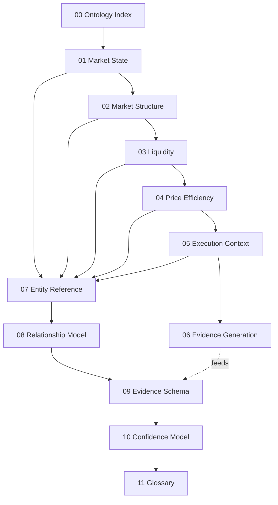

# 00 — Technical Analysis Ontology

**Diagram:** `00_Technical_Analysis_Ontology.excalidraw`
**Volume:** Knowledge (new top-level volume, sibling to `Architecture/`, `Blueprint/`, `governance/`)
**Status:** Draft, non-normative
**Grounded against:** `Architecture/00_Master_Architecture.md`, `03_Feature_Store.md`, `04_Regime_Engine.md`, `05_Volatility_Engine.md`, `06_Market_Structure_Engine.md`, `08_AI_Investment_Committee.md`, `09_Decision_Intelligence_Layer.md`, `17_Evidence_Graph.md`, `19_Bounded_Context_Map.md`, `decisions/0013`, `0027`, `0028`, `0034`, `0041`

---

## What this volume is, and what it deliberately is not

WITrade OS Architecture & Engineering Blueprint v1.0 is **frozen** (`governance/Architecture_Freeze/Architecture_Freeze_Certificate_v1.0.md`, 2026-08-04). `Architecture/README.md` states the rule this volume is built to respect: **"Pages 00-16 and ROADMAP.md are never modified. Every improvement is a sibling layer."** Pages 17-21 already demonstrated the pattern once, adding new source pages rather than editing frozen ones. This volume is that pattern applied one level up: not a new architecture page, but a new **volume**, because its subject is not a subsystem, it is the vocabulary every subsystem from page 03 onward already speaks without ever writing down.

**This is not architecture.** It defines no new component, proposes no new engine, and changes no interface, event, or contract. `governance/Policies/Documentation_Governance.md` binds documentation updates to changes that touch `Architecture/*.md` or `Blueprint/*.md` — this volume touches neither. Where this ontology and a frozen Architecture page ever appear to disagree, **the Architecture page is correct and this page has drifted**, exactly the rule `Architecture/19_Bounded_Context_Map.md` states for itself relative to its own ADRs.

**What it is:** the semantic layer underneath BC3 Feature Engineering and BC4 Market Intelligence (`Architecture/19_Bounded_Context_Map.md`). Page 06 computes `bos_choch()`, `fvg()`, `liquidity()`, `ob()` as named function calls in a Python library already in production use (`smartmoneyconcepts`, ported from TradeHub's `smc-analyzer`). This volume is where **BOS**, **fair value gap**, **liquidity sweep**, and **order block** get formal entity definitions, typed attributes, a confidence contract, and a stated place in the Evidence Graph's node model (page 17) — the vocabulary a trader, a desk prompt, and a graph node all need to mean the same thing when they use the same word.

## Why an ontology and not just better comments on page 06

Three consumers need the same concept to resolve identically, and today nothing enforces that:

1. **A desk prompt** (`Architecture/08_AI_Investment_Committee.md`) reasons in trader language: "the SMC desk sees an unmitigated bullish order block confluent with a liquidity sweep." That sentence has to bottom out in typed evidence graph nodes (ADR-0013: citations are references, never literal values), or it is exactly the hallucination surface ADR-0013 exists to close.
2. **The Evidence Graph** (`Architecture/17_Evidence_Graph.md`) needs a `Level` node's `field` to be one of a closed, versioned vocabulary, not a free string a graph-builder author picks ad hoc per commit.
3. **A human operator** reading the dashboard's `explain()` output (page 17 §Interfaces) needs the rendered rationale to use the same term the platform's own documentation uses for it, or the explanation is not actually explaining anything.

An ontology is the one artefact that serves all three without being restated three times, which is the same "one architectural fact, one canonical source" governance rule `Architecture/README.md` already applies to pages 17-21.

## How the five TA domains map onto the frozen engines

This is the load-bearing table of the whole volume. The user-facing domain decomposition below (chapters 01-05) is a **conceptual** decomposition, one level finer-grained than the **engine** decomposition BC4 already ships (`Architecture/19_Bounded_Context_Map.md` — Regime 04, Volatility 05, Market Structure 06, ML/RL 07). It is not a proposal for new engines. Two ontology domains, Liquidity and Price Efficiency, are both computed by the single Market Structure Engine (page 06) — they are separated here because they are separate *concepts* a desk reasons about independently, not because a second engine exists or is proposed.

| Ontology domain (this volume) | Canonical computing engine | Architecture source |
|---|---|---|
| 01 Market State | Regime Engine + Volatility Engine, conditioned by Feature Store Time/Macro categories | `04_Regime_Engine.md`, `05_Volatility_Engine.md`, `03_Feature_Store.md` |
| 02 Market Structure | Market Structure Engine (SMC) — swings, BOS, CHoCH | `06_Market_Structure_Engine.md` |
| 03 Liquidity | Market Structure Engine (SMC) — `liquidity()` primitive, same engine as 02, not a separate engine | `06_Market_Structure_Engine.md` |
| 04 Price Efficiency | Market Structure Engine (SMC) — `fvg()`, `ob()` primitives, same engine as 02/03 | `06_Market_Structure_Engine.md` |
| 05 Execution Context | Feature Store Time/Macro/Cross Asset categories, Execution Desk's live conditions, Execution Platform | `03_Feature_Store.md`, `08_AI_Investment_Committee.md` (Execution Desk), `Architecture/11_Execution_Platform.md` |
| 06 Evidence Generation | Evidence Graph, directly | `17_Evidence_Graph.md` |

Nothing in this table introduces a component absent from the frozen baseline. It re-groups existing, named outputs by the concept a human trader already uses for them.

## Volume structure

| Chapter | Answers | Grounded against |
|---|---|---|
| [01_Market_State](01_Market_State.md) | What kind of market is this, right now? | Pages 04, 05 |
| [02_Market_Structure](02_Market_Structure.md) | What is price doing structurally — trend, break, shift? | Page 06 |
| [03_Liquidity](03_Liquidity.md) | Where does the market want to go to trigger orders? | Page 06 |
| [04_Price_Efficiency](04_Price_Efficiency.md) | Where did price move too fast to be "fair," and has it been repaid? | Page 06 |
| [05_Execution_Context](05_Execution_Context.md) | Is right now a good time to act, independent of direction? | Page 03 (Time/Macro), page 08 (Execution Desk) |
| [06_Evidence_Generation](06_Evidence_Generation.md) | How does every concept above become a citable graph node? | Page 17 |
| [07_Entity_Reference](07_Entity_Reference.md) | The compiled entity table across all five domains | 01-05 |
| [08_Relationship_Model](08_Relationship_Model.md) | How do entities influence, create, validate, or invalidate one another? | 01-06 |
| [09_Evidence_Schema](09_Evidence_Schema.md) | The node/edge schema every entity above must satisfy | Page 17 §Node model, §Edge model |
| [10_Confidence_Model](10_Confidence_Model.md) | How does a raw observation become a calibrated, propagated probability? | Page 17 §Weighting, ADR-0027, ADR-0028 |
| [11_Glossary](11_Glossary.md) | One-line definition, per term, alphabetical | All of the above |

## Entity model (the template every chapter 01-06 entity follows)

Every entity defined in this volume states the same thirteen fields, chosen to be a strict superset of what page 17's node model already requires (`value`, `as_of`, `source`, `staleness`, `reliability`, `weight`, `provenance` — page 17 §Node model) plus the conceptual fields a human reader needs that a graph node does not carry:

| Field | Meaning |
|---|---|
| Purpose | Why this entity exists as a distinct concept |
| Definition | Precise, unambiguous statement of what it is |
| Inputs | What upstream data or entities it is computed from |
| Outputs | What it produces, and in what shape |
| Relationships | Named edges to other entities (chapter 08 formalizes these) |
| Attributes | The typed fields the entity carries |
| State | Valid lifecycle states, if any |
| Confidence | How its reliability is computed (chapter 10 formalizes this) |
| Evidence Produced | Which Evidence Graph node type(s) it becomes (chapter 09) |
| Evidence Consumed | Which node types it reads to compute itself |
| Dependencies | Other entities or engines it requires to exist first |
| Lifecycle | Created, updated, invalidated, aged, when and by what |
| Examples / Use Cases | A concrete instance, grounded in the actual engine that produces it |

## Future Expansion

- New markets, asset classes, and alternative data (options, order flow, DOM, volume profile, market profile, news NLP) extend this ontology by adding entities and node types within the existing five-domain shape, per the user's original brief — none of chapters 01-06's domain boundaries need to move to accommodate them, mirroring how `Architecture/00_Master_Architecture.md` already states new Quant Research engines "plug in as new boxes at this layer without touching the Committee's interface."
- If a future architecture change promotes any ontology concept to a first-class engine (for example, a standalone Liquidity Engine), that is an Architecture-layer decision requiring an RFC and ADR per `governance/Policies/Implementation_Change_Control.md` — this volume would then update its mapping table in the same change, per the correction-versus-change distinction in `governance/Policies/Documentation_Governance.md`.

---

## Related

- `Architecture/README.md` — the "sibling layer, never edit frozen pages" rule this volume follows
- `governance/Architecture_Freeze/Architecture_Freeze_Certificate_v1.0.md` — why this volume sits outside `Architecture/` and `Blueprint/`
- `governance/Policies/Documentation_Governance.md` — correction vs. change distinction, applied above
- `Architecture/17_Evidence_Graph.md` — the subsystem this ontology's vocabulary ultimately feeds
- `Architecture/19_Bounded_Context_Map.md` — BC3/BC4, the bounded contexts this ontology's vocabulary describes
- Next: `01_Market_State.md`
