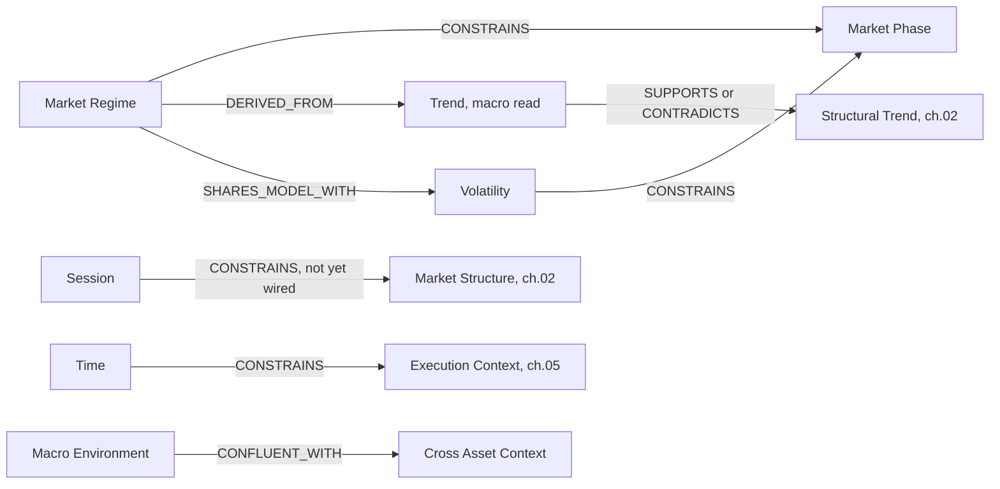

# 01 — Market State

**Diagram:** `01_Market_State.excalidraw`
**Domain:** Market State
**Computed by:** Regime Engine (`Architecture/04_Regime_Engine.md`), Volatility Engine (`Architecture/05_Volatility_Engine.md`), Feature Store Time/Macro/Cross Asset categories (`Architecture/03_Feature_Store.md`)
**Depends on:** `00_Technical_Analysis_Ontology.md`
**Status:** Draft, non-normative

---

## Purpose

Answer, before any structural or liquidity concept is even evaluated, the question every desk and every downstream engine needs answered first (`Architecture/04_Regime_Engine.md` §Purpose): **what kind of market is this, right now, and how sure are we?** Market State is context every other domain in this volume conditions on. Page 06's swing length is regime-aware; page 05's forecast volatility is regime-conditional; nothing in chapters 02-05 is evaluated context-free.

## Domain scope

| Entity | Computed by | Node type produced (ch. 09) |
|---|---|---|
| Market Regime | Regime Engine (04) — GARCH -> Markov Switching -> HMM | `State` |
| Market Phase | **Derived** — Regime state x Volatility percentile, not a separate engine | `Derived` |
| Trend (macro read) | **Derived** — directional interpretation of Regime state | `Derived` |
| Volatility | Volatility Engine (05) — six metrics | `Forecast` / `Observation` |
| Session | Feature Store Time category (03); `smc.sessions()` primitive, page 06 Future Expansion | `Observation` |
| Time | Feature Store Time category (03) — day-of-week, time-to-event | `Observation` |
| Macro Environment | Feature Store Macro category (03) — rates, DXY, yield curve, risk-on/off | `Observation` |
| Cross Asset Context | Feature Store Cross Asset category (03) — correlated pair moves, intermarket signals | `Observation` |

## Entity: Market Regime

| Field | Value |
|---|---|
| Purpose | Classify the current market as trending, mean-reverting, or high/low-volatility so every downstream model starts from the same read |
| Definition | A probabilistic state estimate over `{bull, bear, sideways}`, produced by a GARCH -> Markov Switching -> HMM pipeline over price returns |
| Inputs | Price returns per symbol, from the Feature Store (03) |
| Outputs | `get_regime(symbol, as_of) -> { state, probabilities: {bull, bear, sideways}, confidence, transition_matrix }` |
| Relationships | `CONSTRAINS` Volatility's forecast conditioning (05); `CONSTRAINS` swing-length parameter in Market Structure (06, ch. 02); `SUPPORTS` or `CONTRADICTS` Trend reads |
| Attributes | `state: enum`, `probabilities: {bull, bear, sideways}`, `confidence: float`, `transition_matrix: matrix`, `stale: bool` |
| State | One of `bull`, `bear`, `sideways`, each with a minimum-dwell-time gate before a shift is reported (page 04 §Recovery Strategy) — dampens whipsaw near a 50/50 boundary |
| Confidence | Native to the engine output (`confidence` field); enters graph weighting (ch. 10) as `reliability` |
| Evidence Produced | `State` node — page 17 §Node model |
| Evidence Consumed | None (leaf computation over Feature Store returns) |
| Dependencies | Feature Store (03) |
| Lifecycle | Recomputed every bar close; `regime.updated` on every recompute, `regime.shift.detected` only when the most-probable state changes and the dwell-time gate clears |
| Examples | XAUUSD M15 at `{state: bull, probabilities: {0.71, 0.09, 0.20}, confidence: 0.71}` |

## Entity: Market Phase

| Field | Value |
|---|---|
| Purpose | Give desks a single composite read that a bare regime label doesn't carry: "trending, low volatility" reads very differently from "trending, high volatility" for sizing and structure interpretation |
| Definition | A `Derived` node (page 17 §Node model) combining Market Regime's `state` with Volatility's `percentile`, produced deterministically by the graph builder, never asserted by an LLM |
| Inputs | Market Regime (`State` node), Volatility Percentile (`Forecast`/`Observation` node) |
| Outputs | A label from the cross-product, e.g. `trending_low_vol`, `trending_high_vol`, `ranging_low_vol`, `ranging_high_vol` |
| Relationships | `DERIVED_FROM` Market Regime and Volatility; `CONFLUENT_WITH` any Market Structure read that matches its implied bias |
| Attributes | `phase: enum`, `derived_from: [node_id, node_id]` |
| State | Recomputed whenever either source node updates |
| Confidence | Multiplicative product of its two source nodes' weights (ch. 10 §Weighting) — never independently estimated |
| Evidence Produced | `Derived` node |
| Evidence Consumed | Market Regime `State`, Volatility `Forecast` |
| Dependencies | Market Regime, Volatility |
| Lifecycle | No independent publish event; recomputed on `regime.updated` or `volatility.updated` |
| Examples | XAUUSD M15, regime `bull` (0.71) + vol percentile 88th -> `trending_high_vol` |

**Honest gap:** Market Phase is not a Feature Store category or an engine output as of the frozen baseline. It is defined here as a composite this ontology proposes the Evidence Graph builder compute, not a claim that it already exists in the frozen system. See Future Expansion.

## Entity: Trend (macro read)

| Field | Value |
|---|---|
| Purpose | Capture the directional read implied by Market Regime, kept distinct from page 02's per-swing structural trend (HH/HL/LH/LL sequence) so the two are never silently conflated |
| Definition | `bull` -> uptrend read, `bear` -> downtrend read, `sideways` -> no directional read. A `Derived` interpretation of Market Regime's `state`, not an independently fitted model |
| Inputs | Market Regime `State` node |
| Outputs | `{ direction: up \| down \| none, source_confidence }` |
| Relationships | `SUPPORTS` or `CONTRADICTS` Market Structure's swing-sequence trend (ch. 02) — a disagreement between the two is exactly the kind of `CONTRADICTS` edge page 17 is built to surface, not to hide |
| Attributes | `direction: enum`, `derived_from: node_id` |
| State | Follows Market Regime's state transitions, including its dwell-time gate |
| Confidence | Inherits Market Regime's `confidence` directly, no independent estimation |
| Evidence Produced | `Derived` node |
| Evidence Consumed | Market Regime `State` |
| Dependencies | Market Regime |
| Lifecycle | Recomputed on `regime.updated` |
| Examples | `bull` (0.71) -> `{direction: up, source_confidence: 0.71}` |

## Entity: Volatility

| Field | Value |
|---|---|
| Purpose | One consistent, multi-lens answer to "how much is this instrument moving, and how much should we expect it to move" for position sizing, the Volatility Desk, and Data Quality thresholds |
| Definition | Six metrics, computed together and regime-conditioned: ATR, Forecast Vol, Realized Vol, Expected Move, Volatility Percentile, Tail Risk |
| Inputs | Price/returns from the Feature Store (03); Market Regime state (04) — forecast vol and tail risk are regime-conditional, not computed in isolation |
| Outputs | `get_volatility(symbol, as_of) -> { atr, forecast, realized, expected_move, percentile, tail_risk }` |
| Relationships | `CONSTRAINS` Market Phase; `CONSTRAINS` position sizing (BC6, outside this volume's scope); `SHARES_MODEL_WITH` Market Regime (both share the fitted GARCH model — page 17 §Edge model, the mechanism ADR-0027's dependence discount corrects for) |
| Attributes | `atr: float`, `forecast: float`, `realized: float`, `expected_move: float`, `percentile: float`, `tail_risk: {estimate, confidence_interval}` |
| State | Realized and forecast are always returned together, never just one (page 05 §Recovery Strategy) — a consumer reconciles the two rather than trusting a single "truth" |
| Confidence | Tail risk carries its own confidence interval rather than a point estimate; percentile flags whether its trailing window spans a known regime shift |
| Evidence Produced | `Forecast` node (forecast vol, expected move, tail risk), `Observation` node (ATR, realized vol, percentile) |
| Evidence Consumed | None directly, but regime-conditioned by Market Regime's `State` |
| Dependencies | Feature Store (03), Regime Engine (04) |
| Lifecycle | Recomputed every bar close alongside Regime; `volatility.updated` per recompute, `volatility.regime_shift` when a regime shift event triggers expected-move recalibration |
| Examples | XAUUSD M15 at `{atr: 4.2, forecast: 0.38%, realized: 0.41%, expected_move: 6.1, percentile: 88, tail_risk: {estimate: 0.02, ci: [0.01, 0.04]}}` |

## Entity: Session

| Field | Value |
|---|---|
| Purpose | Give structure, liquidity, and execution-context readings a session label, since London/NY overlap behaves differently from an Asia-session range |
| Definition | Asia / London / NY session classification, computed by the `smc.sessions()` primitive of the same `smartmoneyconcepts` library page 06 uses for structure detection |
| Inputs | Bar timestamps, per-symbol session calendar |
| Outputs | `session: enum {asia, london, ny, london_ny_overlap}` |
| Relationships | `CONSTRAINS` Market Structure confidence (ch. 02) — page 06 names session-aware structure weighting as a named, not-yet-wired Future Expansion item, computed but unused in the confidence score today |
| Attributes | `session: enum`, `is_overlap: bool` |
| State | One active session (or overlap) at any timestamp |
| Confidence | N/A — deterministic classification, not a probabilistic estimate |
| Evidence Produced | `Observation` node |
| Evidence Consumed | None |
| Dependencies | Reference Data (BC2, trading calendar) |
| Lifecycle | Recomputed per bar |
| Examples | 08:15 UTC XAUUSD M15 -> `london` |

**Honest gap:** `smc.sessions()` is computed today but page 06 explicitly states it is "not yet fed into the confidence score" — this ontology entity documents the primitive as it exists, not a claim that session weighting is already active in structure confidence.

## Entity: Time

| Field | Value |
|---|---|
| Purpose | Give every desk context on calendar position: day-of-week seasonality, and proximity to a scheduled event a Risk or Macro desk needs to discount for |
| Definition | Feature Store Time category — day-of-week, time-to-event |
| Inputs | Bar timestamp, economic calendar (external system, `Architecture/00_Master_Architecture.md` §External systems) |
| Outputs | `{ day_of_week, time_to_next_event, event_type }` |
| Relationships | `CONSTRAINS` Execution Context (ch. 05) — a Time node with a near-zero `time_to_event` for a high-impact release is the input the `news-guard` skill's blackout window pattern consumes |
| Attributes | `day_of_week: enum`, `time_to_next_event: duration`, `event_type: enum` |
| State | N/A — deterministic, always current |
| Confidence | N/A |
| Evidence Produced | `Event` node when `time_to_next_event` is within a configured horizon; otherwise `Observation` |
| Evidence Consumed | Economic calendar (external, via BC1's ACL) |
| Dependencies | Feature Store (03) |
| Lifecycle | Recomputed per bar; `Event` nodes carry `scheduled` vs. `occurred` state per page 17 §Node model |
| Examples | `{day_of_week: Fri, time_to_next_event: 14m, event_type: NFP}` |

## Entity: Macro Environment

| Field | Value |
|---|---|
| Purpose | Give the Macro Desk (page 08) a typed, structured read of the broader rates/risk backdrop instead of reasoning over raw prose |
| Definition | Feature Store Macro category — rates, DXY, yield curve, risk-on/off score |
| Inputs | External macro data providers, via BC1's ingestion path |
| Outputs | `{ rates, dxy, yield_curve, risk_on_off_score }` |
| Relationships | `CONSTRAINS` Market Regime interpretation at the Macro Desk level (page 08); `CONFLUENT_WITH` Cross Asset Context |
| Attributes | `rates: float`, `dxy: float`, `yield_curve: curve`, `risk_on_off_score: float` |
| State | N/A |
| Confidence | Inherits the Feature Store's category-level staleness flag (page 03 §Recovery Strategy) |
| Evidence Produced | `Observation` node |
| Evidence Consumed | External macro feed (ACL) |
| Dependencies | Feature Store (03) |
| Lifecycle | Updates on provider cadence, not bar-close-locked like price-derived categories |
| Examples | `{dxy: 104.2, risk_on_off_score: -0.3}` (mild risk-off) |

## Entity: Cross Asset Context

| Field | Value |
|---|---|
| Purpose | Surface correlated-instrument moves so a single-symbol read is never made blind to what correlated markets are doing |
| Definition | Feature Store Cross Asset category — correlated pair moves, intermarket signals |
| Inputs | Multi-symbol Feature Store data |
| Outputs | `{ correlated_moves: [...], intermarket_signals: [...] }` |
| Relationships | `SUPPORTS` or `CONTRADICTS` Market Regime (e.g., DXY strength contradicting a XAUUSD bull regime read) |
| Attributes | `correlated_moves: list`, `intermarket_signals: list` |
| State | N/A |
| Confidence | Category-level staleness flag, as with Macro Environment |
| Evidence Produced | `Observation` node |
| Evidence Consumed | Feature Store, multi-symbol |
| Dependencies | Feature Store (03) |
| Lifecycle | Recomputed per bar close, symbol-set dependent |
| Examples | XAUUSD read alongside `{DXY: -0.4% intraday, US10Y: +3bps}` |

## Relationships (feeds chapter 08)

## Failure Modes / Known Gaps

- **Regime non-convergence and whipsaw** propagate directly into Market Phase and Trend, since both are derived nodes with no independent estimation of their own (page 04 §Failure Modes).
- **Market Phase and Trend are ontology-proposed composites**, not frozen Feature Store categories. A future engine change that adds either as a native output must update this chapter's mapping in the same change (`governance/Policies/Documentation_Governance.md`).
- **Session weighting is computed but inert** in structure confidence today (page 06). This chapter documents the primitive honestly rather than the aspirational state.

## Future Expansion

- Multi-timeframe regime as a native engine output (page 04 §Future Expansion) would let Market Phase be computed per timeframe rather than only at the symbol's primary timeframe.
- Options-implied volatility surface (page 05 §Future Expansion) would add a market-implied Volatility sub-entity alongside the model-implied one.
- Cross-asset volatility spillover (page 05 §Future Expansion) would add an edge type between two symbols' Volatility entities, not currently modeled.

---

## Related

- Previous: `00_Technical_Analysis_Ontology.md`
- `Architecture/04_Regime_Engine.md`, `Architecture/05_Volatility_Engine.md`, `Architecture/03_Feature_Store.md` — canonical sources
- `06_Evidence_Generation.md` — how these entities become graph nodes
- `10_Confidence_Model.md` — the weighting formula referenced above
- Next: `02_Market_Structure.md`
