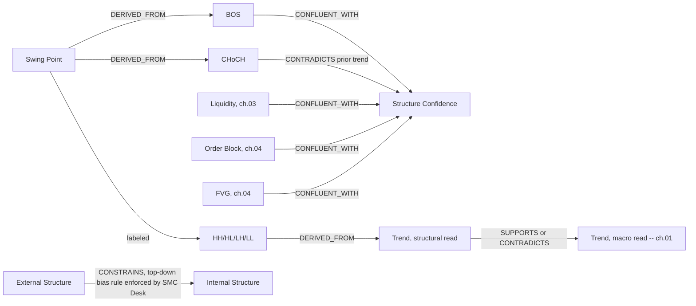

# 02 — Market Structure

**Diagram:** `02_Market_Structure.excalidraw`
**Domain:** Market Structure (Smart Money Concepts)
**Computed by:** Market Structure Engine (`Architecture/06_Market_Structure_Engine.md`)
**Depends on:** `01_Market_State.md`
**Status:** Draft, non-normative

---

## Purpose

Formalize the vocabulary of the Market Structure Engine's pipeline (page 06 §Pipeline: `Swing Detection -> BOS/CHoCH -> Liquidity -> Order Blocks -> FVG -> Mitigation -> Structure Confidence`) as typed entities, so a desk prompt, a graph node, and a chart annotation all mean the same thing by "BOS" or "CHoCH." This chapter covers swings, breaks of structure, and confidence. Liquidity (ch. 03) and Price Efficiency — order blocks, FVGs (ch. 04) — are the same engine's other two primitive families, split into separate chapters because they are separate *concepts* a desk reasons about independently (page 00's mapping table).

## Domain scope

| Entity | Status | Computed by / Derivation |
|---|---|---|
| Swing Point | Native | `swing_highs_lows()` — page 06 |
| BOS (Break of Structure) | Native | `bos_choch()` — page 06 |
| CHoCH (Change of Character) | Native | `bos_choch()` — page 06 |
| Structure Confidence | Native | Confluence rule, 0-10 composite — page 06 |
| External Structure | Derived | Swing structure at the higher of two adjacent analyzed timeframes |
| Internal Structure | Derived | Swing structure at the lower of two adjacent analyzed timeframes |
| HH / HL / LH / LL | Derived | Classical labeling applied to consecutive Swing Points |
| MSS (Market Structure Shift) | Terminology note | Synonym some SMC schools use for what page 06 computes as CHoCH — not a separate computed output |
| Trend (structural read) | Derived | HH/HL sequence (uptrend) vs. LH/LL sequence (downtrend), distinct from ch. 01's regime-level Trend |
| Impulse | Ontology-proposed | Not yet computed — see Honest Gaps |
| Correction | Ontology-proposed | Not yet computed — see Honest Gaps |
| Consolidation | Ontology-proposed | Not yet computed — see Honest Gaps |
| Structure Strength | Ontology-proposed | Not yet computed — see Honest Gaps |

## Entity: Swing Point

| Field | Value |
|---|---|
| Purpose | Identify local pivots — the primitive every other Market Structure entity is built from |
| Definition | A local high or low pivot in OHLCV bars, per the `swing_highs_lows()` primitive of the `smartmoneyconcepts` library (page 06 §Technology) |
| Inputs | Multi-timeframe OHLCV bars from the Feature Store (03) |
| Outputs | A sequence of `{ type: high\|low, price, bar_index, timeframe }` |
| Relationships | `DERIVED_FROM` OHLCV bars; every other Market Structure entity below is `DERIVED_FROM` a Swing Point sequence |
| Attributes | `type: enum`, `price: float`, `bar_index: int`, `timeframe: enum` |
| State | Confirmed once the swing-length lookback window has passed; not repainted after confirmation |
| Confidence | Swing length is regime-aware (page 06 §Recovery Strategy) — trending regimes use a longer swing length than choppy ones, reading ch. 01's Market Regime state |
| Evidence Produced | `Level` node — page 17 §Node model |
| Evidence Consumed | None |
| Dependencies | Feature Store (03), Market Regime (ch. 01, for swing-length parameter) |
| Lifecycle | Recomputed on bar close, per timeframe |
| Examples | XAUUSD 15m swing high at 2412.80, bar 1044 |
| Failure Mode | Too-sensitive swing length produces excessive false pivots in choppy conditions (page 06 §Failure Modes) |

## Entity: BOS (Break of Structure)

| Field | Value |
|---|---|
| Purpose | Signal continuation: price breaking a swing point in the direction of the prevailing structure |
| Definition | Output of `bos_choch()` when a swing point is broken in the direction consistent with the existing structural trend |
| Inputs | Swing Point sequence |
| Outputs | `{ direction, broken_swing, bar_index, timeframe }` |
| Relationships | `SUPPORTS` continuation reads; `CONFLUENT_WITH` an unmitigated Order Block or unswept Liquidity within 0.5% of price (page 06 §Confluence Rule) |
| Attributes | `direction: enum`, `broken_swing: node_id`, `bar_index: int` |
| State | Confirmed at the bar the break occurs |
| Confidence | Contributes one of the five confluence factors to Structure Confidence |
| Evidence Produced | `Level` node, `CONFLUENT_WITH`/`SUPPORTS` edges into the sealed graph |
| Evidence Consumed | Swing Point |
| Dependencies | Swing Point |
| Lifecycle | Publishes `structure.updated` (page 06 §Events Published) |
| Examples | XAUUSD 15m BOS bullish at 2415.10, breaking the prior swing high |

## Entity: CHoCH (Change of Character)

| Field | Value |
|---|---|
| Purpose | Signal a potential reversal: the first break against the prevailing structural trend |
| Definition | Output of `bos_choch()` when a swing point is broken against the existing structural trend, first such break after a run of same-direction breaks |
| Inputs | Swing Point sequence, prior BOS/CHoCH history |
| Outputs | `{ direction, broken_swing, bar_index, timeframe }` |
| Relationships | `CONTRADICTS` the prior Trend (structural read); `INVALIDATES` continuation setups built on the prior trend |
| Attributes | Same shape as BOS, distinguished by the `bos_choch()` classification |
| State | Confirmed at the bar the break occurs |
| Confidence | Contributes one of the five confluence factors to Structure Confidence |
| Evidence Produced | `Level` node |
| Evidence Consumed | Swing Point, prior BOS/CHoCH sequence |
| Dependencies | Swing Point |
| Lifecycle | Publishes `structure.updated` |
| Examples | XAUUSD 15m CHoCH bearish at 2409.40, first break below structure after five consecutive higher highs |

## Entity: Structure Confidence

| Field | Value |
|---|---|
| Purpose | Give desks a single 0-10 composite score instead of five separate booleans to reconcile themselves |
| Definition | Rises when >= 2 of five factors align within 0.5% of price: unmitigated FVG, BOS/CHoCH confirmation, unswept liquidity, order block, grid level (page 06 §Confluence Rule) |
| Inputs | FVG (ch. 04), BOS/CHoCH (this chapter), Liquidity (ch. 03), Order Block (ch. 04), Grid level (symbol-specific, versioned config) |
| Outputs | `confidence: float [0,10]` |
| Relationships | `DERIVED_FROM` all five confluence factors; feeds `get_structure()`'s composite output |
| Attributes | `confidence: float`, `contributing_factors: [node_id]` |
| State | Recomputed whenever any contributing factor changes |
| Confidence | Is itself a confidence measure — enters graph weighting (ch. 10) as the `Level` node's `weight` contribution |
| Evidence Produced | Attribute on the parent `Level`/composite node, not a separate node type |
| Evidence Consumed | FVG, BOS/CHoCH, Liquidity, Order Block, grid level nodes |
| Dependencies | ch. 03, ch. 04 |
| Lifecycle | Publishes `structure.confluence.detected` when it crosses a configurable threshold — the trigger that gates a Committee cycle (page 06 §Events Published, same pattern as TradeHub's `smc-analyzer` gating DeepSeek calls) |
| Examples | Confidence 7/10 at 2412.00: unmitigated FVG + BOS confirmation + unswept liquidity aligned |

## Derived swing-labeling family: External / Internal Structure, HH / HL / LH / LL

| Entity | Definition | Node type | Status |
|---|---|---|---|
| External Structure | Swing structure at the higher of two adjacent analyzed timeframes (e.g., Daily structure when reasoning about a 4H setup) | `Level` (higher-timeframe) | Derived — same `swing_highs_lows()` primitive, different timeframe. Page 06 already computes 5m/15m/1H/4H/D; this is a naming convention over that existing multi-timeframe output, not a new computation |
| Internal Structure | Swing structure at the lower of two adjacent analyzed timeframes | `Level` (lower-timeframe) | Derived, same basis |
| HH (Higher High) | A Swing Point of type `high` whose price exceeds the prior swing high | Attribute on `Level` | Derived — classical labeling applied to consecutive Swing Points, not a separate library output |
| HL (Higher Low) | A Swing Point of type `low` whose price exceeds the prior swing low | Attribute on `Level` | Derived |
| LH (Lower High) | A Swing Point of type `high` whose price is below the prior swing high | Attribute on `Level` | Derived |
| LL (Lower Low) | A Swing Point of type `low` whose price is below the prior swing low | Attribute on `Level` | Derived |

**Relationship rule:** the **top-down bias rule** — never trade against Daily + 4H combined bias — is enforced by the SMC Desk (page 08), not by the engine itself (page 06 §Confluence Rule: "this engine reports facts, the Committee applies the rule"). External Structure is the node the top-down rule reads; Internal Structure is what a desk reconciles against it.

## Terminology note: MSS

Some SMC/ICT teaching material uses **Market Structure Shift (MSS)** as a synonym for what page 06's `bos_choch()` primitive classifies as **CHoCH**. This ontology does not introduce MSS as a separate computed entity — it is recorded here, and in the Glossary (ch. 11), purely to prevent a desk prompt or a human operator from treating MSS and CHoCH as two different signals when the underlying engine produces one.

## Entity: Trend (structural read)

| Field | Value |
|---|---|
| Purpose | The per-swing-sequence trend read, distinct from ch. 01's regime-level Trend (a GARCH/HMM-derived macro read) |
| Definition | `HH/HL` sequence -> uptrend; `LH/LL` sequence -> downtrend; a mixed sequence -> no structural trend |
| Inputs | The HH/HL/LH/LL-labeled Swing Point sequence |
| Outputs | `{ structural_direction: up \| down \| none }` |
| Relationships | `SUPPORTS` or `CONTRADICTS` ch. 01's Trend (macro read) — the two are independent computations (one from price structure, one from a fitted regime model) and a disagreement is a genuine `CONTRADICTS` edge, not noise to suppress |
| Attributes | `structural_direction: enum` |
| State | Updates on each new confirmed Swing Point |
| Confidence | Inherits Structure Confidence of the most recent contributing swings |
| Evidence Produced | `Derived` node |
| Evidence Consumed | Swing Point sequence |
| Dependencies | Swing Point |
| Lifecycle | Recomputed on `structure.updated` |
| Examples | Five consecutive HH/HL on XAUUSD 4H -> `{structural_direction: up}` |

## Honest gaps: Impulse, Correction, Consolidation, Structure Strength

Page 06 does not compute these as named outputs. They are recorded here as **ontology-proposed** entities because the user's brief names them and a future Market Structure Engine extension is a plausible, low-risk addition (the Confluence Rule and swing pipeline already carry everything needed to derive them):

| Entity | Proposed definition | Proposed derivation |
|---|---|---|
| Impulse | A displacement leg between two Swing Points that produced at least one FVG (ch. 04) | Swing Point pair + FVG presence, if this ontology's proposal is adopted |
| Correction | A retracement leg following an Impulse, not itself producing a BOS in the impulse's direction | Swing Point pair + absence of continuation BOS |
| Consolidation | A run of Swing Points with no BOS/CHoCH and low Structure Confidence for N bars | Swing Point sequence + Structure Confidence threshold |
| Structure Strength | The price displacement magnitude of a swing leg, feeding Structure Confidence as a continuous factor rather than the current boolean confluence-count | ATR-normalized displacement (ch. 01's Volatility entity) |

Adopting any of these as real, computed entities is an Architecture-layer change to page 06 and requires an RFC and ADR (`governance/Policies/Implementation_Change_Control.md`) — this table is a proposal this ontology carries, not a claim of existing behavior.

## Relationships (feeds chapter 08)

## Failure Modes / Known Gaps

- Swing detection noise, stale mitigation status, and grid math drift are page 06's named failure modes and apply identically to every entity in this chapter that derives from Swing Point.
- Impulse, Correction, Consolidation, and Structure Strength are ontology proposals, not frozen outputs — see the Honest Gaps table above.
- MSS is a terminology alias, not a second signal — see Terminology note above.

## Future Expansion

- Extend grid math beyond XAUUSD/US30 (page 06 §Future Expansion) — every entity here that reads a grid level inherits this limitation.
- Session-aware structure weighting (page 06 §Future Expansion, ch. 01's Session entity) — would make Structure Confidence session-conditional.

---

## Related

- Previous: `01_Market_State.md`
- `Architecture/06_Market_Structure_Engine.md` — canonical source for every native entity above
- `03_Liquidity.md`, `04_Price_Efficiency.md` — the same engine's other two primitive families
- Next: `03_Liquidity.md`
