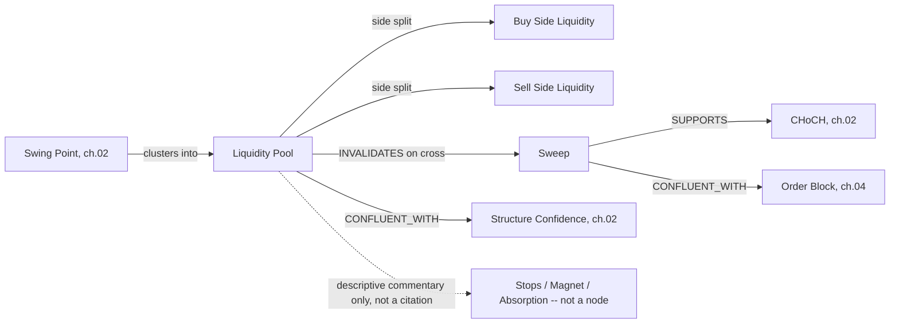

# 03 — Liquidity

**Diagram:** `03_Liquidity.excalidraw`
**Domain:** Liquidity
**Computed by:** Market Structure Engine (`Architecture/06_Market_Structure_Engine.md`) — `liquidity()` primitive. Same engine as ch. 02, not a separate engine.
**Depends on:** `02_Market_Structure.md`
**Status:** Draft, non-normative

---

## Purpose

Liquidity is where the market "wants to go" to trigger resting orders before continuing or reversing. Page 06 computes exactly one native primitive for this domain: `liquidity()`, defined as "unswept swing-high/low clusters." Everything a trader means by liquidity vocabulary — buy-side, sell-side, sweeps, grabs, magnets, institutional absorption — is either a directional labeling of that one primitive, a derivation from it and the OHLCV series, or, in several cases named explicitly below, **a narrative frame this platform's current data sources cannot independently verify.** ADR-0013 makes a citation to an unrepresentable value structurally impossible; this chapter is where that discipline gets applied to Liquidity vocabulary specifically, so a desk cannot cite "institutional absorption" as evidence when no node type exists to back it.

## Domain scope

| Entity | Status | Basis |
|---|---|---|
| Liquidity Pool | Native | `liquidity()` — page 06 |
| Buy Side Liquidity | Derived | Directional split of Liquidity Pool, above current price |
| Sell Side Liquidity | Derived | Directional split of Liquidity Pool, below current price |
| Equal Highs / Equal Lows | Derived | Swing Point (ch. 02) clustering within tolerance, the geometric case `liquidity()` most commonly clusters on |
| Sweep | Derived | Liquidity Pool level crossed by price, then reversed |
| Grab | Terminology note | Synonym for Sweep in most SMC teaching |
| Liquidity Voids | Terminology note | Often used synonymously with the Fair Value Gap (ch. 04) primitive |
| Stops / Resting Orders | Interpretive, not observable | No order-book/DOM data source exists in the frozen baseline (page 03 §Future Expansion: Alternative Data is a placeholder) |
| Magnet | Interpretive, qualitative | A heuristic label, not an independently computed value |
| Institutional Absorption | Interpretive, not observable | Requires order-flow/volume-profile data not present in any frozen Feature Store category |
| Liquidity Efficiency | Ontology-proposed | Not yet computed — see Honest Gaps |
| Liquidity Strength | Ontology-proposed | Not yet computed — see Honest Gaps |

## Entity: Liquidity Pool

| Field | Value |
|---|---|
| Purpose | Mark price clusters where resting orders are inferred to sit, the SMC substitute for order-book depth this platform does not have |
| Definition | An unswept cluster of swing highs or swing lows, output by the `liquidity()` primitive |
| Inputs | Swing Point sequence (ch. 02) |
| Outputs | `{ level, cluster_swings: [node_id], side: buy\|sell, swept: bool }` |
| Relationships | `CONFLUENT_WITH` BOS/CHoCH and Order Blocks within 0.5% of price (page 06 §Confluence Rule); `INVALIDATES` itself on sweep (state transition, not a separate entity) |
| Attributes | `level: float`, `cluster_swings: [node_id]`, `side: enum`, `swept: bool`, `swept_at: timestamp\|null` |
| State | `unswept` -> `swept`, one-way transition, never reverts |
| Confidence | Contributes one of the five confluence factors to Structure Confidence (ch. 02) |
| Evidence Produced | `Level` node |
| Evidence Consumed | Swing Point (`Level` nodes from ch. 02) |
| Dependencies | Swing Point (ch. 02) |
| Lifecycle | Recomputed on `structure.updated`; a sweep is a state mutation on the existing node's `swept` field, matching page 17's pattern for mitigation (ch. 04 uses the identical mutation-vs-new-node distinction) |
| Examples | XAUUSD equal highs at 2418.50 (three swing highs within 0.15%), `side: sell`, `swept: false` |

## Entity: Buy Side Liquidity / Sell Side Liquidity

| Field | Value |
|---|---|
| Purpose | Directional framing of the same Liquidity Pool primitive: which side of current price it sits on determines whether it represents resting sell-stops above (buy-side liquidity, since sweeping it triggers buy orders) or resting buy-stops below (sell-side liquidity) |
| Definition | A Liquidity Pool with `side` set by its `level` relative to current price at evaluation time, not a separately computed primitive |
| Inputs | Liquidity Pool, current price |
| Outputs | Same shape as Liquidity Pool, with `side` resolved |
| Relationships | `CONFLUENT_WITH` the structural bias implied by ch. 02's Trend entities |
| Attributes | Inherited from Liquidity Pool |
| State | `side` can flip if price crosses the level without sweeping it in the SMC sense (rare, edge case at the boundary) |
| Confidence | Same as parent Liquidity Pool |
| Evidence Produced | Attribute on the `Level` node, not a separate node type |
| Evidence Consumed | Liquidity Pool |
| Dependencies | Liquidity Pool |
| Lifecycle | Recomputed whenever price or the pool updates |
| Examples | The 2418.50 pool above a current price of 2405.00 is buy-side liquidity |

## Entity: Equal Highs / Equal Lows

| Field | Value |
|---|---|
| Purpose | Name the specific geometric pattern — near-identical consecutive swing prices — that is the clearest, most common case the `liquidity()` clustering primitive detects |
| Definition | Two or more Swing Points of the same type within a tolerance band, forming a Liquidity Pool |
| Inputs | Swing Point sequence (ch. 02) |
| Outputs | `{ swings: [node_id], tolerance_pct }` |
| Relationships | `DERIVED_FROM` Swing Point; typically the direct cause of a Liquidity Pool node |
| Attributes | `swings: [node_id]`, `tolerance_pct: float` |
| State | Static once the swing sequence is confirmed |
| Confidence | Inherits from Swing Point confidence |
| Evidence Produced | Attribute on the `Level` node the Liquidity Pool becomes |
| Evidence Consumed | Swing Point |
| Dependencies | Swing Point |
| Lifecycle | Evaluated whenever a new Swing Point is confirmed |
| Examples | Three swing highs at 2418.50, 2418.62, 2418.40 within a 0.2% tolerance |

## Entity: Sweep

| Field | Value |
|---|---|
| Purpose | The event that transitions a Liquidity Pool from `unswept` to `swept`, and the primary signal SMC reasoning treats as evidence of a reversal setup |
| Definition | Price crosses a Liquidity Pool's `level` intrabar and closes back on the originating side |
| Inputs | Liquidity Pool, subsequent OHLCV bars |
| Outputs | `{ pool: node_id, sweep_bar, wick_extent, closed_back: bool }` |
| Relationships | `INVALIDATES` the swept pool as a future target; `SUPPORTS` a CHoCH read (ch. 02) if it follows the sweep; `CONFLUENT_WITH` an Order Block formed on the same bar (ch. 04) |
| Attributes | `pool: node_id`, `sweep_bar: int`, `wick_extent: float`, `closed_back: bool` |
| State | A one-time event per pool; does not repeat on the same pool |
| Confidence | Derived from `closed_back` and `wick_extent` relative to ATR (ch. 01's Volatility entity) — a sweep with a shallow close-back is weaker evidence than a full rejection |
| Evidence Produced | `Event` node — page 17 §Node model |
| Evidence Consumed | Liquidity Pool |
| Dependencies | Liquidity Pool |
| Lifecycle | Fires once, mutates the pool's `swept` field to `true` |
| Examples | Price wicks to 2418.68, closes at 2416.20 — sweep of the 2418.50 pool with `closed_back: true` |

## Terminology notes: Grab, Liquidity Voids

- **Grab** ("liquidity grab") is used synonymously with **Sweep** in most SMC teaching material. This ontology does not define it as a separate entity, following the same discipline ch. 02 applied to MSS/CHoCH.
- **Liquidity Voids** are, in a large share of SMC material, used synonymously with the **Fair Value Gap** primitive (ch. 04) — both describe a price region with abnormally little two-way trading. Where a source distinguishes them (a liquidity void as any thin-trading region, an FVG specifically as the 3-candle imbalance page 06 computes), this ontology treats FVG as the only one with a computed primitive and records "liquidity void" as informal usage pointing at the same node.

## Interpretive entities: not independently observable with current data sources

The frozen architecture has no order-book, DOM, or volume-profile data source. Page 03 lists Alternative Data (options flow, on-chain) as a placeholder category, not yet wired. The following SMC vocabulary describes *market microstructure claims* this platform cannot verify with any node it can currently produce:

| Entity | What it claims | Why it cannot be a citable node today |
|---|---|---|
| Stops / Resting Orders | Specific stop-loss or pending orders rest at a Liquidity Pool level | No broker order-book feed exists; this is an inference SMC theory makes from price geometry alone, not a measurement |
| Institutional Absorption | Large participants are absorbing supply/demand at a level | Requires order-flow or volume-profile data; no Feature Store category carries this (page 03 §Feature Categories) |
| Magnet | Price is "drawn toward" a specific unswept pool | A qualitative heuristic applied by a trader/desk to an unswept, high-confluence Liquidity Pool, not a separately measured quantity |

**Per ADR-0013, a desk cannot cite what does not exist as a node.** If a desk's reasoning references "institutional absorption" or describes a level as a "magnet," that language must be understood as descriptive commentary the desk generates around a real, citable `Level` node (the Liquidity Pool itself), never as a citation to a fact this platform measured. This table exists specifically so that distinction is unambiguous rather than assumed.

## Ontology-proposed: Liquidity Efficiency, Liquidity Strength

| Entity | Proposed definition | Proposed derivation |
|---|---|---|
| Liquidity Efficiency | The rate at which detected pools are eventually swept, per symbol/session | Ratio of `swept` to total Liquidity Pool nodes over a rolling window |
| Liquidity Strength | The magnitude of a pool, e.g., number of contributing Equal Highs/Lows or ATR-normalized cluster tightness | Count of `cluster_swings` and tolerance band width, ATR-normalized (ch. 01) |

As with ch. 02's Honest Gaps, adopting either as a real computed output is an Architecture-layer change requiring an RFC and ADR.

## Relationships (feeds chapter 08)

## Failure Modes / Known Gaps

- Every failure mode inherited from Swing Point (ch. 02) propagates here, since Liquidity Pool is `DERIVED_FROM` Swing Point.
- Stops, Resting Orders, Institutional Absorption, and Magnet are explicitly not backed by any node this platform can produce today — treat any desk language using these terms as narrative, not citation.
- Liquidity Efficiency and Liquidity Strength are ontology proposals, not frozen outputs.

## Future Expansion

- An order-flow or DOM data source (named as a Future Proofing target in this volume's originating brief, `00_Technical_Analysis_Ontology.md`) would convert Stops/Resting Orders and Institutional Absorption from interpretive to computable, closing this chapter's largest honesty gap.
- Cross-symbol liquidity confluence (page 17 §Future Expansion: "a locus shared across correlated instruments") once the Instrument Master's cluster map is live.

---

## Related

- Previous: `02_Market_Structure.md`
- `Architecture/06_Market_Structure_Engine.md` — canonical source for `liquidity()`
- `04_Price_Efficiency.md` — the Fair Value Gap primitive referenced above
- `09_Evidence_Schema.md` — the `Event` node type Sweep produces
- Next: `04_Price_Efficiency.md`
