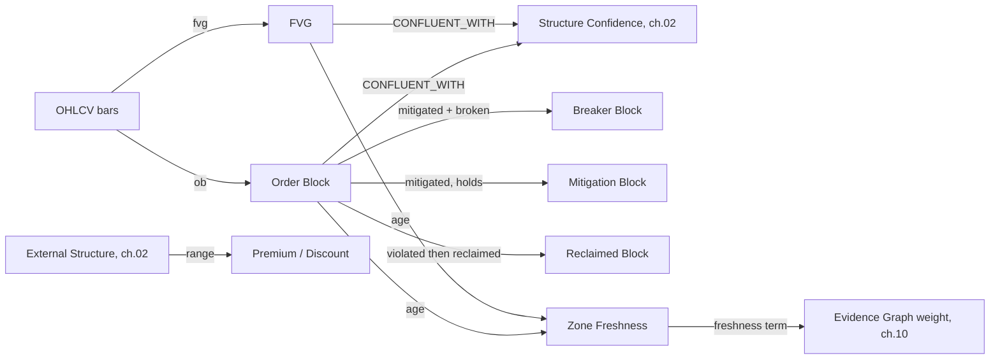

# 04 — Price Efficiency

**Diagram:** `04_Price_Efficiency.excalidraw`
**Domain:** Price Efficiency
**Computed by:** Market Structure Engine (`Architecture/06_Market_Structure_Engine.md`) — `fvg()` and `ob()` primitives, plus Mitigation. Same engine as ch. 02/03, not a separate engine.
**Depends on:** `03_Liquidity.md`
**Status:** Draft, non-normative

---

## Purpose

Price Efficiency concerns where price moved too fast to trade both directions fairly — leaving a gap or an unbalanced candle behind — and whether that inefficiency has since been repaid. Page 06 computes two native primitives here: `fvg()` (3-candle imbalance) and `ob()` (last opposing candle before displacement), plus a `mitigation` boolean tracking whether either has been filled. This chapter formalizes those, plus the range-relative concepts of premium and discount, and flags the sub-typed block vocabulary (breaker, reclaimed) as a derived refinement of the single mitigation boolean the engine currently returns.

## Domain scope

| Entity | Status | Basis |
|---|---|---|
| Fair Value Gap (FVG) | Native | `fvg()` — page 06 |
| Order Block (OB) | Native | `ob()` — page 06 |
| Mitigation | Native | Boolean, page 06 pipeline stage |
| Imbalance | Terminology note | Synonym for FVG — page 06 itself defines FVG as "3-candle imbalance" |
| Breaker Block | Derived | An Order Block that mitigates *and* is subsequently broken through, flipping role |
| Mitigation Block | Derived | An Order Block price returns to and holds (does not break through) |
| Reclaimed Block | Derived | An Order Block violated, then reclaimed by a reversal back through it |
| Premium | Derived | Price in the upper half of a defined range |
| Discount | Derived | Price in the lower half of a defined range |
| Efficiency Zones | Ontology-proposed | Not yet computed — see Honest Gaps |
| Gap Fill Probability | Ontology-proposed | Not yet computed — see Honest Gaps |
| Zone Strength | Ontology-proposed | Not yet computed — see Honest Gaps |
| Zone Freshness | Native-adjacent | Directly derivable from the `mitigation` boolean's timestamp |

## Entity: Fair Value Gap (FVG)

| Field | Value |
|---|---|
| Purpose | Mark a 3-candle imbalance — a price region one side traded through without two-way participation — as a zone price is statistically inclined to revisit |
| Definition | Output of `fvg()`: a gap between candle 1's range and candle 3's range where candle 2 displaced price without overlap, with `join_consecutive` merging adjacent gaps |
| Inputs | OHLCV bars, multi-timeframe (03) |
| Outputs | `{ high, low, direction, bar_index, timeframe, mitigated: bool }` |
| Relationships | `CONFLUENT_WITH` BOS/CHoCH and Order Blocks within 0.5% of price (page 06 §Confluence Rule); `SUPPORTS` a Sweep (ch. 03) formed on the same displacement candle |
| Attributes | `high: float`, `low: float`, `direction: enum`, `mitigated: bool`, `mitigated_at: timestamp\|null` |
| State | `unmitigated` -> `mitigated`, one-way (page 06 recomputes mitigation from the finest available timeframe to avoid the intrabar-fill blind spot, §Recovery Strategy) |
| Confidence | Contributes one of the five confluence factors to Structure Confidence (ch. 02) while `unmitigated` |
| Evidence Produced | `Level` node |
| Evidence Consumed | OHLCV bars |
| Dependencies | Feature Store (03) |
| Lifecycle | Recomputed on `structure.updated`; mitigation is a state mutation, not a new node |
| Examples | XAUUSD 15m bullish FVG 2408.10-2409.40, `mitigated: false` |

## Entity: Order Block (OB)

| Field | Value |
|---|---|
| Purpose | Mark the last opposing candle before a displacement move — the SMC proxy for where a large directional order is inferred to have originated |
| Definition | Output of `ob()`: the last candle against the direction of an ensuing displacement |
| Inputs | OHLCV bars, displacement detection |
| Outputs | `{ high, low, direction, bar_index, timeframe, mitigated: bool }` |
| Relationships | `CONFLUENT_WITH` FVG and Liquidity Pool (ch. 03) within 0.5% of price; base entity for Breaker/Mitigation/Reclaimed Block below |
| Attributes | `high: float`, `low: float`, `direction: enum`, `mitigated: bool`, `mitigated_at: timestamp\|null` |
| State | `unmitigated` -> `mitigated`; see Breaker/Mitigation/Reclaimed for the finer state machine this ontology proposes on top of it |
| Confidence | Contributes one of the five confluence factors to Structure Confidence (ch. 02) |
| Evidence Produced | `Level` node |
| Evidence Consumed | OHLCV bars |
| Dependencies | Feature Store (03) |
| Lifecycle | Recomputed on `structure.updated` |
| Examples | XAUUSD 15m bullish OB 2406.80-2407.50, `mitigated: false` |

## Entity: Mitigation

| Field | Value |
|---|---|
| Purpose | The single boolean page 06's pipeline computes for both FVG and OB: has price returned to fill this zone? |
| Definition | `has price returned to fill OB/FVG?` — page 06 §Pipeline, stage 6 |
| Inputs | FVG or OB node, subsequent OHLCV bars, recomputed from the finest available timeframe |
| Outputs | `mitigated: bool`, `mitigated_at: timestamp\|null` |
| Relationships | `INVALIDATES` the zone's contribution to Structure Confidence once true |
| Attributes | Same as above |
| State | One-way transition |
| Confidence | N/A — deterministic boolean |
| Evidence Produced | Mutation on the parent `Level` node's attributes, not a separate node |
| Evidence Consumed | FVG or OB |
| Dependencies | FVG, OB |
| Lifecycle | Checked every bar close against the finest timeframe available (page 06 §Recovery Strategy, avoiding the stale-mitigation failure mode) |
| Examples | The 2406.80-2407.50 OB mitigated at bar 1052 when price traded back into the zone |

## Terminology note: Imbalance

Page 06 itself defines FVG as a "3-candle imbalance" — Imbalance is not a second computed entity, it is the descriptive name for the same `fvg()` output. This ontology does not introduce it separately, consistent with the discipline applied to MSS (ch. 02) and Grab/Liquidity Void (ch. 03).

## Derived block-state family: Breaker, Mitigation Block, Reclaimed Block

Page 06 returns a single `mitigated: bool` per Order Block. SMC vocabulary distinguishes *how* a zone was revisited, which the current boolean does not capture. This ontology proposes the following refinement as a state machine layered on the existing boolean, not a new primitive:

| Entity | Proposed definition | Relation to the native `mitigated` boolean |
|---|---|---|
| Breaker Block | An Order Block that is mitigated *and* subsequently price closes through it in the opposite direction, flipping its role (a former bullish OB acting as resistance) | Requires `mitigated: true` plus a directional break after mitigation, not yet a tracked field |
| Mitigation Block | An Order Block price returns to and holds — mitigated without a subsequent break-through | `mitigated: true`, no break-through observed |
| Reclaimed Block | An Order Block violated (broken through), then price reverses back through it a second time, "reclaiming" it | Requires tracking a second directional crossing after the first violation, not yet a tracked field |

Adopting this three-state refinement as a real computed output on page 06 is an Architecture-layer change requiring an RFC and ADR (`governance/Policies/Implementation_Change_Control.md`). Until then, a desk reasoning about a "breaker block" is describing a pattern in the raw `mitigated` history a human or a future engine version would need to compute explicitly — it is not yet a citable node.

## Entity: Premium / Discount

| Field | Value |
|---|---|
| Purpose | Give the SMC Desk a range-relative read: is price in the expensive (premium) or cheap (discount) half of the range it is trading within? |
| Definition | Price located above (`premium`) or below (`discount`) the 50% midpoint of a defined range, typically the current External Structure leg (ch. 02) |
| Inputs | External Structure range (high, low, ch. 02), current price |
| Outputs | `{ zone: premium\|discount\|equilibrium, distance_from_midpoint_pct }` |
| Relationships | `CONSTRAINS` how a desk weights a bullish vs. bearish setup — a bullish FVG found deep in a premium zone is lower-quality evidence in classic SMC reasoning than the same FVG in a discount zone |
| Attributes | `zone: enum`, `distance_from_midpoint_pct: float` |
| State | Recomputed continuously as price moves within the range |
| Confidence | N/A — deterministic geometric computation, given an agreed range definition |
| Evidence Produced | `Derived` node |
| Evidence Consumed | External Structure (`Level` node, ch. 02) |
| Dependencies | External Structure (ch. 02) |
| Lifecycle | Recomputed per bar |
| Examples | Range 2390-2430, price 2422 -> `{zone: premium, distance_from_midpoint_pct: 60%}` |

**Honest note:** page 06 does not compute Premium/Discount natively. This entity is a straightforward geometric derivation from a range this platform already computes (External Structure, ch. 02) plus current price — low-risk to adopt as a native output, but not yet one.

## Ontology-proposed: Efficiency Zones, Gap Fill Probability, Zone Strength

| Entity | Proposed definition | Proposed derivation |
|---|---|---|
| Efficiency Zones | A composite view combining all unmitigated FVGs and OBs into a single ranked map of "least efficient" (most likely to be revisited) price regions | Rank unmitigated `Level` nodes by recency and confluence count |
| Gap Fill Probability | Empirical probability an FVG of a given size, in a given regime (ch. 01), is filled within N bars | Requires a resolved-outcome dataset per FVG, analogous to ADR-0028's desk calibration approach applied to price zones instead of desk opinions |
| Zone Strength | Magnitude of the imbalance/displacement that created the zone, ATR-normalized | Displacement size (ch. 01's Volatility ATR) at zone formation |

## Entity: Zone Freshness

| Field | Value |
|---|---|
| Purpose | Distinguish a zone formed minutes ago from one that has sat unmitigated for weeks — freshness is a real input to confidence even though page 06 does not name it separately |
| Definition | Time elapsed since an FVG or OB's `bar_index`, given the zone remains `unmitigated` |
| Inputs | FVG or OB node's `bar_index`, current bar |
| Outputs | `age_bars: int`, `age_duration: timedelta` |
| Relationships | Directly feeds the Evidence Graph's `freshness(n)` weighting term (page 17 §Weighting) — this is the one entity in this chapter with a direct, already-specified home in the confidence formula (ch. 10) |
| Attributes | `age_bars: int`, `age_duration: timedelta` |
| State | Monotonically increasing until mitigation, at which point the node is no longer live evidence |
| Confidence | Is itself a confidence input, not something that has its own separate confidence |
| Evidence Produced | Attribute on the parent `Level` node |
| Evidence Consumed | FVG, OB |
| Dependencies | FVG, OB |
| Lifecycle | Recomputed every bar for every unmitigated zone |
| Examples | FVG formed 40 bars ago, still unmitigated -> lower `freshness` weight than one formed 3 bars ago |

## Relationships (feeds chapter 08)

## Failure Modes / Known Gaps

- Stale mitigation status (page 06 §Failure Modes) propagates to every entity in this chapter derived from the `mitigated` boolean.
- Breaker Block, Mitigation Block, and Reclaimed Block are proposed refinements of the existing boolean, not yet computed.
- Efficiency Zones and Gap Fill Probability are ontology proposals requiring a resolved-outcome dataset that does not yet exist.
- Premium/Discount is a low-risk, not-yet-adopted derivation from existing native outputs.

## Future Expansion

- Gap Fill Probability, once adopted, should follow ADR-0028's isotonic-calibration pattern rather than a naive historical hit rate, for the same reasons that ADR gives for desk confidence.
- Breaker/Reclaimed Block tracking would strengthen ch. 03's Sweep entity, since a swept Liquidity Pool immediately followed by a Breaker Block is a well-known SMC confluence pattern this ontology cannot yet express as two linked citable nodes.

---

## Related

- Previous: `03_Liquidity.md`
- `Architecture/06_Market_Structure_Engine.md` — canonical source for `fvg()`, `ob()`, and Mitigation
- `10_Confidence_Model.md` — where Zone Freshness's `freshness(n)` term is formalized
- Next: `05_Execution_Context.md`
