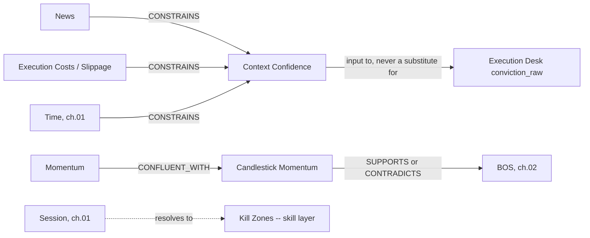

# 05 — Execution Context

**Diagram:** `05_Execution_Context.excalidraw`
**Domain:** Execution Context
**Computed by:** Feature Store Time/Technical categories (`Architecture/03_Feature_Store.md`), Execution Platform (`Architecture/11_Execution_Platform.md`), News/Calendar ACLs (`Architecture/19_Bounded_Context_Map.md`)
**Depends on:** `04_Price_Efficiency.md`
**Status:** Draft, non-normative

---

## Purpose

Answer a question that is independent of direction entirely: **is right now a good time to act at all**, regardless of what Market State, Structure, Liquidity, and Price Efficiency say. A structurally perfect long setup two minutes before NFP, or during a session with a blown-out spread, is a different decision than the identical setup at 10am London with normal conditions. This is the Execution Desk's domain (`Architecture/08_AI_Investment_Committee.md`: "Execution Desk — reads current liquidity/spread conditions, page 11").

## Domain scope

| Entity | Status | Basis |
|---|---|---|
| Session | Cross-reference | Defined in ch. 01 — not redefined here, referenced by role |
| Kill Zones | Skill-layer, not Feature Store native | `news-guard` skill's event-blackout pattern; standard ICT high-liquidity-window vocabulary |
| Time of Day | Cross-reference | ch. 01's Time entity |
| News | Native, sanitized | ACL-2 Text sanitiser output (page 19) — never raw text, per ADR-0032 |
| Macro Events | Cross-reference | ch. 01's Macro Environment + Time entities |
| Execution Costs | Native | Slippage analysis — page 11 |
| Slippage | Native | `execution.slippage.recorded` — page 11 |
| Spread | Partially native | Referenced by page 08 (Execution Desk input) but not independently defined by page 11 — see Honest Gaps |
| Candlestick Momentum | Derived | Body/wick ratio relative to ATR (ch. 01), not a named Feature Store field |
| Volume | Honest gap | Present on the raw `Bar` model (BC1) but not a named Feature Store category — see Honest Gaps |
| Momentum | Native | Technical feature category — RSI, MACD, Stochastic (page 03) |
| Context Confidence | Derived | Composite of the above, feeds the Execution Desk's `conviction_raw` |

## Entity: News

| Field | Value |
|---|---|
| Purpose | Give desks a typed, bounded signal from news providers without ever exposing raw prose to an LLM that allocates capital — closing defect B5 (`Architecture/README.md` §The six blocking defects) |
| Definition | Output of ACL-2, the Text Sanitiser (page 19 §Anti-Corruption Layers): "Prose -> typed, bounded features. Raw text never reaches a desk" |
| Inputs | News provider feed (NewsAPI/Benzinga-class, page 00 §External systems) |
| Outputs | `{ sentiment_score, headline_category, relevance, timestamp }` — never the headline text itself as a citable value |
| Relationships | `CONSTRAINS` Macro Environment (ch. 01) reads; `CONSTRAINS` the Time entity's `time_to_next_event` when a scheduled release is also a news event |
| Attributes | `sentiment_score: float`, `headline_category: enum`, `relevance: float` |
| State | Time-decaying relevance, not persistent |
| Confidence | Bounded by the ACL's own confidence in classification, distinct from and always lower than a directly measured price/volatility node |
| Evidence Produced | `Observation` node (typed, never raw text — page 17 §Security Boundary: "the graph never contains raw untrusted text") |
| Evidence Consumed | External news feed, via ACL-2 |
| Dependencies | BC1 Market Data (ingestion), ACL-2 |
| Lifecycle | Published as new items arrive; decays in relevance over a configured window |
| Examples | `{sentiment_score: -0.6, headline_category: geopolitical, relevance: 0.8}` |

## Entity: Execution Costs / Slippage

| Field | Value |
|---|---|
| Purpose | Measure the gap between an approved trade's expected terms and what the broker actually delivered — the input that both calibrates future sizing and can trip the Kill Switch on a sustained pattern |
| Definition | `execution.slippage.recorded` — every fill, whether within tolerance or not (page 11 §Events Published), computed as actual vs. expected fill price |
| Inputs | Approved Trade (BC6), broker fill confirmation |
| Outputs | `{ expected_price, fill_price, slippage_bps, within_tolerance: bool }` |
| Relationships | `CONSTRAINS` Risk Management's Kill Switch on a sustained pattern, not a single incident (page 11 §Recovery Strategy); feeds RL simulator calibration (page 07) |
| Attributes | `expected_price: float`, `fill_price: float`, `slippage_bps: float`, `within_tolerance: bool` |
| State | One record per fill, immutable once written |
| Confidence | N/A — a direct measurement, not an estimate |
| Evidence Produced | `Observation` node, post-trade only — never available before a decision, so it cannot inform the decision that produced it, only future ones |
| Evidence Consumed | Broker fill data (BC8) |
| Dependencies | Execution Platform (page 11) |
| Lifecycle | Written per fill; auto-flags for operator review when beyond tolerance, never auto-cancels or auto-retries (page 11 §Recovery Strategy) |
| Examples | Expected 2412.00, filled 2412.15, `slippage_bps: 6.2, within_tolerance: true` |

## Entity: Candlestick Momentum

| Field | Value |
|---|---|
| Purpose | A per-bar read of conviction — how much of the bar's range was directional body versus indecisive wick — that is finer-grained than the Technical category's oscillator-based Momentum entity below |
| Definition | Body size relative to total bar range, normalized by ATR (ch. 01's Volatility entity) |
| Inputs | OHLCV bar, ATR |
| Outputs | `{ body_pct, direction, atr_normalized_body }` |
| Relationships | `SUPPORTS` a BOS (ch. 02) formed on a high-momentum candle; `CONTRADICTS` one formed on a small-body, long-wick candle |
| Attributes | `body_pct: float`, `direction: enum`, `atr_normalized_body: float` |
| State | Computed per closed bar |
| Confidence | N/A — deterministic geometric computation |
| Evidence Produced | `Observation` node |
| Evidence Consumed | OHLCV bar, ATR (ch. 01) |
| Dependencies | Feature Store (03) |
| Lifecycle | Recomputed per bar close |
| Examples | A 4.2-point body on a bar with ATR 4.2 -> `atr_normalized_body: 1.0` (full-range conviction candle) |

**Honest note:** page 03's Technical feature category does not name this field explicitly. It is a straightforward derivation from OHLCV + ATR (both already computed), not a claim of existing behavior.

## Entity: Momentum

| Field | Value |
|---|---|
| Purpose | The multi-bar, oscillator-based read of directional conviction, as distinct from Candlestick Momentum's single-bar read |
| Definition | Composite of the Technical feature category's momentum oscillators — RSI, MACD, Stochastic (page 03 §Feature Categories) |
| Inputs | Technical feature category (03) |
| Outputs | `{ rsi, macd, stochastic }` |
| Relationships | `CONFLUENT_WITH` Candlestick Momentum and Trend entities (ch. 01, ch. 02) when all point the same direction |
| Attributes | `rsi: float`, `macd: {line, signal, histogram}`, `stochastic: {k, d}` |
| State | Recomputed per bar close |
| Confidence | Category-level staleness flag inherited from Feature Store (page 03 §Recovery Strategy) |
| Evidence Produced | `Observation` node |
| Evidence Consumed | Technical feature category |
| Dependencies | Feature Store (03) |
| Lifecycle | Recomputed per bar close |
| Examples | `{rsi: 68, macd: {histogram: +0.4}, stochastic: {k: 82, d: 75}}` |

## Entity: Context Confidence

| Field | Value |
|---|---|
| Purpose | Give the Execution Desk one composite read of "is this a clean time to act," combining timing, cost, and news risk into a single number the desk's `conviction_raw` (ADR-0028) can be grounded in |
| Definition | A `Derived` node combining News relevance, Slippage history, and Time's `time_to_next_event` proximity |
| Inputs | News, Execution Costs, Time (ch. 01) |
| Outputs | `context_confidence: float [0,1]` |
| Relationships | `CONSTRAINS` the Execution Desk's `conviction_raw`, never a substitute for it — per ADR-0028, only the desk's calibrated conviction enters pooling, this entity is an input to that reasoning, not a bypass of it |
| Attributes | `context_confidence: float`, `contributing_factors: [node_id]` |
| State | Recomputed continuously |
| Confidence | Multiplicative product of contributing node weights, same pattern as ch. 01's Market Phase |
| Evidence Produced | `Derived` node |
| Evidence Consumed | News, Execution Costs, Time |
| Dependencies | News, Execution Costs, Time (ch. 01) |
| Lifecycle | Recomputed whenever any contributing node updates |
| Examples | Low news relevance, historical slippage within tolerance, 40 minutes to next event -> `context_confidence: 0.85` |

## Skill-layer concept: Kill Zones

**Kill Zones** (London open, NY open, London/NY overlap — the ICT term for the highest-liquidity windows of the trading day) are not a Feature Store native category. They are operationally implemented today at the **skill layer**, not the frozen Architecture: the `news-guard` skill's event-blackout pattern (fetches the Forex Factory calendar, blacks out high-impact events within a configurable window) and TradingView session tooling (`smc.sessions()`, ch. 01's Session entity) together cover the same ground a formal Kill Zone entity would. This chapter records Kill Zones as a named concept a desk prompt may use, explicitly noting it currently resolves to Session (ch. 01) plus the Time entity's `time_to_next_event`, not a separately computed node.

## Honest gap: Volume

Volume is not a named Feature Store category (page 03 §Feature Categories lists Technical, Regime, SMC, Volatility, Time, Macro, Alternative Data, Cross Asset, Labels — no Volume category). Volume itself is a field of the raw `Bar` model BC1 Market Data already ingests (OHLC**V**, page 19 §BC1 Internal models), so the underlying data exists, but no derived volume-based feature (volume profile, OBV, relative volume) is computed by any frozen engine as of this baseline. A desk citing "volume confirms this move" is describing raw bar data, not a Feature Store output, until this gap is closed.

## Honest gap: Spread

Page 08 names "current liquidity/spread conditions" as the Execution Desk's input, and page 11 checks "price still valid, size within limits" pre-send, but no frozen page defines a standalone Spread metric, its computation, or its Feature Store category. This chapter records Spread as a named concept the Execution Desk is specified to read, without asserting a computation this ontology cannot point to.

## Relationships (feeds chapter 08)

## Failure Modes / Known Gaps

- News sentiment classification error propagates directly into Context Confidence — the ACL's own confidence bound is the only safeguard, per its Evidence Produced field above.
- Volume and Spread are named honest gaps: the concepts exist in trader vocabulary and in the raw data (Volume) or the desk's specification (Spread), but neither has a computed Feature Store output today.
- Kill Zones is a skill-layer concept, not an Architecture-layer one — a future engine change that promotes it to a Feature Store category must update this chapter in the same change.

## Future Expansion

- A native Volume feature category (volume profile, OBV, relative volume) would close this chapter's largest gap and directly strengthen ch. 03's currently-interpretive Liquidity entities.
- A defined Spread metric on page 11 would let Context Confidence stop relying on an undocumented input.
- Kill Zones formalized as a Feature Store category would let ch. 02's session-aware structure weighting (page 06 §Future Expansion) and this chapter's Context Confidence share one canonical source instead of two independent skill-layer and engine-layer readings.

---

## Related

- Previous: `04_Price_Efficiency.md`
- `Architecture/11_Execution_Platform.md`, `Architecture/03_Feature_Store.md`, `Architecture/19_Bounded_Context_Map.md` §Anti-Corruption Layers — canonical sources
- `01_Market_State.md` — Session, Time, Macro Environment entities referenced above
- Next: `06_Evidence_Generation.md`
