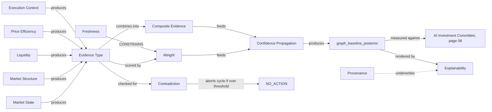

# 06 — Evidence Generation

**Diagram:** `06_Evidence_Generation.excalidraw`
**Domain:** Evidence Generation
**Computed by:** Evidence Graph (`Architecture/17_Evidence_Graph.md`) — BC5 Deliberation
**Depends on:** `01_Market_State.md`, `02_Market_Structure.md`, `03_Liquidity.md`, `04_Price_Efficiency.md`, `05_Execution_Context.md`
**Status:** Draft, non-normative

---

## Purpose

Chapters 01-05 define *what* the platform can observe about a market. This chapter defines *how an observation becomes evidence* — the single mechanism every entity in this volume must pass through before it can be cited by a desk. Page 17 states the platform's central claim directly: "every number a desk cites is a reference to a fact this graph produced, and the fact is verifiable by walking the graph, never by re-trusting the LLM that cited it." This chapter is not a new engine. It is the ontology's account of page 17's own model — node types, weighting, propagation, contradiction, and explainability — restated so that chapters 01-05's entities have a documented path from "computed value" to "citable evidence," and so chapters 07-10 have a shared vocabulary to build on.

## Domain scope

| Entity | Status | Basis |
|---|---|---|
| Evidence Type | Native | The 9 node types — page 17 §Node model |
| Weight | Native | `weight(n) = reliability x freshness x quality x regime_applicability x independence` — page 17 §Weighting |
| Freshness | Native | `staleness{is_stale, age_s, max_age_s, severity}` field, mandatory on every node — ADR-0034 |
| Decay / Aging | Derived | The time-progression of `staleness.age_s` toward `max_age_s`, not a separate field |
| Contradiction | Native | Detected and classified pre-Committee — page 17 §Responsibilities |
| Supporting Evidence | Native | `SUPPORTS`/`CONFLUENT_WITH` edges — page 17 §Edge model |
| Composite Evidence | Native | `Derived` node type — page 17 §Node model |
| Confidence Propagation | Native | Log-odds accumulation with dependence-discount — page 17 §Weighting |
| Aggregation / Scoring | Native | Graph-baseline posterior — page 17 §Responsibilities |
| Provenance | Native | `provenance{snapshot_id, feature_versions}`, mandatory on every node — page 17 §Node model |
| Explainability | Native | `explain()` four views — page 17 §Interfaces |

## Entity: Evidence Type

| Field | Value |
|---|---|
| Purpose | Give every fact in the graph a closed, typed vocabulary so a desk (or this ontology) can never invent a tenth category of thing to cite |
| Definition | One of nine node types: `Observation`, `Level`, `State`, `Forecast`, `Event`, `Constraint`, `PortfolioFact`, `Precedent`, `Derived` (page 17 §Node model) |
| Inputs | Every chapter 01-05 entity's "Evidence Produced" field maps to exactly one of these nine |
| Outputs | A typed node, identity `{type}:{symbol}:{timeframe}:{as_of}:{field}` |
| Relationships | `DERIVED_FROM` is the only edge type that can point from a `Derived` node back to its constituents; every other edge type connects any two typed nodes per the rule table |
| Attributes | `type: enum`, `value`, `as_of`, `source{engine, version, params_ref}` |
| State | Immutable once sealed into a graph (Invariant 3, page 17) |
| Confidence | N/A at the type level — confidence is a property of the individual node's `weight` |
| Evidence Produced | Itself — this is the base unit |
| Evidence Consumed | N/A — this is the classification scheme, not a computation |
| Dependencies | Every Research Platform engine (03-07 in Architecture numbering) |
| Lifecycle | One instance per `{symbol, timeframe, as_of, field}` tuple per cycle |
| Examples | Ch. 02's BOS -> `Event` node; ch. 04's Order Block -> `Level` node; ch. 01's Market Phase -> `Derived` node |

## Entity: Weight

| Field | Value |
|---|---|
| Purpose | Collapse five independent quality signals into the one number that determines how much a node moves the graph-baseline posterior — the mechanism that makes "critically stale evidence contributes nothing" a structural fact rather than a convention |
| Definition | `weight(n) = reliability(n) x freshness(n) x quality(n) x regime_applicability(n) x independence(n)` — multiplicative, so any factor at zero removes the evidence entirely (page 17 §Weighting) |
| Inputs | The five component functions, each computed from the node's own attributes and its `source`/`staleness` fields |
| Outputs | `weight: float [0, ...]` |
| Relationships | `CONSTRAINS` every downstream aggregation this node participates in; a zero-weight node is present in the graph (for explainability) but inert in scoring |
| Attributes | `weight: float`, and implicitly the five factors that produced it |
| State | Recomputed at graph assembly, never mutated after sealing |
| Confidence | This *is* the platform's confidence primitive — see `10_Confidence_Model.md` |
| Evidence Produced | An attribute on every node, not a separate node type |
| Evidence Consumed | `reliability`, `freshness`, `quality`, `regime_applicability`, `independence` — each a per-node computed factor |
| Dependencies | Freshness (below), the node's own `source` metadata, `SHARES_MODEL_WITH` edges for independence discounting |
| Lifecycle | Computed once per node per assembly, immutable thereafter |
| Examples | A fresh, high-reliability, regime-matched, independent `Observation` might weight near 1.0; the same fact one bar past `max_age_s` with `staleness.severity: critical` weights to 0 and cannot support a `TradeProposal` (Invariant 4, page 17) |

## Entity: Freshness

| Field | Value |
|---|---|
| Purpose | Make staleness a first-class, mandatory property of every fact, closing the gap where an old number could silently be treated as current |
| Definition | `staleness{is_stale: bool, age_s: float, max_age_s: float, severity: enum}` — present on every node without exception (ADR-0034) |
| Inputs | Node's `as_of` timestamp, the current cycle's assembly time, a per-field `max_age_s` policy |
| Outputs | The `staleness` object; feeds directly into `Weight`'s `freshness(n)` factor |
| Relationships | `CONSTRAINS` `Weight`; ch. 04's Zone Freshness entity is this same mechanism applied specifically to Order Block / FVG nodes, not a separate computation |
| Attributes | `is_stale: bool`, `age_s: float`, `max_age_s: float`, `severity: enum {ok, warning, critical}` |
| State | Continuously increasing `age_s` until the node is superseded by a new `as_of` |
| Confidence | Directly multiplies into `Weight` |
| Evidence Produced | Attribute on every node |
| Evidence Consumed | Node's own `as_of`, assembly clock (point-in-time correctness, ADR-0034's five layers) |
| Dependencies | Clock injection layer (ADR-0034) |
| Lifecycle | Evaluated at every graph assembly, never cached across cycles |
| Examples | A Regime Engine `State` node computed 40 seconds ago with `max_age_s: 300` -> `severity: ok`; the same node at 310 seconds -> `severity: critical`, weight collapses to 0 |

## Entity: Decay / Aging

| Field | Value |
|---|---|
| Purpose | Name the general concept traders mean by "this signal is getting old" — not a separate computation from Freshness, but this ontology's explicit acknowledgment that the user-facing vocabulary (decay, aging) and the Architecture-layer mechanism (`staleness`) are the same thing |
| Definition | The monotonic progression of `staleness.age_s` toward `staleness.max_age_s`, and the corresponding drop in `Weight` as it crosses `warning` then `critical` thresholds |
| Inputs | Freshness |
| Outputs | No independent output — this entity exists to prevent the ontology from inventing a second staleness mechanism |
| Relationships | `DERIVED_FROM` Freshness |
| Attributes | None beyond Freshness's own |
| State | N/A |
| Confidence | N/A |
| Evidence Produced | None — terminology note, not a node type |
| Evidence Consumed | Freshness |
| Dependencies | Freshness |
| Lifecycle | N/A |
| Examples | "The FVG is three days old, its evidence has decayed" = ch. 04's Zone Freshness has crossed into `warning` or `critical` severity |

## Entity: Contradiction

| Field | Value |
|---|---|
| Purpose | Catch disagreement between facts *before* the Committee is convened, so a desk never has to privately resolve a conflict the graph could have surfaced structurally — and so unresolved conflict can abort a cycle to `NO_ACTION` cheaply, before any LLM call |
| Definition | A classified relationship between two nodes whose values conflict, detected deterministically by the edge rule table (page 17 §Responsibilities, §Failure Modes) |
| Inputs | Every sealed node in the current assembly |
| Outputs | `evidence.contradiction.detected` event per instance, classified by kind: timeframe, direct, model, stale, data (page 17 §Events Published) |
| Relationships | Manifests as a `CONTRADICTS` edge between the two nodes; aggregate contradiction weight above threshold triggers `evidence.cycle.aborted` |
| Attributes | `kind: enum`, `node_a: node_id`, `node_b: node_id`, `weight: float` |
| State | Detected once per assembly; not persisted as a mutable object |
| Confidence | The contradiction's own weight, computed from the two conflicting nodes' individual weights |
| Evidence Produced | `evidence.contradiction.detected` event |
| Evidence Consumed | Any two nodes connected by a rule-table entry that defines a conflict condition |
| Dependencies | The edge derivation rule table (page 17, versioned, no LLM ever asserts an edge) |
| Lifecycle | Computed once per assembly, before any desk is polled |
| Examples | Ch. 02's Trend entity reads bullish on H4 while ch. 01's Market Regime reads high-volatility mean-reverting — a `timeframe` or `model` contradiction depending on the rule-table entry matched |

## Entity: Supporting Evidence / Composite Evidence

| Field | Value |
|---|---|
| Purpose | Let independently-computed facts reinforce each other explicitly, and let the graph express "these five things together mean more than any one alone" without an LLM ever asserting that relationship |
| Definition | `SUPPORTS`/`CONFLUENT_WITH` edges between nodes (Supporting Evidence), and the `Derived` node type for a deterministic combination of several nodes (Composite Evidence) — e.g. ch. 01's Market Phase, ch. 05's Context Confidence |
| Inputs | Any two-or-more sealed nodes matched by a rule-table entry |
| Outputs | An edge (Supporting Evidence) or a new `Derived` node (Composite Evidence) |
| Relationships | Every `Derived` entity across chapters 01-05 (Market Phase, structural Trend, Context Confidence) is an instance of Composite Evidence; every `CONFLUENT_WITH` pairing named in those chapters (e.g. Liquidity Pool `CONFLUENT_WITH` BOS/Order Blocks, page 06 §Confluence Rule) is Supporting Evidence |
| Attributes | Edge: `type, from, to, rule_id`. Node: same shape as any `Derived` node |
| State | Immutable once sealed |
| Confidence | A `Derived` node's weight follows the same multiplicative formula, computed from its constituent nodes' weights (this is the pattern every ch. 01-05 "Derived" entity already documents) |
| Evidence Produced | `Derived` node, or an edge attribute on existing nodes |
| Evidence Consumed | Two or more typed nodes matched by a rule-table confluence condition |
| Dependencies | Edge derivation rule table |
| Lifecycle | Computed once per assembly |
| Examples | Ch. 05's Candlestick Momentum `SUPPORTS` a ch. 02 BOS on the same bar; ch. 01's Market Phase is `DERIVED_FROM` Market Regime and Volatility jointly |

## Entity: Confidence Propagation

| Field | Value |
|---|---|
| Purpose | Turn a graph full of individually-weighted, sometimes-contradicting nodes into one number — the graph-baseline posterior — that exists *before* any desk reasons about the situation, giving the platform a deterministic reference point the LLM layer can be measured against |
| Definition | Log-odds accumulation across all relevant nodes with a dependence-discount term subtracted for nodes sharing a fitted model (`SHARES_MODEL_WITH` edges), full derivation in `review/R09_Evidence_Graph.md` §4-5 |
| Inputs | Every weighted node relevant to the current `symbol/timeframe/as_of`, plus `SHARES_MODEL_WITH` edges for discounting |
| Outputs | `graph_baseline_posterior` — a `LONG`/`SHORT` log-odds value |
| Relationships | `SHARES_MODEL_WITH` is what makes GARCH dependence between Regime and Volatility explicit and correctable (page 17 §Edge model); this is the same log-odds pooling mechanism ADR-0027 specifies for desk votes, applied one layer earlier |
| Attributes | `graph_baseline_posterior: float`, `contributing_nodes: [node_id]` |
| State | Computed fresh per assembly, never mutated |
| Confidence | This entity's own output *is* a confidence measure — formalized fully in `10_Confidence_Model.md` |
| Evidence Produced | Field on the sealed `EvidenceGraph` output |
| Evidence Consumed | Every weighted node, `SHARES_MODEL_WITH` edges |
| Dependencies | Weight, Contradiction (a graph that aborts on contradiction never reaches this step) |
| Lifecycle | Computed once per cycle, logged permanently as `graph_committee_divergence` once compared against the Committee's own pooled posterior (page 17 §Recovery Strategy) |
| Examples | Strong bullish structure (ch. 02) + swept sell-side liquidity (ch. 03) + fresh bullish OB (ch. 04), independent, low contradiction -> a strongly positive `graph_baseline_posterior` |

## Entity: Aggregation / Scoring

| Field | Value |
|---|---|
| Purpose | Name the general operation Confidence Propagation performs, so this ontology has one term covering "combine many weighted facts into a single decision-relevant number" wherever it recurs (graph-baseline posterior here, desk conviction in ch. 05, Committee pooling at page 08) |
| Definition | Terminology note, not a separate computation — Aggregation/Scoring in this ontology always resolves to either Confidence Propagation's log-odds pooling (graph layer) or ADR-0027's log-odds pooling with dependence discounting (Committee layer). This ontology does not introduce a third pooling mechanism |
| Inputs | N/A |
| Outputs | N/A |
| Relationships | `DERIVED_FROM` Confidence Propagation |
| Attributes | N/A |
| State | N/A |
| Confidence | N/A |
| Evidence Produced | None |
| Evidence Consumed | None |
| Dependencies | Confidence Propagation |
| Lifecycle | N/A |
| Examples | "Score this setup" = read the relevant nodes' weights and the graph-baseline posterior, never a separate scoring formula |

## Entity: Provenance

| Field | Value |
|---|---|
| Purpose | Let every cited fact be traced back to the exact code version and data snapshot that produced it — the difference between "the graph says X" and "the graph says X, computed by feature version 1.4.2 against snapshot `snap_2026...`, reproducible on demand" |
| Definition | `provenance{snapshot_id, feature_versions}`, mandatory on every node without exception (page 17 §Node model) |
| Inputs | The point-in-time snapshot identifier and feature registry versions active at computation time (ADR-0034's five layers) |
| Outputs | The `provenance` object |
| Relationships | Underwrites `explain()`'s `full_trace` view; a `Precedent` node's provenance is what makes its historical `as_of`-filtering auditable (page 17 §Node model) |
| Attributes | `snapshot_id: string`, `feature_versions: {feature: version}` |
| State | Immutable, fixed at node creation |
| Confidence | N/A — a factual record, not an estimate |
| Evidence Produced | Attribute on every node |
| Evidence Consumed | Snapshot layer, feature registry (ADR-0034) |
| Dependencies | Point-in-time correctness system (ADR-0034) |
| Lifecycle | Fixed once, never updated |
| Examples | A ch. 02 BOS node's provenance lets an auditor reproduce the exact swing sequence that triggered it, against the exact bar data available `as_of` that timestamp — not today's revised data |

## Entity: Explainability

| Field | Value |
|---|---|
| Purpose | Give every consumer of a decision — trader, auditor, or the next research cycle — a way to see *why*, at the level of detail their role permits, without ever regenerating the explanation as free text disconnected from the sealed graph |
| Definition | `explain(decision_id, view) -> RenderedExplanation`, four views: `one_line`, `decision_card`, `full_trace`, `counterfactual` (page 17 §Interfaces) |
| Inputs | A sealed `EvidenceGraph`, a `decision_id`, the requested view, the caller's role |
| Outputs | `RenderedExplanation`, rendered from the sealed graph, never from re-generated text |
| Relationships | `full_trace` walks every `SUPPORTS`/`CONTRADICTS`/`DERIVED_FROM` edge that fed the decision; `counterfactual` uses `ablate()` to recompute the posterior with one node removed, research-only, never on the live path |
| Attributes | `view: enum`, `role: enum {auditor, dashboard_viewer, ...}` |
| State | Rendered on demand, not precomputed and stored |
| Confidence | Reflects the underlying graph's weights and posterior directly — no independent confidence of its own |
| Evidence Produced | `RenderedExplanation` (not a graph node itself — a read-model over the sealed graph) |
| Evidence Consumed | The full sealed `EvidenceGraph` |
| Dependencies | Every entity in this chapter — explainability is the terminal consumer of all of them |
| Lifecycle | On-demand, per request; `full_trace` and `ablate()` carry no latency SLO (page 17 §Latency Budget) |
| Examples | A dashboard viewer sees `one_line`: "Long bias, structure + liquidity confluent, no unresolved contradiction." An auditor requesting `full_trace` sees every node and edge, down to ch. 04's specific Order Block that anchored the setup |

## Relationships (consolidates chapters 01-05, feeds chapter 08)

## Failure Modes / Known Gaps

- Every failure mode named on page 17 (§Failure Modes) applies unchanged here: assembly incompleteness, edge rule table staleness, contradiction misclassification, precedent small-sample deception.
- This chapter defines no new computation. Any apparent gap between a chapter 01-05 entity and this chapter's model is a gap in that entity's own honesty status (Native/Derived/Interpretive), already flagged in its own chapter — not a new gap introduced here.
- Aggregation/Scoring is explicitly a terminology note rather than a mechanism, to prevent this ontology from inventing a third pooling formula alongside the graph's log-odds propagation and the Committee's ADR-0027 pooling.

## Future Expansion

- Cross-symbol confluence detection (page 17 §Future Expansion) would let Supporting Evidence extend across correlated instruments, not just within one symbol's graph.
- Streaming intra-cycle graph updates, once the batch-per-cycle model is proven, would change Freshness/Decay from a per-assembly computation to a continuously-updated one.
- If any chapter 01-05 entity currently marked "Ontology-proposed" is promoted via RFC+ADR, it enters this chapter's model exactly like any other native entity — no change to this chapter's mechanism, only to the Evidence Type table's row count.

---

## Related

- Previous: `05_Execution_Context.md`
- `Architecture/17_Evidence_Graph.md` — canonical source for this entire chapter
- `decisions/0013-citations-are-references-not-values.md`, `decisions/0027-...md`, `decisions/0034-...md` — the ADRs this chapter restates in ontology terms
- `09_Evidence_Schema.md` — extends this chapter's node/edge model with the closed vocabulary of `field` values
- `10_Confidence_Model.md` — formalizes Weight and Confidence Propagation in full
- Next: `07_Entity_Reference.md`
