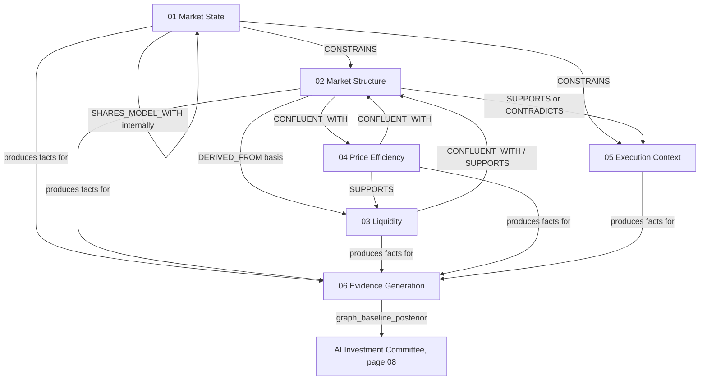

# 08 — Relationship Model

**Diagram:** `08_Relationship_Model.excalidraw`
**Domain:** Cross-chapter relationship consolidation
**Computed by:** Evidence Graph edge derivation rule table (`Architecture/17_Evidence_Graph.md` §Edge model)
**Depends on:** `01_Market_State.md` through `07_Entity_Reference.md`
**Status:** Draft, non-normative

---

## Purpose

Every chapter so far has stated, per entity, what it `SUPPORTS`, `CONTRADICTS`, `CONFLUENT_WITH`, or is `DERIVED_FROM`. This chapter is the reason those fields exist: **the Technical Analysis Ontology is a graph, not a hierarchy.** There is no single root entity, no strict parent-child tree, no domain that "owns" another. Market State conditions Market Structure; Market Structure conditions Liquidity and Price Efficiency; Execution Context is independent of direction entirely; and Evidence Generation sits underneath all five, converting every one of them into the same typed vocabulary. A hierarchy diagram would misrepresent this — a bidirectional `SUPPORTS`/`CONTRADICTS` edge between ch. 01's regime-level Trend and ch. 02's structural Trend has no "parent," and page 17's own model is explicit that no LLM asserts an edge; every edge here traces to a rule and to the attributes that triggered it. This chapter consolidates those edges into one place, organized by the nine types page 17 defines, so the graph shape is visible without re-reading six chapters' mermaid diagrams individually.

## The nine edge types (page 17 §Edge model)

| Edge type | Meaning | Who asserts it |
|---|---|---|
| `SUPPORTS` | One node's value increases confidence in another's read | Rule table, from node attributes |
| `CONTRADICTS` | Two nodes disagree in a way the graph must surface, not hide | Rule table |
| `CONFLUENT_WITH` | Two independent nodes align spatially or thematically (the Confluence Rule, page 06) | Rule table |
| `DERIVED_FROM` | One node is a deterministic function of another | Graph builder, at construction |
| `SHARES_MODEL_WITH` | Two nodes share a fitted model, so their independence must be discounted | Rule table, model lineage |
| `INVALIDATES` | One node's occurrence removes another's standing as live evidence | Rule table |
| `CONSTRAINS` | One node bounds or conditions how another is interpreted, without invalidating it | Rule table |
| `PRECEDES` | Temporal ordering between two events, relevant to sequence-dependent reasoning | Rule table, timestamps |
| `ANALOGOUS_TO` | A historical precedent resembles the current situation | Learning/Precedent index (BC9) |

Every edge below is quoted or directly paraphrased from a specific chapter's own "Relationships" field — this chapter introduces no new edge that chapters 01-06 did not already state. `PRECEDES` and `ANALOGOUS_TO` do not yet have a chapter 01-06 instance: this ontology has not yet modeled a `Precedent` node (BC9's domain, out of this volume's scope) or a strictly sequence-dependent pair distinct from what `DERIVED_FROM`/`SUPPORTS` already captures. Both are recorded here as gaps to close in a future revision, not asserted with fabricated examples.

## Consolidated edges by type

### DERIVED_FROM

| From | To | Source chapter |
|---|---|---|
| OHLCV bars | Swing Point | ch. 02 |
| Swing Point | BOS, CHoCH | ch. 02 |
| Swing Point (labeled) | HH / HL / LH / LL | ch. 02 |
| HH/HL/LH/LL | Trend (structural read) | ch. 02 |
| Market Regime + Volatility | Market Phase | ch. 01 |
| Market Regime | Trend (macro read) | ch. 01 |
| Swing Point (ch. 02) | Liquidity Pool | ch. 03 |
| Equal Highs/Lows | Liquidity Pool | ch. 03 |
| External Structure (ch. 02) | Premium / Discount | ch. 04 |
| Freshness | Decay / Aging | ch. 06 |
| Confidence Propagation | Aggregation / Scoring (terminology) | ch. 06 |

### CONFLUENT_WITH

| Nodes | Rule | Source chapter |
|---|---|---|
| Market Phase <-> Market Structure read | Matching bias | ch. 01 |
| BOS/CHoCH <-> unmitigated FVG, unswept Liquidity, Order Block, grid level | Structure Confidence's 5-factor rule (page 06) | ch. 02, ch. 03, ch. 04 |
| Liquidity Pool <-> BOS/CHoCH, Order Blocks | Within 0.5% of price | ch. 03 |
| FVG <-> BOS/CHoCH, Order Blocks | Within 0.5% of price | ch. 04 |
| Sweep <-> Order Block (same bar) | Same displacement candle | ch. 03 |
| Momentum <-> Candlestick Momentum | Both point the same direction | ch. 05 |

### SUPPORTS / CONTRADICTS

| Nodes | Direction | Source chapter |
|---|---|---|
| Market Regime <-> Trend (macro read) | SUPPORTS or CONTRADICTS | ch. 01 |
| Trend (macro) <-> Structural Trend (ch. 02) | SUPPORTS or CONTRADICTS, independent computations | ch. 01, ch. 02 |
| Cross Asset Context <-> Market Regime | SUPPORTS or CONTRADICTS (e.g. DXY vs. XAUUSD bull read) | ch. 01 |
| CHoCH -> prior Trend | CONTRADICTS | ch. 02 |
| Sweep -> CHoCH | SUPPORTS | ch. 03 |
| FVG -> Sweep (same displacement candle) | SUPPORTS | ch. 04 |
| Candlestick Momentum -> BOS | SUPPORTS (high-momentum candle) or CONTRADICTS (small-body, long-wick) | ch. 05 |

### CONSTRAINS

| From | To | Source chapter |
|---|---|---|
| Market Regime | Volatility's forecast conditioning | ch. 01 |
| Market Regime | Swing-length parameter (ch. 02) | ch. 01 |
| Volatility | Market Phase | ch. 01 |
| Volatility | Position sizing (BC6, out of scope) | ch. 01 |
| Session | Market Structure confidence (ch. 02) — named, not yet wired | ch. 01 |
| Time | Execution Context (ch. 05) | ch. 01 |
| Macro Environment | Market Regime interpretation at the Macro Desk | ch. 01 |
| External Structure | Internal Structure (top-down bias rule, enforced by SMC Desk not the engine) | ch. 02 |
| Premium/Discount | How a desk weights a bullish/bearish setup | ch. 04 |
| News | Context Confidence | ch. 05 |
| Execution Costs / Slippage | Context Confidence | ch. 05 |
| Time | Context Confidence | ch. 05 |
| News | Macro Environment reads, Time's `time_to_next_event` | ch. 05 |
| Context Confidence | Execution Desk `conviction_raw` — input to, never a substitute for | ch. 05 |
| Sustained slippage pattern | Risk Management Kill Switch | ch. 05 |
| Freshness | Weight | ch. 06 |

### INVALIDATES

| Node | Invalidates | Source chapter |
|---|---|---|
| Liquidity Pool sweep | The pool itself, as a future target | ch. 03 |
| CHoCH | Continuation setups built on the prior trend | ch. 02 |
| Mitigation (true) | The zone's contribution to Structure Confidence | ch. 04 |

### SHARES_MODEL_WITH

| Nodes | Basis | Source chapter |
|---|---|---|
| Market Regime <-> Volatility | Both share the fitted GARCH model — the dependence ADR-0027's discount corrects for | ch. 01 |

## Informal / descriptive relationships (not page-17 edge types)

Several chapter mermaid diagrams use labels like "clusters into," "resolves to," or "measured against" for readability. These are **not** among the nine formal edge types and this ontology does not claim they are — they describe a computational relationship (e.g. Swing Point clustering into a Liquidity Pool is really `DERIVED_FROM`; Session "resolving to" Kill Zones is a documentation note that Kill Zones has no independent computation, not an edge at all) or a monitoring relationship outside the graph (graph-baseline posterior "measured against" the Committee's pooled posterior is the `graph_committee_divergence` metric, page 17 §Recovery Strategy — a logged comparison, not a graph edge). Where a chapter's prose edge label doesn't map cleanly to one of the nine, treat the nearest formal type in the tables above as authoritative and the mermaid label as illustrative shorthand only.

## Relationships (domain-level view)

## Failure Modes / Known Gaps

- `PRECEDES` and `ANALOGOUS_TO` have no instance in chapters 01-06 — this ontology has not yet modeled temporal-sequence-dependent pairs or Precedent nodes, both out of this volume's current scope (BC9 Learning).
- Every edge in this chapter is a restatement of a chapter 01-06 field, not an independent derivation — if a future revision changes a chapter's Relationships field, this chapter's tables go stale until updated in the same change.
- The domain-level mermaid diagram compresses dozens of entity-level edges into six domain boxes; it is an orientation aid, not a substitute for the per-chapter and per-edge-type tables above.

## Future Expansion

- Once `07_Entity_Reference.md`'s ontology-proposed entities (Impulse, Correction, Structure Strength, Liquidity Efficiency, Efficiency Zones, Gap Fill Probability, Breaker/Mitigation/Reclaimed Block) are adopted, each will add rows to this chapter's edge tables — most already have an implied edge type, visible in their home chapter's proposed-derivation field.
- A `Precedent`-node worked example, once BC9's Learning context publishes into the graph, would give `ANALOGOUS_TO` its first real instance here.

---

## Related

- Previous: `07_Entity_Reference.md`
- `Architecture/17_Evidence_Graph.md` §Edge model — canonical source for the nine edge types
- `01_Market_State.md` through `06_Evidence_Generation.md` — the source of every edge tabulated above
- `09_Evidence_Schema.md` — extends the node side of this model with a closed `field` vocabulary
- Next: `09_Evidence_Schema.md`
