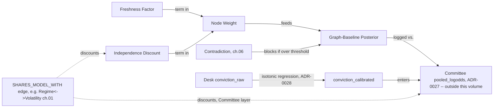

# 10 — Confidence Model

**Diagram:** `10_Confidence_Model.excalidraw`
**Domain:** Confidence, from a single node's weight to the Committee's pooled probability
**Computed by:** Evidence Graph weighting (`Architecture/17_Evidence_Graph.md` §Weighting), ADR-0027 (log-odds pooling), ADR-0028 (calibration), ADR-0034 (point-in-time correctness)
**Depends on:** `06_Evidence_Generation.md`, `09_Evidence_Schema.md`
**Status:** Draft, non-normative

---

## Purpose

Chapter 06 named Weight and Confidence Propagation as native mechanisms without formalizing their math. This chapter does that — and, because confidence in this platform is not one number but three layered ones, it also draws the boundary this ontology must respect: **this volume owns the node-level Weight and the graph-level baseline posterior (BC5 Deliberation's Evidence Graph). It does not own the Committee's pooled probability (page 08, ADR-0027) or desk calibration (ADR-0028) — those belong to the AI Investment Committee, not the Research Platform this ontology is grounded against.** They are documented here anyway, in full, because ch. 05's Context Confidence and ch. 06's Confidence Propagation both name `conviction_raw`/`conviction_calibrated` as their downstream consumer, and a confidence model that stops at the graph boundary without explaining what happens on the other side of it would be incomplete for a reader trying to understand why any of this matters.

## Three layers of confidence

| Layer | Owner | Entity | Formalized |
|---|---|---|---|
| 1. Node-level | Evidence Graph (BC5) — this ontology's domain | `Weight` | Below |
| 2. Graph-level | Evidence Graph (BC5) — this ontology's domain | `graph_baseline_posterior` (Confidence Propagation, ch. 06) | Below |
| 3. Committee-level | AI Investment Committee (page 08) — outside this volume | `conviction_calibrated`, `pooled_logodds` | Below, for continuity only |

A single word — "confidence" — is used loosely across all three by traders and even by some Architecture pages. This chapter's job is to make sure this ontology never conflates them: a node's `weight` is not a desk's `conviction_calibrated`, and neither is the `graph_baseline_posterior`.

## Entity: Node Weight

| Field | Value |
|---|---|
| Purpose | Reduce every node's trustworthiness to one number so the graph never has to reason in five dimensions at once |
| Definition | `weight(n) = reliability(n) x freshness(n) x quality(n) x regime_applicability(n) x independence(n)` (page 17 §Weighting) |
| Inputs | The node's own `source`, `staleness`, and graph position (for `SHARES_MODEL_WITH` edges) |
| Outputs | `weight: float`, multiplicative so any zero factor removes the node from scoring entirely |
| Relationships | `CONSTRAINS` every aggregation the node participates in (ch. 06); the mechanism behind Invariant 4 (page 17): a node with `staleness.severity == critical` weights to 0, and a graph containing one cannot seal into a state permitting a `TradeProposal` |
| Attributes | `weight: float`, plus its five components (not separately named fields on the node — components are computed, not stored) |
| State | Recomputed at assembly, immutable once sealed |
| Confidence | This entity *is* the platform's node-level confidence primitive |
| Evidence Produced | Attribute on every node |
| Evidence Consumed | `reliability`, `freshness`, `quality`, `regime_applicability`, `independence` |
| Dependencies | Freshness Factor, Independence Discount (below) |
| Lifecycle | Once per node per assembly |
| Examples | See Freshness Factor and Independence Discount below for two of the five factors worked in detail; `reliability`, `quality`, `regime_applicability` are engine-specific and not further decomposed by this ontology |

## Entity: Freshness Factor

| Field | Value |
|---|---|
| Purpose | Convert the `staleness` object (ch. 06, ADR-0034) into the numeric `freshness(n)` term Weight actually multiplies by |
| Definition | A monotonically decreasing function of `age_s` relative to `max_age_s`, reaching 0 at `severity: critical`. This ontology does not assert the exact curve shape (linear decay, exponential, or a step function at `warning`/`critical` boundaries) — that parameter lives in the graph builder's own config, versioned like the edge rule table |
| Inputs | `staleness{is_stale, age_s, max_age_s, severity}` |
| Outputs | `freshness(n): float [0, 1]` |
| Relationships | `CONSTRAINS` Weight; the mechanism ch. 04's Zone Freshness entity and ch. 01's `stale` flags all resolve to |
| Attributes | `freshness: float` |
| State | Continuously decreasing between recomputes |
| Confidence | This factor is itself a confidence input, not a separately estimated quantity |
| Evidence Produced | Component of `weight`, not a separate node |
| Evidence Consumed | `staleness` object |
| Dependencies | ADR-0034's point-in-time layers (clock injection specifically) |
| Lifecycle | Recomputed at every assembly |
| Examples | A ch. 04 FVG at `severity: ok` might contribute `freshness(n) = 0.95`; the same FVG at `severity: critical` contributes `0`, per Invariant 4 |

**Honest gap:** the exact functional form of `freshness(n)` (beyond "monotonically decreasing, zero at critical") is not specified in any frozen Architecture page this ontology is grounded against. This chapter names the boundary conditions page 17 states explicitly and leaves the interior curve as an implementation parameter, not a fabricated formula.

## Entity: Independence Discount

| Field | Value |
|---|---|
| Purpose | Stop two nodes that share a fitted model from being counted as two independent confirmations, closing the double-counting gap page 08 names but does not fix (page 17 §Edge model) |
| Definition | A discount applied via `SHARES_MODEL_WITH` edges: two nodes connected by this edge type have their combined contribution reduced below what treating them as independent would produce |
| Inputs | `SHARES_MODEL_WITH` edges in the current graph, e.g. ch. 01's Market Regime and Volatility sharing a fitted GARCH model |
| Outputs | `independence(n): float [0, 1]`, the fifth factor in Node Weight |
| Relationships | `DERIVED_FROM` graph structure, not asserted per-node; the same mechanism ADR-0027 names as `independence_d` at the Committee layer, applied one layer earlier, at the node layer |
| Attributes | `independence: float` |
| State | Recomputed at assembly, depends on which nodes are present in the current graph |
| Confidence | An approximation derived from graph structure, not a measured correlation — ADR-0027 states this explicitly about its own `independence_d` and the same caveat applies here |
| Evidence Produced | Component of `weight` |
| Evidence Consumed | `SHARES_MODEL_WITH` edges |
| Dependencies | Model lineage tracking (which nodes share which fitted model) |
| Lifecycle | Recomputed at every assembly |
| Examples | Market Regime and Volatility (ch. 01) both weighing into the same setup's evidence are each discounted below 1.0, rather than both contributing full independent weight |

## Entity: Graph-Baseline Posterior (Confidence Propagation, formalized)

| Field | Value |
|---|---|
| Purpose | Give the platform one deterministic, LLM-free reference probability per cycle, so the Committee's own conclusion can be measured against something that owes nothing to prompt engineering |
| Definition | Log-odds accumulation across every weighted node relevant to `{symbol, timeframe, as_of}`, with the same dependence-discount logic as Node Weight's independence factor applied at the aggregate level (full derivation: `review/R09_Evidence_Graph.md` §4-5) |
| Inputs | Every weighted, non-contradicted node in the sealed graph |
| Outputs | `graph_baseline_posterior: float` (log-odds) |
| Relationships | `SHARES_MODEL_WITH` discounting propagates up from Node Weight; compared against the Committee's `pooled_logodds` as `graph_committee_divergence` (page 17 §Recovery Strategy) |
| Attributes | `graph_baseline_posterior: float`, `contributing_nodes: [node_id]` |
| State | Computed once per cycle |
| Confidence | This *is* the graph-level confidence measure |
| Evidence Produced | Field on the sealed `EvidenceGraph` |
| Evidence Consumed | Every weighted node |
| Dependencies | Node Weight, Independence Discount, Contradiction (ch. 06 — a graph that aborts on contradiction never reaches this computation) |
| Lifecycle | Once per cycle, permanently logged for `graph_committee_divergence` |
| Examples | See ch. 06's Confidence Propagation entity for a worked example |

## Beyond this volume's boundary: Committee-level pooling (documented for continuity)

The Committee's confidence model (page 08, formalized by ADR-0027 and ADR-0028) is **not** part of the Research Platform this ontology is grounded against — it belongs to BC5 Deliberation's AI Investment Committee, one layer above the Evidence Graph. It is recorded here, briefly and without a full entity template, because chapters 05 and 06 both point to it as "where this confidence goes next," and leaving that pointer undefined would be a worse gap than a short, clearly-bounded summary.

**Desk calibration (ADR-0028):** a desk's self-reported `conviction_raw` (0-100) is never used as a weight directly — it is calibrated per desk via isotonic regression against realised outcomes: `conviction_calibrated = isotonic_desk(conviction_raw)`. Before a desk has 100 resolved opinions, a shrunk prior applies instead: `conviction_calibrated = 0.5 + 0.3 * (conviction_raw / 100 - 0.5)`.

**Committee pooling (ADR-0027):**

```
pooled_logodds(LONG) =
    prior_logodds(LONG | regime, session)
  + SUM over desks d:
        w_d * independence_d * logodds(conviction_calibrated_d | stance_d)
  - red_team_penalty
```

`prior_logodds` is a measured base rate (not 0.5), `w_d` is the learned, PBO-gated desk weight, `independence_d` is the Committee-layer analogue of this chapter's Independence Discount (derived from the same `SHARES_MODEL_WITH` structure), and `red_team_penalty` comes from ADR-0029's Red Team desk.

**Why this matters to this ontology specifically:** ch. 01's Market Regime and Volatility `SHARES_MODEL_WITH` each other. That single fact discounts three things across two layers this chapter has now made explicit: the Node Weight of each (this chapter), the Graph-Baseline Posterior's aggregate (this chapter), and the Regime Desk / Volatility Desk's `independence_d` in Committee pooling (ADR-0027, outside this volume). One shared GARCH model, three corrections, one root cause — which is the entire point of deriving `independence` from graph structure instead of a human deciding per-cycle when correlation matters.

## Relationships (closes the loop to chapter 06)



## Failure Modes / Known Gaps

- The exact curve of `freshness(n)` (beyond its boundary conditions) is not specified by any frozen page — recorded as an honest gap above, not invented.
- `independence(n)` and Committee-layer `independence_d` are both approximations derived from graph structure, not measured correlations — ADR-0027 states this about its own term and the same caveat applies to this chapter's node-level analogue.
- If `graph_committee_divergence` shows the Committee never disagrees productively with the graph baseline, ADR-0027's own tripwire applies: the LLM layer should be reduced to Red Team plus the CRO Gate. This ontology does not own that decision, but ch. 06's Confidence Propagation is the node this tripwire's metric is computed from.

## Future Expansion

- If `freshness(n)`'s functional form is formalized in a future Architecture change, this chapter's Honest Gap resolves without changing this chapter's structure — only its level of detail.
- Options-implied volatility (ch. 01 §Future Expansion) would give `regime_applicability(n)` a market-implied alternative input alongside the model-implied one, for Volatility-sourced nodes specifically.

---

## Related

- Previous: `09_Evidence_Schema.md`
- `Architecture/17_Evidence_Graph.md` §Weighting — canonical source for `weight(n)`
- `Architecture/decisions/0027-log-odds-pooling-with-dependence-discounting.md`, `0028-desk-confidence-is-calibrated-before-use.md`, `0034-...md` — canonical sources for the Committee-layer formulas
- `06_Evidence_Generation.md` — where Weight and Confidence Propagation were first introduced
- Next: `11_Glossary.md`
